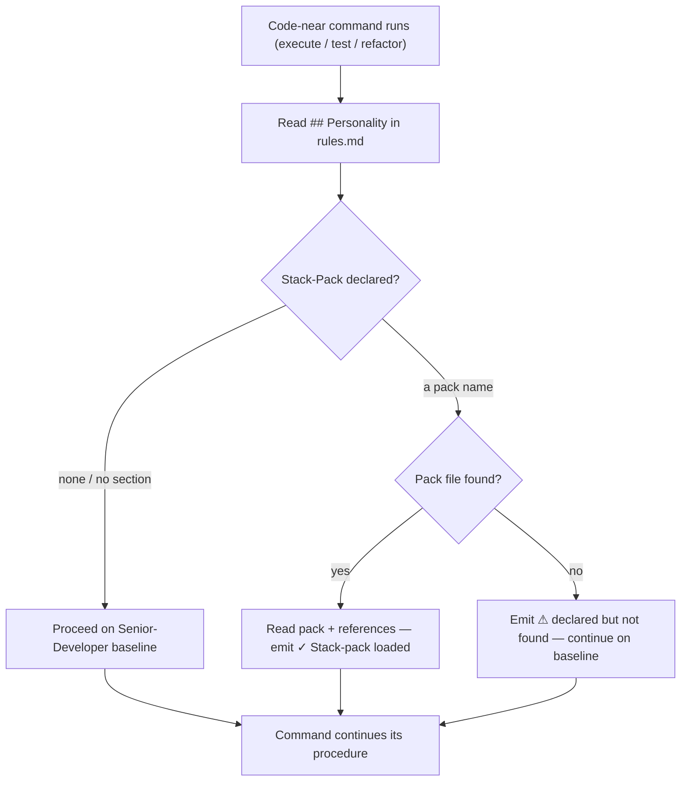

# Slice 002 — stack-php-laravel Pack (D27 Tier 2)

> Completed: 2026-05-20
> Commits: 07ee6f8..4ec7949 (branch main — no PR)

## What

This slice ships the `stack-php-laravel` stack-pack — the code-near personality layer
for PHP/Laravel projects: PHP 8.4/8.5 idioms, Laravel and Filament patterns, and Pest
test patterns, split across `SKILL.md` and three `references/` files. A project
declares its pack via a `## Personality` block in `rules.md`, and the three code-near
commands (`/craft:execute`, `/craft:test`, `/craft:refactor`) load it at start — or
warn and continue on the Senior-Developer baseline alone if a declared pack is
missing. This makes Tier 2 of the personality system operational (Tier 1 shipped in
slice 001).

## Why

- Scope kept narrow — pack content + `## Personality` schema + the three loaders; the
  onboard stack-detection heuristic and any prime pre-warning were deferred to later
  slices.
- Content was extracted and generalized: the Cluster-B counterpart of slice 001's
  baseline, lifted from the same `real_live_projekt` `developer` skill but made
  generic for all PHP/Laravel adopters — neutral examples, no project domain,
  database-agnostic.
- The missing-pack fallback is a deliberate design choice — a declared-but-absent
  pack warns and continues rather than aborting the command, so a misconfiguration
  degrades gracefully.
- `disable-model-invocation: true` on the pack: it is loaded deterministically via
  the `## Personality` declaration, not opportunistically by description matching —
  the same principle as the baseline.

## Decisions

- (none promoted — the PHP 8.5 coverage and the missing-pack fallback were in-slice
  design choices, captured in the Why above.)

## Commits

- `07ee6f8` — feat(skills): add stack-php-laravel stack-pack
- `4ec7949` — feat(commands): declare and load the stack-pack in code-near phases

## How (Diagram)

