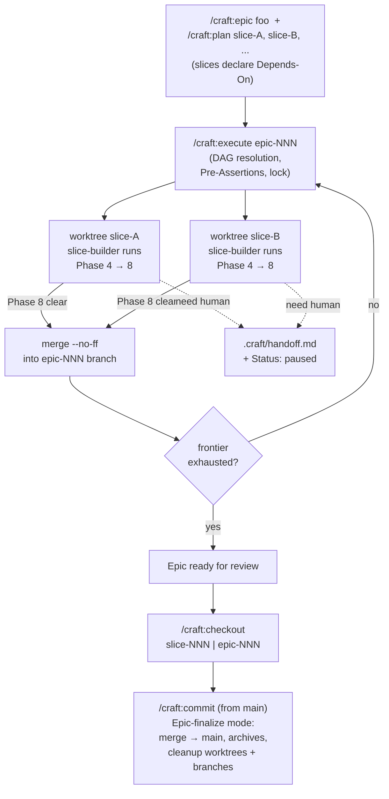

# Slice 009 — Parallel Worktree Execution (C+D+E)

> Completed: 2026-05-27
> Commits: 74f1e0f..0f0eb55 (main, no PR)
> Decisions promoted: D29, D30, D31 in `brainstorm-decisions.md`

## What

Slice-009 ships the autonomous-build orchestration layer for CRAFT. With `/craft:execute <epic-NNN>` a planned epic now runs Phases 4–7 without per-phase user intervention: one git worktree per runnable slice next to the repo, a `slice-builder` subagent per worktree delegating to the existing per-phase commands (`/craft:build` → `/craft:test` → `/craft:recap` → `/craft:refactor` → `/craft:review`) in subagent mode, and `--no-ff` merges into a dedicated `epic-<NNN>-<slug>` branch as each slice clears review. The orchestrator stops only at epic-end (or at opt-in `## Review Checkpoints`) — Phase-5 UX exercise, refactor decisions, and Heavy + needs-rethinking findings always pause their slices via a `.craft/handoff.md` marker, surfaced by a new SessionStart hook. Four new commands (`execute`, `checkout`, `worktree-status`, `worktree-clean`) and one new subagent (`slice-builder`) carry the surface; eight existing commands gain mode-detection or subagent-mode sections. The former Phase-4 build command `/craft:execute` was renamed to `/craft:build` to free the strongest user-facing verb for the orchestrator.

## Why

The linear per-phase workflow that CRAFT shipped originally is right for a single slice but ceremonial at epic scale — at five or more slices the human spends as much time confirming phase transitions as planning the work. Three load-bearing decisions resolve this without weakening human control where it matters: **D29 — Concentrated-control execution** says the human owns the hard phases (Plan / Recap / escalated Review / Commit), the agent owns the mechanical ones; **D30 — Parallel worktree architecture** isolates each slice on its own branch in a sibling worktree, with explicit `Depends-On:` frontmatter driving a DAG the orchestrator can parallelize; **D31 — Rename + delegation** frees `/craft:execute` for the orchestrator role and forbids duplicating phase logic — the orchestrator delegates to the existing per-phase commands via a published Subagent Mode contract on each. The `.craft/handoff.md` marker file is the universal "human needed" signal — file-based, debuggable, hook-watchable, no Claude-Code-API coupling. Phase 5 is preserved as human-only (UX feedback cannot be fabricated), refactor candidates are never silently applied, and review-blocking findings always escalate to the human.

## Walk-through

User-facing flow: plan an epic with `/craft:epic foo` (Vision + Slice Decomposition), refine each entry into a regular slice with `/craft:plan slice-A`, … — each slice optionally declares `Depends-On: [...]`. `/craft:execute epic-001` then takes over: Pre-Assertions (onboarded, target plan exists, working tree clean on `main`, no concurrent execute lock, DAG cycle-free); creates the epic-worktree and per-slice worktrees; spawns `slice-builder` subagents in parallel. Inside each slice-worktree the subagent invokes the existing phase commands in their Subagent Mode — `/craft:build` works sub-tasks to green; `/craft:test` writes the 5a block to `.craft/handoff.md` and pauses (Phase 5 requires a human); `/craft:recap` auto-drafts What/Why/Walk-through flagged for review; `/craft:refactor` either skips per `rules.md` or writes a candidate list as a handoff; `/craft:review` applies Local-edit fixes, escalates Heavy + needs-rethinking via handoff. On clean Phase-8 the orchestrator merges the slice-branch into the epic-branch with `--no-ff`. When the frontier is exhausted, the orchestrator emits "Epic ready for review" or a partial-completion block listing every handoff/failure. The user inspects via `/craft:checkout`, then `/craft:commit` from main — it detects Epic-finalize mode from `git worktree list`, merges the epic-branch into `main` with `--no-ff`, walks each included slice's decisions via the existing `[K]/[I]/[R]/[D]` dialog plus the epic's decisions, writes archive entries for every slice and an epic archive, deletes plan files, removes worktrees + branches. A SessionStart hook (`worktree-handoff-notify.sh`) ensures pending handoffs from prior runs surface in every new chat — paused work never gets quietly forgotten.

## Diagram

## Decisions

All 15 decisions captured during the slice were marked `[K]` (Keep in archive only) — the architectural cluster is already promoted into `brainstorm-decisions.md` as D29/D30/D31 at the right level of abstraction; the 15 below are the sub-bullets that compose D30.

- Worktree location: `../<repo>-worktrees/<slice-id>-<slug>/` next to the repo (not inside it). *Why not* in-repo: scanner tools (npm/Docker/IDEs) would otherwise treat sub-checkouts as the main one.
- Worktree lifecycle: per slice, alive from start of Phase 4 until Phase 9 archive cleanup. Created by `/craft:execute`, not by `/craft:plan`.
- Concurrency: multiple slices run in parallel; sub-tasks within one slice remain sequential.
- Phase distribution: Phase 1–3 on main, 4–7 in slice-worktree, 8 = merge (slice → epic by orchestrator, epic → main by `/craft:commit`), 9 = cleanup.
- Ready-for-checkout signal: `.craft/handoff.md` marker file in the slice-worktree. File-based, debuggable, hook-watchable.
- Recap/Review provisioning: `/craft:checkout` does only `git worktree`-related navigation and prints a stack-pack-specific hint (e.g., `composer install`). No automated dependency installation.
- Merge strategy: always `--no-ff` merge commits — slice → epic and epic → main both preserve the parallel-build topology in history.
- Branch naming: `<slice-id>-<slug>` and `epic-<NNN>-<slug>`. Configurable via `## Worktree Settings` in `rules.md`.
- Default review-stop: end of epic. Per-slice / per-checkpoint stops opt-in via `## Review Checkpoints` in the epic plan. *Why*: per-slice stops produce review fatigue.
- Merge topology: slices merge to an `epic-<NNN>-<slug>` branch inside a dedicated epic-worktree, not directly to main — enables the "checkout the full epic for review" mode.
- Slice dependencies: explicit `Depends-On: [slice-NNN, ...]` frontmatter. *Why not* heuristic file-overlap detection: too unsafe.
- Cleanup policy: automatic worktree-remove + branch-delete at Phase 9 (Archive). `/craft:worktree-clean` reconciles orphans from interrupted runs.
- `/craft:abort` behavior: asks before removing an active worktree; default `n`.
- New commands shipped: `/craft:execute` (orchestrator), `/craft:checkout`, `/craft:worktree-status`, `/craft:worktree-clean`.
- Phase 7 (Refactor) was skipped for this slice per project rule in `.claude/project/rules.md` — Markdown asset slice.

## Review Findings

Phase 8 fresh-context reviewer returned 10 findings, all Local-edit (no Heavy + needs-rethinking). Soft cap (5) was reached and waived by the user — all remaining findings were pure Markdown spec clarifications with no behavior change. Three Heavy findings (worktree-removal not executed in `abort.md`, missing `commit.md` A0 assertion, `rules.md.template` wrong command reference and default path) plus seven Light clarifications were applied in-phase. Plugin validation green throughout.

## Commits

- `74f1e0f` — docs(templates): add Depends-On, Review Checkpoints, Worktree Settings
- `2213648` — refactor(commands)!: rename /craft:execute (Phase 4 build) → /craft:build
- `0cea98c` — feat(craft): add /craft:execute orchestrator + slice-builder agent + worktree tools
- `c4793b5` — feat(craft): worktree-aware Phase 9 + Subagent Mode contracts on phase commands
- `0f0eb55` — docs: autonomous-flow Quickstart + record D29/D30/D31

## Follow-ups

(none — Phase 8 closed with zero needs-rethinking findings)

## Notes

- **Bootstrap slice** — slice-009 builds the worktree infrastructure that future slices will use, so it could not itself run inside `/craft:execute`. It was built directly on `main` with the classic per-phase `/craft:*` workflow.
- **Cross-references to historical `/craft:execute`** in `brainstorm-decisions.md` (D9/D14/D27/D28 era) and in archived slices (slice-001 through slice-008) were preserved intentionally — decision-log accuracy. Only behaviorally active references in `commands/`, `skills/`, `README.md`, and `templates/` were swept to `/craft:build`.
