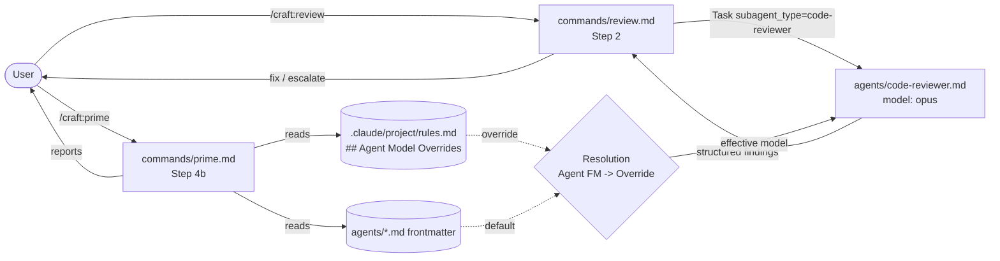

# Slice 010 — Per-Phase Model Switching

> Completed: 2026-05-27
> Commits: 4ff53f4..HEAD (main, no PR — trunk-based)

## What

CRAFT routes Code Review to a new Opus-pinned `code-reviewer` subagent and Slice Execution (via `/craft:execute`) to a Sonnet-pinned `slice-builder`. Projects override per-agent in `.claude/project/rules.md` → `## Agent Model Overrides`; `/craft:prime` Step 4b resolves and reports the effective Agent → Model map and soft-warns on invalid entries. Dialogic phases (Plan, Debug autonomous loop) deliberately stay on the session model.

## Why

- `intent.md` Goal G ("Model switching per phase") asked for Opus on planning/review and Sonnet on execution. Mid-execute research (claude-code-guide subagent, sources at code.claude.com/docs) verified that Claude Code does NOT support `model:` frontmatter on slash commands, skills, or hooks — only on subagents. Forced architecture from "model per command" to "delegation to model-pinned subagents".
- Two originally planned agents (`plan-architect`, `debug-investigator`) were dropped during execution: their phases are interactive (three universal planning questions; AUTONOMOUS LOOP with streaming bundles and 3s-pause UX), and subagents block their parent on a single return — they cannot stream incremental output nor receive a mid-loop user pause. Routing those phases through a subagent would degrade UX.
- The `rules.md` override mechanism preserves project-level customisation without forking agent files, consistent with the 3-tier Personality model (D27).

## Decisions

- **Subagent delegation is the only path for per-phase model switching** — Claude Code does not support `model:` frontmatter on slash commands, skills, or hooks; `/model` in a command body renders as text. *Why not*: per-command frontmatter would have been simpler if it existed, but it does not (verified, source: code.claude.com/docs/en/model-config). Promoted to `intent.md` Non-Goals.
- **Plan and Debug autonomous loop are NOT delegated** — *Why not*: subagents block on a single return message and cannot stream incremental bundles or honour a mid-loop user "pause" input; routing dialogic UX through a subagent boundary breaks the interaction. Promoted to `intent.md` Non-Goals.
- **Skills `model:` frontmatter is undocumented** — not used in this slice. Future model pinning routes exclusively through `agents/*.md`. Archive-only.
- **GitHub issue #173** (Agent `model:` field was non-functional in earlier Claude Code versions) — a one-shot verification procedure ships in `model-defaults.md` § Verification. If the installed version still mis-honours the pin, the fallback documented there is "switch the session model manually for review work". Archive-only.
- **Phase 5 ran as a post-release smoke check, not a pre-Commit gate** — *Why not* run Phase 5 before Phase 9: the CRAFT dev repo cannot test itself (agents are resolved from `~/.claude/plugins/cache/...`, not from the dev source), so the verification can only happen after `/craft:upgrade` lands 0.4.0. Slice took the 4→6→8→9 path with Phase 5 deferred. This deviation is dev-repo-specific; end-user CRAFT projects do not have the chicken/egg constraint. Archive-only.

## Commits

- `4ff53f4` — feat(model-switching): per-phase model via subagent delegation
- `0a961d7` — chore(release): bump version to 0.4.0
- (next) — docs(slices): archive slice-010 + promote decisions to intent.md + bump .next-id

## Follow-ups

> Phase 8 found 0 Heavy + Needs-Rethinking and 0 Light + Needs-Rethinking. All 7 Light + Local findings were fixed in-phase under a soft-cap waiver. The Heavy + Rethink finding (plugin agents/ resolution) was fixed inline via a Phase-4 loop-back inside this slice.

(none — all findings resolved in-phase)

## How (Diagram)

