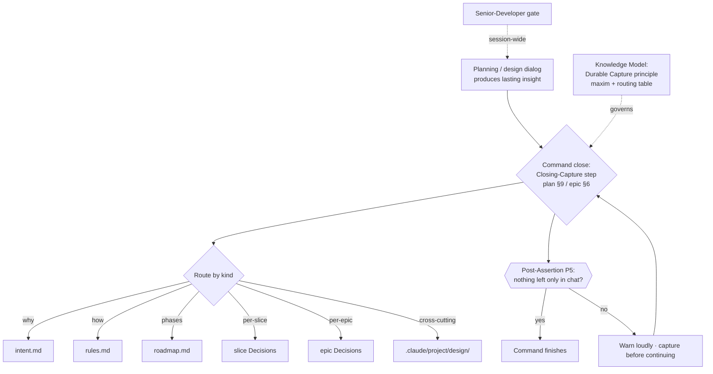

# Slice 013 — Persist Planning Artifacts (Durable Capture)

> Completed: 2026-06-03
> Commits: 8c228ac..c0d0e68 (branch main, trunk-based)

## What

Made "persist planning output to disk as you produce it" a named, first-class CRAFT
principle — **Durable Capture** — stated once in the workflow Knowledge Model, enforced
with teeth in both planning commands, and backed by a canonical home
(`.claude/project/design/`) for cross-cutting design knowledge.

## Why

- CRAFT persisted slice/epic/intent/rules knowledge but had no explicit rule to capture
  analysis in the same turn it is produced, and no canonical home for cross-cutting design
  knowledge — one project had to invent its own `konzept.md` workaround.
- Enforcement reuses CRAFT's existing Pre/Post-Assertion convention (a new P5) rather than
  a bespoke mechanism, keeping the durable-state contract consistent across commands.

## Decisions

- **(B) Doc-home = `.claude/project/design/` directory** — cross-cutting design knowledge
  (domain model, scenario catalog, matrices) lives in a dedicated, on-demand directory.
  *Why not a single `design-notes.md`:* the named artifacts are independent documents;
  one file is the same anti-pattern at smaller scale. *Why not delegate to the project:*
  merely permitting an ad-hoc concept doc codifies the workaround instead of closing the
  gap. *Cost it pays:* design docs are not loaded on `/craft:prime` (only intent/rules/
  roadmap are), so the convention adds no prime-context budget — hence it lives in the
  Knowledge Model's *supporting-files* list, not the prime-loaded core trio. **Promoted to
  `intent.md`.**
- **Naming = "Durable Capture"**, maxim **"Chat is not storage."** — reads as a principle,
  not a mechanism. **Promoted to `intent.md`** (merged with the doc-home decision into one
  headline entry).
- **Scope = one slice, not an epic** — decision (B) did not split the work into multiple
  independently-shippable bodies; every edit serves the single principle landing.
- **Teeth = closing-capture step + Post-Assertion (P5)** — consistent with CRAFT's existing
  Pre/Post-Assertion convention for durable-state planning commands.

## Commits

- `8c228ac` — feat(workflow): introduce Durable Capture principle and design/ knowledge home
- `ea00232` — feat(plan,epic): enforce Durable Capture at planning-turn close
- `0da1262` — feat(onboard): materialize the .claude/project/design/ convention
- `c0d0e68` — chore(plans): bump slice counter to 14

## Follow-ups

> Optional — light / needs-rethinking findings carried over from Phase 8 Review. Each is a candidate for a future slice.

- None. Phase 8 review returned 0 heavy / 3 light findings, all local-edit and fixed
  in-phase (forward-looking design/ link note, terminal punctuation, `konzept.md` →
  `concept.md`).

## How (Diagram)

> Durable Capture flow — from a planning dialog producing insight to the P5 gate.

