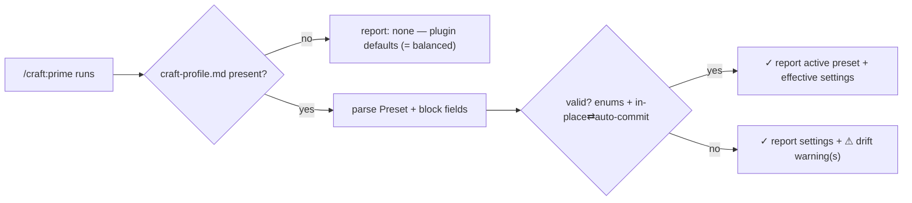

# Slice 015 — Profile Format

> Completed: 2026-06-18
> Commits: 25e719d..3cb3299 (branch main, no PR)

## What

Every CRAFT project now has a single, portable home for its operating preferences: a
Markdown profile file (`.claude/project/craft-profile.md`), three shipped presets
(`careful` / `balanced` / `autonomous`), and a documented default set. `/craft:prime`
detects, validates, and reports the profile. The settings are read and reported but
nothing acts on them yet — that is the rest of the `autonomy-profiles` epic (epic-001).

## Why

- A portable file beats more `rules.md` blocks because the whole setup can be copied
  into a sibling project to reuse it (epic Decision A).
- As the epic's foundation, the slice ships "complete schema, zero behaviour change":
  the implicit default (no file) equals the `balanced` preset — today's behaviour — so
  adopting the profile system is a no-op until a project edits its profile.
- Validation is report-only, never auto-correcting, consistent with CRAFT's drift Tabu.

## Decisions

- **Profile format = Markdown file** — a self-contained `.claude/project/craft-profile.md`, portable by copy; presets are starting templates, the file *is* the effective config with no field-level merge. *Why not* a structured YAML/JSON file: consistency with the existing Markdown config surface (intent.md/rules.md); revisitable if a structured format proves necessary.
- **Language + models move into the profile** — schema carries `## Operational Language` + `## Agent Model Overrides` in full; the consumer read-source switch and `rules.md` block removal were split into a separate `settings-migration` slice. *Why not* migrate consumers here: the consumer surface spans commit/build/review/execute + rules.md cleanup — too large for a reviewable foundation slice.
- **Permission allowlist lives in `settings.local.json`** — the profile records only the chosen permission *scope name* for documentation. *Why not* duplicate the allowlist in the profile: the harness owns permissions; duplication would drift.
- **Preset names `careful` / `balanced` / `autonomous`** — the "give me the defaults" fast-path resolves to `balanced`.

## Commits

- `25e719d` — feat(profile): add portable profile format, presets, and defaults
- `e58be4e` — feat(prime): detect, validate, and report the CRAFT profile
- `fa6cb7a` — docs(profile): document the CRAFT profile in README and project index
- `3cb3299` — chore(plans): add epic-001 autonomy-profiles and bump counters

## Follow-ups

> Optional — light / needs-rethinking findings carried over from Phase 8 Review. Each is a candidate for a future slice.

- (none) — Phase 8 returned 0 heavy, 4 light (all local-edit): 3 fixed in-phase, 1 declined with rationale (`> Preset:` blockquote matches CRAFT's plan-file frontmatter convention). No needs-rethinking findings.

## How (Diagram)

