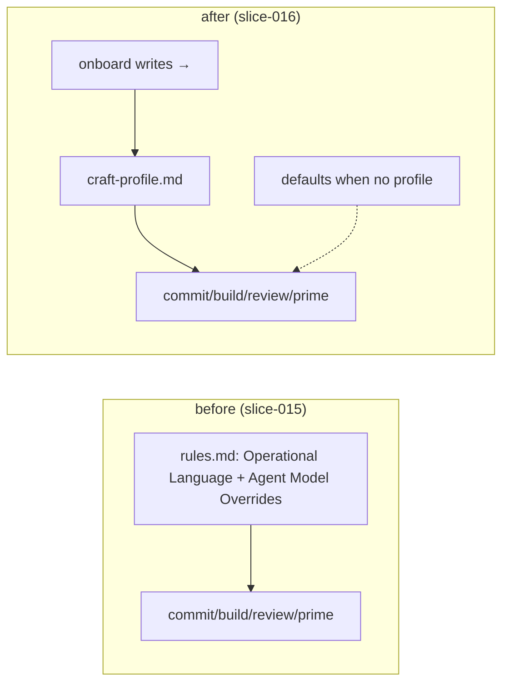

# Slice 016 — Settings Migration

> Completed: 2026-07-01
> Commits: 6d4a800..75ab7e2 (branch main, no PR)

## What

The CRAFT profile is now the **operative** home for language and model-override
settings. Every consumer command (`prime`, `commit`, `build`, `review`) reads them from
`craft-profile.md` (or the documented defaults), `/craft:onboard` writes them there, and
the `## Operational Language` + `## Agent Model Overrides` blocks are gone from `rules.md`
and its template. This completes epic Decision A — those settings leave `rules.md`
entirely.

## Why

- Slice-015 made the profile *exist and be reported*; this slice makes it
  *authoritative*. Keeping language/models in two possible homes (`rules.md` and the
  profile) would drift, so the migration consolidates to a single source of truth.
- The onboarding write-out landed here (not the later `onboarding-wizard` slice)
  specifically so `rules.md` is never left as a half-home — removing the blocks while
  `onboard` still wrote them there would contradict itself.
- No behaviour change for default projects: absent a profile, the same defaults apply
  (Chat=system, Commits/Comments=English, models from `model-defaults.md`).

## Decisions

- **Onboarding write-out lands here, not in `onboarding-wizard`** — `/craft:onboard` is updated to write language/models into the profile in this slice, so `rules.md` is never left as a half-home; the `onboarding-wizard` slice then adds the autonomy/commit/merge knobs + guided UX on top of an onboard that already produces a profile. *Why not* defer onboard entirely: removing the `rules.md` blocks while onboard still wrote them there would be self-contradictory.
- **This repo dogfoods the removal** — CRAFT's own `.claude/project/rules.md` loses its (currently empty, commented-out) `## Agent Model Overrides` block as part of this slice — a State change, not just a template change. It has no `## Operational Language` block to remove.
- **No behaviour change for default projects** — projects with no profile keep the exact prior behaviour via the documented defaults (Chat=system, Commits/Comments=English, models from `model-defaults.md`); the migration is source-of-truth only.

## Commits

- `6d4a800` — feat(commands): source language + models from craft-profile.md
- `050aea4` — refactor(rules): drop Operational Language + Agent Model Overrides blocks
- `8e39d6b` — docs(profile): point settings + model references at craft-profile.md
- `75ab7e2` — chore(plans): bump slice counter to 17

## Follow-ups

> Optional — light / needs-rethinking findings carried over from Phase 8 Review. Each is a candidate for a future slice.

- (none) — Phase 8 Round 1 returned 2 heavy (1 rethink/blocking, 1 local) + 2 light (local); all four were resolved in a Phase-4 loop-back and a fresh-context Round 2 verified them RESOLVED with no new defects. No open findings carried over.

## How (Diagram)

