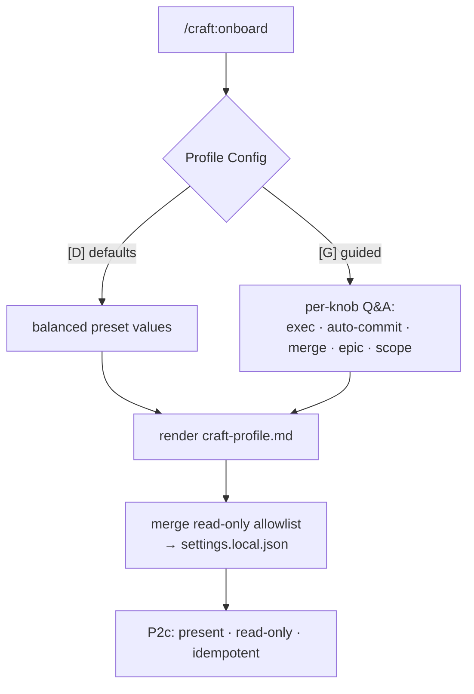

# Slice 017 — Onboarding Wizard

> Completed: 2026-07-02
> Commits: 67b2dba..27ccba9 (branch main, no PR)

## What

`/craft:onboard` gains a real setup experience: a fast `[D]` defaults path and a `[G]`
guided multiple-choice dialog that captures the full autonomy/commit/merge/epic/permission
knobs into `craft-profile.md`, plus a read-only default permission allowlist merged into
`.claude/settings.local.json`. Before this slice, onboard only ever wrote the `balanced`
preset's literals for those knobs (interactive selection was explicitly deferred here) and
wrote no allowlist.

## Why

- Slice-015 shipped the profile schema and slice-016 migrated the consumers onto it; what
  remained was the human-facing way to *populate* the knobs and a permission baseline.
- This slice adds only that UX — no new schema (schema-first, like slice-015): the knobs
  are captured now; the execution *behaviours* land in the later epic slices
  (`inplace-autonomous`, `protected-main-pr`, `epic-sequential`).
- The default allowlist is read-only by deliberate decision — a plugin-shipped default must
  be conservative for arbitrary projects, and mutating commands always keep prompting so
  trust is never widened silently.

## Decisions

- **Schema-first scope** — the guided wizard captures all profile knobs now (execution mode, commit policy, PR/merge workflow, permission scope), but this slice implements no execution behaviour; the behaviours land in `inplace-autonomous` / `protected-main-pr` / `epic-sequential`. *Why not* couple each knob to its behaviour: mirrors slice-015's "complete schema, zero behaviour change" foundation and keeps this slice reviewable.
- **Read-only default permission allowlist** — the allowlist onboard writes to `.claude/settings.local.json` contains only non-mutating wildcards (git status/diff/log/show/blame, ls/wc/head/tail/cat/grep, read-only `gh` view/list); mutating commands still prompt. *Why not* a broader dev set (git add/commit, test runners): a plugin-shipped default must be conservative for arbitrary projects, and the user runs a restrictive permission posture. The Phase-8 review caught `find` wrongly included here (`find -delete`/`-exec` mutate) — removed, and every entry re-audited for "no mutating mode under any flag".

## Commits

- `67b2dba` — feat(onboard): guided profile wizard + read-only permission allowlist
- `11ac6d9` — docs(profile): document the read-only permission allowlist tiers
- `27ccba9` — chore(plans): bump slice counter to 18

## Follow-ups

> Optional — light / needs-rethinking findings carried over from Phase 8 Review. Each is a candidate for a future slice.

- Light · the `settings.local.json` write is an inline, non-atomic Read→merge→Write JSON merge in the command spec; reuse slice-014's atomic `scripts/ensure-worktree-trust.sh` (which explicitly anticipated onboarding as a consumer) instead of duplicating the fragile logic. Candidate for a small future slice.

## How (Diagram)

