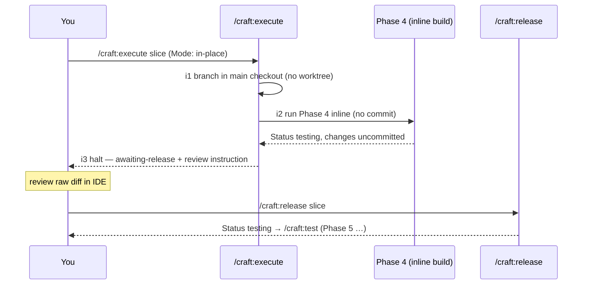

# Slice 018 — Inplace Autonomous

> Completed: 2026-07-02
> Commits: b44b626..d39eef3 (branch main, no PR)

## What

`/craft:execute` gains an **in-place** execution mode: when the profile sets
`Execution → Mode: in-place`, it builds a single slice on a branch in the **main checkout**
(no worktree, no `slice-builder` subagent), makes **no commits**, and **halts before
Phase 5** so the human reviews the raw uncommitted diff in their IDE. A new `/craft:release`
command lifts that halt and resumes the slice into Phase 5. The worktree/parallel path is
untouched (epic Decision C).

## Why

- First epic-001 slice that makes `/craft:execute` *act* on the profile — slice-015 built
  the schema and slice-017 populated it; this one reads `Mode` and `Auto-commit`.
- In-place is single-slice by nature (the main checkout cannot host parallel slices), so
  epic-level in-place is deferred to the `epic-sequential` slice; A7 rejects an epic target
  in in-place mode.
- The halt/resume uses a **dedicated** `/craft:release` gesture (over reusing the
  handoff/pause machinery) because "commit only on your release" is a first-class human
  approval-to-proceed checkpoint, semantically distinct from a context break.

## Decisions

- **Single-slice in-place scope** — this slice handles only `/craft:execute <slice-NNN>` with `Mode: in-place`; epic-level in-place (an epic's slices run sequentially in place) is deferred to `epic-sequential`. *Why not* include epic-level now: it overlaps `epic-sequential` and would balloon the slice; the single-slice mechanic is the reviewable foundation.
- **Dedicated release gesture, not reused handoff/pause** — the in-place halt is resumed by a new `/craft:release` command, chosen over reusing the slice-builder handoff/pause machinery. *Why* a dedicated gesture: "commit only on your release" is a first-class human approval-to-proceed control point, distinct from a context-poisoning handoff or a mid-phase pause; the named gesture makes the release explicit and discoverable. Stays in the `/craft:` namespace (consistent with intent.md's non-goal against short-name shims).
- **Phase-9 finalize of the in-place branch is out of scope** — this slice takes an in-place slice up to `/craft:release` → Phase 5; the remaining phases + commit use existing commands. `/craft:commit`'s Standard mode commits on the *current* branch and does not merge a branch to `main`, so finalizing an in-place `<slice-id>-<slug>` branch needs an "in-place-finalize" mode in `/craft:commit` (see Follow-ups). *Why not* build it here: it is `/craft:commit` surface, outside this slice's `execute` + `release` scope.

## Commits

- `b44b626` — feat(execute): in-place autonomous execution mode + /craft:release
- `c77be69` — fix(commit): point awaiting-release recovery at /craft:release
- `093b7ad` — docs: document in-place execution mode
- `d39eef3` — chore(plans): bump slice counter to 19

## Follow-ups

> Optional — light / needs-rethinking findings carried over from Phase 8 Review. Each is a candidate for a future slice.

- **Phase-9 in-place-finalize mode in `/craft:commit`** — merge the in-place `<slice-id>-<slug>` branch → `main` (analogous to the existing Slice-finalize worktree mode). Without it, `/craft:commit` Standard mode commits the in-place work on the branch but leaves it un-merged on a direct-merge/trunk project; `release.md` breadcrumbs this and advises a `pull-request` workflow or a manual merge until it ships. Reviewer-judged non-blocking (the vertical increment is testable without reaching `main`). Candidate for a future slice.
- Phase-8 Round 1 returned 0 heavy, 6 light (all local-edit) + 1 Round-2 residual light — all 7 fixed in-phase (in-phase fix cap of 5 waived). No open findings beyond the in-place-finalize follow-up above.

## How (Diagram)

