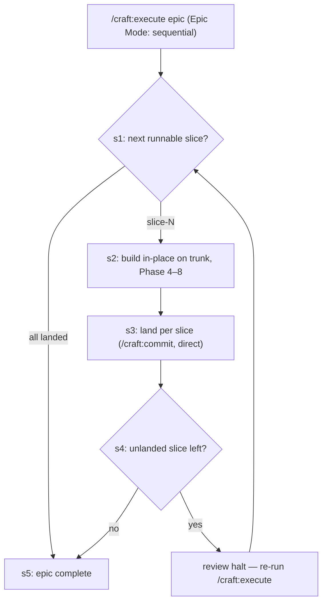

# Slice 020 — Epic Sequential

> Completed: 2026-07-06
> Commits: c7d032c..9cee353 (branch main, no PR — this repo is trunk-based)

## What

`/craft:execute` gains a **sequential epic mode**: when the profile sets `Epic Mode:
sequential`, execute runs an epic's slices **one-by-one in dependency order** — each built
in-place on the trunk in the main checkout and **committed per slice**, with a **review halt
between slices** (re-run continues) — instead of the parallel worktree fan-out. Scoped to the
`direct` merge workflow (see Follow-ups). Epic-001's **last** slice; the parallel path is
unchanged (additive, epic Decision E).

## Why

- Final epic-001 slice acting on the profile: slice-015/017 built + populated the schema,
  slice-018 (in-place) + slice-019 (per-slice PR) built the per-slice mechanics; this reads
  `Epic Mode` and adds the sequential orchestration on top.
- In-place per slice matches the profile's "one-by-one in place" and reuses slice-018 — no
  worktrees, no epic-branch; each slice lands on its own.
- Phase-8 review drove real scope changes (three rounds): a "fix everything now" loop-back
  **resolved two load-bearing prerequisites** (implemented slice-018's in-place-finalize;
  made `/craft:commit` A1 status-aware, resolving slice-019's A1/epic follow-up); a second
  round of protected-main-specific depth led to a deliberate **rescope to `direct`-only**,
  deferring the protected-main × sequential combination as a focused follow-up.

## Decisions

- **Autonomous-in-place per slice + review halt between** — each slice runs Phase 4–8 in-place, commits per slice, and execute halts for review between slices (resume on re-run). The Phase-5 `[W]/[B]/[U]` + review escalations still halt per slice; "autonomous" means no per-phase re-invocation, not fabricated answers.
- **In-place substrate, no worktree fan-out** — sequential slices build in the main checkout (matches "one-by-one in place"; reuses slice-018); no worktrees, no epic-branch — each slice lands on its own.
- **Additive — the parallel path is untouched (Decision E)** — `Epic Mode: parallel` (default) keeps the exact worktree fan-out + epic-branch merge; sequential is a separate orchestration branch.
- **Per-slice landing delegates to the Merge Workflow** — each slice lands via `/craft:commit` (`direct` → `main`); sequential invents no commit mechanic of its own.
- **Scope expanded in review to resolve two prerequisites** — `/craft:commit` A1 now disambiguates a multi-plan set by `Status: committing`/`awaiting-approval` (resolves slice-019's A1/epic follow-up); in-place-finalize is now implemented (resolves slice-018's follow-up).
- **Rescope: `direct`-only; protected-main × sequential deferred** — after two rounds of protected-main-specific blockers on a clean `direct` path, the user chose to ship `direct`-sequential and defer protected-main × sequential; sequential now guards against the combo. *Why:* `direct`-sequential is a complete increment; protected-main × sequential stacks in-place + PR-gate + sequential + remote sync and deserves its own slice.

## Commits

- `c7d032c` — feat(execute): sequential epic mode (Epic Mode: sequential, direct workflow)
- `1ff55a3` — feat(commit): status-aware A1 + in-place-finalize
- `c39c371` — docs: document sequential epic mode
- `9cee353` — chore(plans): bump slice counter to 21

## Follow-ups

> Optional — light / needs-rethinking findings carried over from Phase 8 Review. Each is a candidate for a future slice.

- **protected-main × sequential epic** (carried, deferred) — a sequential epic under a `pull-request` + `Protected-main` profile. It needs the in-place PR-branch resume (the mid-landing slice sits on its branch while `/craft:execute`'s A3 requires the trunk) plus local↔remote sync after each `gh pr merge`. Guarded (execute aborts the combo with a clear message); a focused future slice.
- **Resolved by this slice** (were carried from 018/019): slice-018 **in-place-finalize** (now implemented in `/craft:commit` Step 7) and slice-019 **A1/epic multi-plan** (now disambiguated by Status in `/craft:commit` A1).

## Review notes

Phase 8 took **3 rounds**: R1 found `/craft:commit` A1 blocked the sequential landing (multi-plan abort) + protected-main non-functional → "fix everything now" loop-back (resolved the 018/019 follow-ups); R2 verified the `direct` loop clean but found protected-main × sequential still had 2 Heavy/rethink (A3-vs-PR-branch dead-end, local-main-stale) → rescope loop-back (direct-only + guard); R3 verified coherent + regression-free (2 dangling-ref + 1 README light fixed in-phase).

## How (Diagram)

