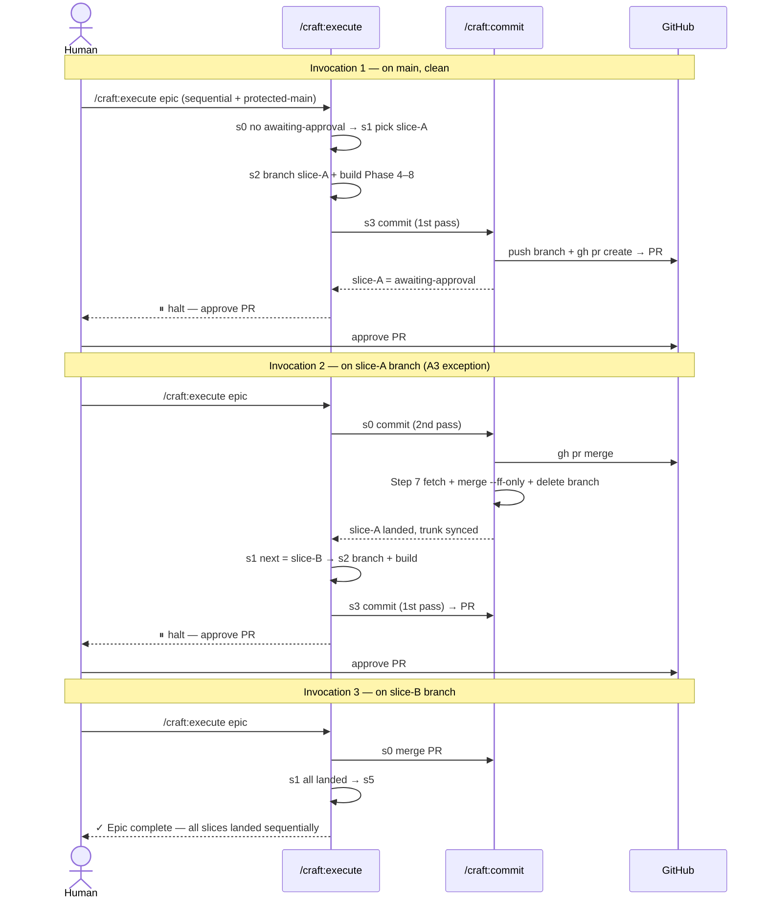

# Slice 021 — Protected-main × sequential epic

> Completed: 2026-07-07
> Commits: 96a1d11..7b6e8e9 (branch-only, no PR — this repo runs `direct` merge)

## What

A sequential epic can now run under a protected-main pull-request profile. Previously
`/craft:execute <epic>` hard-aborted the combination `Epic Mode: sequential` +
`Merge → Type: pull-request` + `Protected-main: yes` (the slice-020 guard); now each slice of
the epic lands one-by-one through its own human-approved PR, with an automatic local↔remote
trunk sync between slices.

## Why

- **Reuse over rebuild** — the protected-main PR gate in `/craft:commit` (slice-019) and its
  Step-7 In-place-finalize sync already existed and were shaped forward-compatibly by
  slice-020, so this slice adds almost no new mechanism; it *orchestrates* the existing one.
- **Resume-via-re-run** — a PR waits on a human GitHub approval (seconds or days), so the run
  halts and is continued by re-running `/craft:execute <epic>`; this survives `/clear` and
  context resets (the git checkout persists on disk) and mirrors the handoff/continue pattern.

## Decisions

- **Resume-via-re-run** — the post-approval continuation is a stateless re-run of
  `/craft:execute <epic>` that detects the `awaiting-approval` slice and resumes. *Why not* an
  in-loop blocking wait: it would tie up the session for the whole epic and not survive a reset;
  *why not* letting `/craft:commit` drive the loop: it would leak orchestration into the commit
  surface.
- **Scope bounded to reuse of the existing PR gate** — `/craft:commit`'s protected-main gate is
  invoked unchanged per slice; this slice adds only the resume + local↔remote sync around it.
  *Why not* re-implement: it would duplicate slice-019.
- **slice-019 "A1 multi-plan" out-of-scope** — sequential mode has no epic-branch merge (each
  slice lands its own PR via `s3`), so `/craft:commit`'s Epic-finalize path is never reached
  here and the "A1 exactly-one-plan vs Epic-finalize multi-plan" follow-up is not a
  prerequisite. *Why not* fold it in: it is genuinely separate Epic-finalize surface.
- **A3 relaxation is narrow** — the "clean tree on trunk" precondition is loosened only for the
  resume case, and (after Phase-8 review) only for the awaiting-approval slice's own PR branch,
  with a directed abort when resumed off the trunk. *Why not* also admit the trunk: `/craft:commit`'s
  A6 aborts a second-pass merge on the trunk, so admitting it would mislead the agent into a
  broken abort + lock-leak.
- **Test = structural + scratch-repo dogfood** — verification runs `claude plugin validate` +
  structural assertions + a documented dry-run trace; no live PRs against CRAFT's own `main`.
  *Why not* a live in-repo dogfood: it needs real GitHub approvals and would be invasive on the
  plugin's trunk.
- **Adjacent stale-breadcrumb fix in `release.md`** — corrected the false "in-place-finalize is a
  pending follow-up" claim (shipped in slice-020's `/craft:commit` Step 7). *Why not* defer: a
  false "does not yet" claim in the exact adjacent doc is a coherence bug, not new scope.

## Commits

- `96a1d11` — feat(execute): land sequential-epic slices via protected-main PR workflow
- `6f0021d` — docs(release): correct stale in-place-finalize breadcrumb
- `7b6e8e9` — chore(plans): bump slice counter to 22

## Follow-ups

> Optional — light / needs-rethinking findings carried over from Phase 8 Review. Each is a candidate for a future slice.

- **Sequential epic never finalizes its epic plan / writes an epic archive** (Phase-5 finding) —
  the Sequential epic path (s1–s5) has no epic-plan removal or epic-level archive step: each
  slice self-lands via its own `/craft:commit` (which only `rm`s the *slice* plan), so after the
  last slice lands, `epic-<NNN>-*.md` lingers in `.claude/plans/` and no
  `.claude/project/slices/epic-<NNN>-*.md` is written. **Pre-existing from slice-020**, affects
  `direct` sequential equally — candidate for a "sequential epic finalize/archive" slice.
- **Mid-slice hard-stop recovery under protected-main is under-specified** (Phase-8 Light ·
  Rethink) — a naive `/craft:execute` re-run after a hard stop hits A3's dirty-tree abort; the
  real recovery is finish-slice → `/craft:commit` opens the PR → re-run. Pre-existing shape,
  symmetric with the `direct` sequential path (slice-020) — a doc/UX clarification for a future
  slice.

## How (Diagram)

