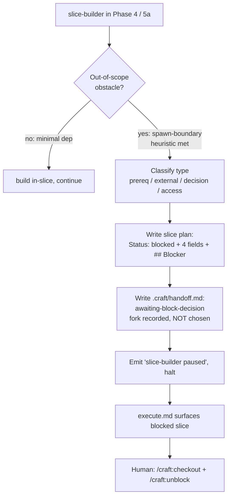

# Slice 026 — Autonomous blocker handoff

> Completed: 2026-07-08
> Commits: 0ed3c0b..d8e6b6d (branch main, trunk-based)
> Epic: epic-002 (Blocked Slice Status), slice 4 of 4

## What

CRAFT's first-class `blocked` state now has an autonomous frontend. When the `slice-builder`
subagent hits an out-of-scope obstacle during a `/craft:execute` run — with no human present to
run the interactive `/craft:block` fork — it classifies the blocker on the four-type taxonomy,
writes the full `blocked` state itself (mirroring `/craft:block`'s schema field-for-field), and
halts with a canonical `.craft/handoff.md` marker at `Status: awaiting-block-decision`. This is
the autonomous counterpart to the interactive `/craft:block` and completes epic-002.

## Why

- **Full state, not a proposal** — the autonomous path writes the real `blocked` frontmatter +
  `## Blocker` section rather than a handoff-only suggestion, so the surfacing and orphan
  detection built in slice-025 light up immediately without waiting on a human to formalize it.
- **Classify but don't decide** — the agent classifies the blocker *type* (an observable
  property) but never picks the `spawn / park / descope` resolution; that human direction call
  is the whole reason `blocked` exists (to stop unattended scope creep), so it is recorded in the
  handoff, never fabricated. This extends the baseline's "never fabricate a human answer" stance.
- **One schema, reused** — reusing `/craft:block`'s frontmatter + `## Blocker` schema
  field-for-field keeps all downstream consumers (prime/status surfacing, `/craft:unblock`,
  `/craft:commit` auto-resurface) working unchanged.

## Decisions

- **Autonomous path writes the FULL `blocked` state** — chosen over a handoff-only proposal.
  *Why not handoff-only*: the block would not be a real state until the human formalized it, so
  prime/status would show it as a generic paused handoff and orphan detection would stay dark.
- **Agent classifies the type, never the fork** — the `prerequisite-work` spawn/park/descope
  choice is a human direction decision. *Why not let the agent choose*: a direction change under
  concentrated control is the human's call; auto-choosing would reintroduce the scope creep
  `blocked` exists to prevent.
- **New handoff status token `awaiting-block-decision`** — joins the `awaiting-*` family in the
  canonical handoff schema (`skills/workflow/SKILL.md`); it is the one token that pairs with a
  slice plan at `Status: blocked` (not `paused`) and resolves via `/craft:unblock`.
- **Implements design record `d1-blocked-state.md` item 4** — the converged design was the spec;
  this slice added no new architecture beyond the two decisions above.
- **Phase 7 skipped** — per the project rule dropping Refactor for this Markdown-authoring repo.

## Commits

- `0ed3c0b` — feat(execute): autonomous blocker handoff for slice-builder
- `d8e6b6d` — chore(plans): bump slice counter to 27

## Follow-ups

> Optional — light / needs-rethinking findings carried over from Phase 8 Review. Each is a candidate for a future slice.

- (none — all 5 Phase-8 findings were Local edits, fixed in-phase)

## How (Diagram)

