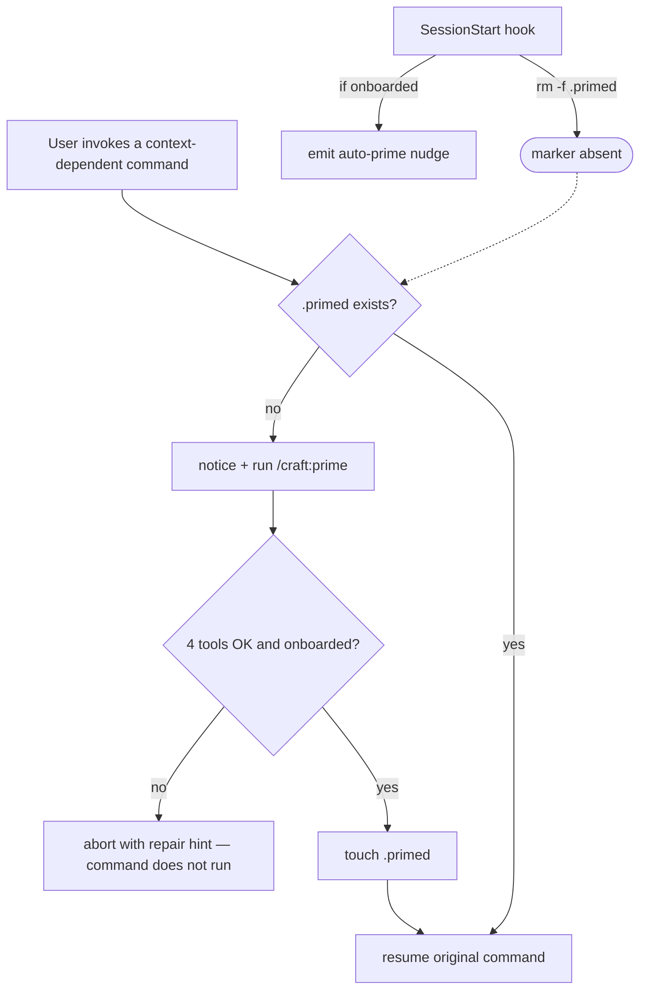

# Slice 028 — Auto-prime fallback + tool guard

> Completed: 2026-07-08
> Commits: c25e7a9..6d39145 (branch only, no PR)

## What

Context-dependent CRAFT commands now self-protect against running in an unprimed
session. A shared **ensure-primed gate** in each command's pre-flight checks a
per-session `.claude/plans/.primed` marker and, when it is absent, auto-runs
`/craft:prime` — which loads project context **and** verifies the four required tools —
before the command proceeds. Previously such a command, invoked in a fresh or `/clear`ed
session where the SessionStart auto-prime nudge was skipped, could run on unloaded
context or an unverified toolchain. Roadmap item **F2**.

## Why

- **In-command gate (spec), not a `UserPromptSubmit` hook** — pure Markdown that avoids
  depending on unverified Claude Code hook-firing behavior for slash-command prompts.
- **Session-scoping via SessionStart-clears-marker** — prime writes the marker, the hook
  deletes it at session start; per-session semantics with no session-ID plumbing, and a
  correct re-trigger after `/clear`.
- **Tool guard inherited from prime** — routing through `/craft:prime` reuses its strict
  four-tool health check + repair hints; no second mechanism.
- **Classification lives in the workflow SKILL** — context-free commands are exempt so
  quick read-only / maintenance and pre-onboarding ideation operations are not forced
  through a full prime.

## Decisions

- **In-command gate (spec), not a hook** — the check lives in each command's pre-flight via a shared workflow-SKILL sub-procedure. *Why not the `UserPromptSubmit` hook*: it depends on the hook firing for slash-command prompts, which needs Claude Code behavior verification; the in-command approach is pure Markdown with no unverified behavior. Hook remains possible future hardening.
- **Session-scoping via SessionStart-clears-marker** — prime writes `.primed`; the SessionStart hook deletes it at session start. *Why not* a bare persistent marker: it would falsely read "primed" in a later session. *Why not* a session-ID-matched marker: needs ID plumbing into an agent-run Markdown command. The chosen form also correctly re-primes after `/clear` (context genuinely wiped then).
- **Tool guard inherited from prime, not a separate mechanism** — auto-running `/craft:prime` already performs the strict four-tool health check with repair hints; F2's tool-availability guard is satisfied by routing through prime rather than duplicating the check.
- **Classification lives in the workflow SKILL** (the gate's home), not a separate design file — membership is refinable; edge-case flow commands are classified context-free to avoid forcing a full prime on quick read-only / single-file operations.
- **Worktree-seed contract for `/craft:execute`** (Phase-8 finding H1) — `/craft:execute` seeds `.claude/plans/.primed` into each worktree right after `git worktree add`, so the gate is a silent no-op for `slice-builder` subagents. *Why*: SessionStart hooks do not fire for `Task` subagents and the marker is gitignored (absent from a fresh checkout), so the un-seeded gate would auto-run `/craft:prime` inside every worktree — redundant at best, an abort of the autonomous run at worst. The seed is truthful: the orchestrator primed on `main` and briefs each subagent with intent/rules.
- **`brainstorm` / `grill-me` classified context-free** (Phase-8 finding H2) — the Phase 1/2 ideation commands precede both code and the plan; `brainstorm` in particular may open a green-field, pre-onboarding session where `/craft:prime` (which requires onboarding) could not run anyway.
- **`worktree-clean` classified context-free** — a git/worktree maintenance command that self-checks onboarding in its own Pre-Assertions and needs no loaded project context (the plan's original enumeration omitted it; classified during Phase 4 to make the classification total).

## Commits

- `c25e7a9` — feat(prime): ensure-primed gate for context-dependent commands
- `6d39145` — chore(plans): bump slice counter to 29

## Follow-ups

- The "re-triggers after `/clear`" guarantee assumes SessionStart fires on `/clear` (the same mechanism the pre-existing auto-prime already relies on) — worth an empirical confirmation in a behavioral spot-check.
- A seeded `.primed` in a **retained** worktree (after a handoff/pause) is never cleared by SessionStart (which only clears main's marker); a fresh session that manually `cd`s into a leftover worktree and runs a phase command directly would see a stale "primed". Benign — such a session auto-primes on `main` and normal resumption routes via `/craft:continue` / `/craft:release` / `/craft:execute` from `main`, not direct in-worktree invocation.

## How (Diagram)

