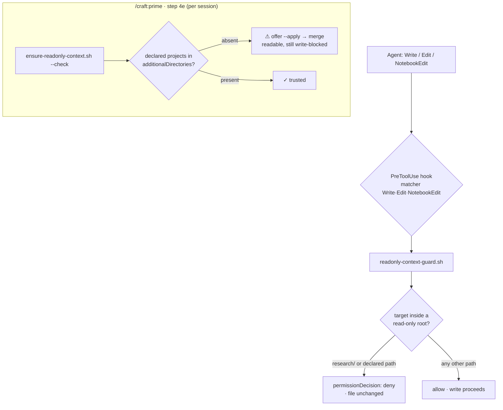

# Slice 029 — F1 Read-only context sources

> Completed: 2026-07-08
> Commits: a98e58a..6e7c444 (branch only, no PR)

## What

Adds a read-only context guard. A project keeps reference material the agent may **read
but never write** — the in-repo `research/` folder (auto-protected by name) and declared
external "connected projects". A PreToolUse hook (`readonly-context-guard.sh`, matcher
`Write|Edit|NotebookEdit`) denies writes whose target is inside a read-only root; declared
external projects are made *readable* via `permissions.additionalDirectories` while staying
write-blocked. Previously nothing stopped an agent or subagent from overwriting the cloned
reference repos already sitting in the gitignored `research/` dump.

## Why

- **Formalize what exists** — `research/` was an unprotected de-facto dump (gitignored, 0
  tracked files); F1 guards it rather than introducing a new folder.
- **Hook + hard-block** — a PreToolUse hook is the roadmap's chosen "teeth" (works
  regardless of permission config) and denies outright, not warns.
- **Fail-open safety** — if `jq`/JSON parsing breaks the guard allows rather than blocking
  every write; this is a soft guard, not a security boundary.

## Decisions

- **Full F1 in one slice** — both read-only sources (in-repo `research/` and declared
  connected projects) shipped together, unified by the single PreToolUse write-guard. *Why
  not* a minimal research-only slice or an epic split: the two facets share one mechanism
  and one testable surface.
- **Two input paths, one guard** — `research/` is auto-detected by convention; connected
  projects are *declared* (a `## Read-Only Context Sources` list in `rules.md`). *Why not*
  convention for both: an arbitrary external repo path cannot be convention-detected.
- **Hard-block, not warn** — the guard emits `permissionDecision: "deny"`. *Why not* a soft
  warning: the roadmap specifies "blocking".
- **Reuse slice-014's additionalDirectories merge** — `ensure-readonly-context.sh` mirrors
  `ensure-worktree-trust.sh` (idempotent, atomic, gitignored) and is wired into
  `/craft:prime` step 4e. *Why not* a bespoke merge: the pattern is proven and append-only,
  so the two helpers coexist without conflict.
- **Declaration home = `rules.md`** — the `## Read-Only Context Sources` block follows the
  `## Worktree Settings` operational-block precedent. *Why not* `craft-profile.md`: the
  parallel additionalDirectories feature already lives in `rules.md`.

## Commits

- `a98e58a` — feat(hooks): read-only context guard for research/ and connected projects
- `c2d05de` — feat(prime): trust declared connected projects read-only via additionalDirectories
- `fe5399c` — test(scripts): harness for read-only context guard and sync helper
- `ba38263` — docs: document read-only context sources (F1)
- `025e3cf` — chore(plans): bump slice counter to 30
- `6e7c444` — docs(roadmap): drop completed F2 from backlog

## Follow-ups

> From Phase 8 Review (0 heavy, 6 light — non-blocking). Two Light + needs-rethinking
> findings deferred; both fold into one future slice.

- **Lexical path normalization for the guard** — the guard compares the target with a
  literal string prefix and never canonicalizes, so a `..` segment can bypass
  (`commands/../research/x` → allowed) or false-deny (`research/../commands/x` → blocked).
  Unreachable via Claude's canonical absolute paths today. The same fix unifies the
  guard's `awk` parser with the helper's `python3`/`normpath` parser so a declared `..`
  path can't be readable-but-unguarded. Add the deferred `..`-traversal test cases with it.
- **Matcher maintenance note** — if Claude Code ever adds a file-write tool beyond
  `Write|Edit|NotebookEdit`, extend both the `hooks.json` matcher and the guard's `case`.

## How (Diagram)

