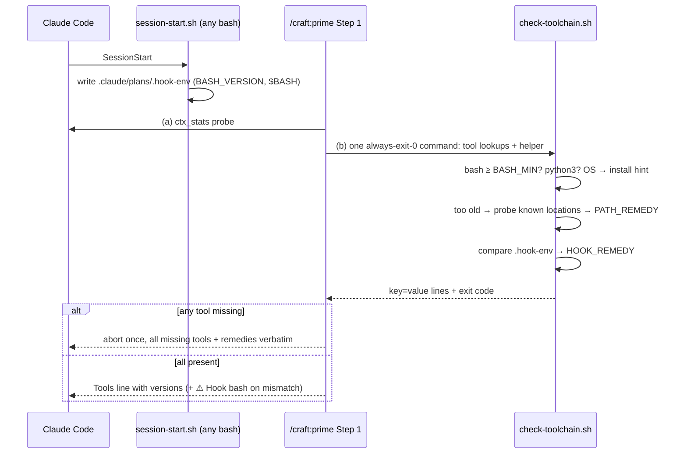

# Slice 033 — Modern bash baseline

> Completed: 2026-09-13
> Commits: 907748d..0f45648 (branch only — direct-to-main)
> Review rounds: **2** (two-pass round 1 per D33 → Phase-4 loop-back; one agreed re-review with targeted verification)
> Roadmap: F4 — "Modern-bash baseline"

## What

CRAFT requires bash ≥ 5.0 and python3, and `/craft:prime` checks both at every session start. Prime
now **collects every missing tool first and aborts once** with the complete list and a fitting
command — brew on macOS, the distribution's package manager on Linux (yum for EL7 / Amazon Linux 2),
WSL 2 on Windows. When a current bash **is installed but not on this session's PATH** — typically a
desktop-app or IDE launch — prime says exactly that and gives the PATH remedy instead of an install
command.

`scripts/check-toolchain.sh` defines the minimum once and reports bash, python3 and the OS;
`hooks/session-start.sh` records the bash the hooks actually get in `.claude/plans/.hook-env`;
`scripts/test-toolchain-check.sh` (59 cases) guards both, including real runs of all hooks under
`/bin/bash` 3.2.

## Why

- **Collect-then-abort** — a headless probe showed an agent stopping at the first missing tool, which
  costs the user a second install round.
- **The off-PATH case is the realistic one** — the planning assumption was wrong: the Bash tool does
  not reliably pick up the shell profile's PATH but inherits the launch PATH, like the hooks. In the
  desktop-app case a current bash is usually installed but unreachable, and `brew install bash` is
  the wrong advice.
- **Real bash-3.2 protection instead of a syntax check** — `bash -n` misses bash-4 constructs, and
  even a 3.2 run stays green because bash 3.2 skips the broken command. Hence two independent
  detectors (promoted to `rules.md`).
- Unchanged: the 5.0 minimum is the user's decision; hooks and the check script stay 3.2-compatible;
  the minimum lives only in the script; `env.PATH` is verified to reach hooks (expected for the Bash tool).

## Decisions

- **Minimum bash 5.0** (user decision) — CRAFT is a developer tool and may require current bash.
  *Why not* 4.4: the user prefers the current state of the art over enterprise-LTS coverage.
  Repology (2026-09-13): 5.x on Ubuntu 20.04+, Debian 11–13, EL9, Fedora, Alpine, Arch, Homebrew;
  **4.4** on RHEL/Alma/Rocky 8 and openSUSE Leap 15.6, **4.2** on Amazon Linux 2 — the hint says so.
- **Hook bash older than the Bash tool's → warning, not abort** (user decision) — hooks stay
  3.2-compatible and keep working; only modern-bash scripts would be affected.
- **Hooks stay bash-3.2-compatible permanently; `scripts/` may use modern bash** (user decision) —
  only a 3.2-safe SessionStart hook can report an old bash, and a hook that fails to start would leave
  the read-only guard fail-open. Banked in `rules.md` (Bash baseline).
- **Detect the hook's bash from inside a hook** — the only reliable reading is `BASH_VERSION` inside
  the SessionStart hook, persisted next to `.primed`: one record per project folder, rewritten at every
  session start (concurrent sessions in one folder overwrite each other — the remedy says so).
- **`env.PATH` reaches hooks — verified** (Claude Code 2.1.270) — two headless runs launched with
  `PATH=/usr/bin:/bin`: without an `env` block the hook ran `/bin/bash` 3.2.57; with
  `"env": {"PATH": "/opt/homebrew/bin:…"}` it saw that PATH and ran bash 5.3.15. Verified for hooks,
  expected (unverified) for the Bash tool; whether settings `env` values expand `$PATH` is unverified,
  so remedies ask for the literal output of `echo $PATH`.
- **Amazon Linux 2 → yum, not dnf** — AL2 predates dnf; only AL2023 ships it.
- **Locale-independent version probe** (review round 2, Heavy) — bash localizes `--version`
  (`GNU bash, Version 5.3.15` on a German Mac with `LANG` unset), which silently broke the off-PATH
  detection; candidates now answer `LC_ALL=C <bash> -c 'printf "%s" "$BASH_VERSION"'`.
- **Scope extension (user-approved)** — the ensure-primed gate sentence dropped "four required tools"
  in 14 commands + two skills; the workflow skill's Tool Dependencies table gained bash and python3.
- **H1 lesson → `rules.md` `[R]`** — a 3.2 runtime pass alone is false comfort (mutation M10 stayed
  43/43 green under `/bin/bash`); scanner + 3.2 run with shell-error-text assertion, each proven by a
  mutation the other misses (M12 via `eval`).
- **D33 carve-out waived** (user) — probe B's surprise (Bash tool inherits the launch PATH) was
  explained by automated probes; a real Dock/IDE launch is checked live at the next release.
- **Loop-back and review-cap handling** (user) — round 1's 14 local findings exceeded the fix cap;
  they became four hardening sub-tasks + a fresh Phase-5 report instead of a waived cap. Round 2's
  9 findings were fixed in-phase and verified targeted (mutations M21–M24, one prime probe without
  LANG) instead of a third review round.
- 22 further plan entries (Phase-5 evidence rounds, verdicts, probe observations) were kept `[K]`
  and are summarized in the review record below; the autopilot observation (concurrent sessions
  knocking out context-mode) went to `.claude/project/design/autopilot-mode.md`.

## Commits

- `907748d` — chore(plans): bump slice counter to 34
- `df72387` — feat(hooks): record the bash the SessionStart hook runs with
- `36b1ba4` — feat(scripts): check bash >= 5.0 and python3 with OS-aware remedies
- `8ae802f` — feat(prime): require bash >= 5.0 and python3 in pre-flight
- `41469eb` — test(scripts): guard the status-graph harness against an old bash
- `2f1f631` — docs: document the bash >= 5.0 / python3 requirement
- `52b9e4e` — docs(design): note concurrent sessions knocking out context-mode
- `0f45648` — docs(rules): require two detectors for bash-3.2 compatibility

## Follow-ups

- **R1 · Light · Rethink** — `.hook-env` (and the pre-existing `.primed`) are not gitignored in consumer
  projects; `/craft:onboard` adds no ignore entries. `/craft:execute` A3 needs an empty
  `git status --porcelain`, which untracked `.claude/plans/` files make unlikely.
- **R2 · Light · Rethink** — desktop/IDE users may see a permanent `⚠ Hook bash` line with no current
  impact; consider informational wording/level (partly addressed by L6).
- **R3 · Light · Rethink** — the status-graph harness guard reuses the full toolchain helper (python3,
  off-PATH and Claude-Code launch advice) instead of a bare bash-version check.
- **Status-graph gap** — `/craft:review` recommends a loop-back to Phase 4, but no command writes
  `reviewing → implementing` and `/craft:build` does not read `reviewing`; the edge is unmarked and
  unrowed in `skills/workflow/SKILL.md`, so the status-graph harness cannot see it. Set by hand here.
- **Docs site** — `docs/index.html` (EN/DE) still lists four required tools; `test-docs-site.sh` does
  not check the list. Update via the docs-site skill at the next release.

## Known limits (disclosed, not closed)

- **Invisible until a release** — the installed 1.4.0 has none of this; normal sessions show it only
  after a version-bumped release, or in a `--plugin-dir` session.
- **`⚠ Hook bash` rendering never shown live** — covered by harness output assertions only.
- **Verbatim rendering cannot be forced** — in the no-LANG probe the agent reformatted the PATH remedy
  into a list (meaning preserved, "never `$PATH`" dropped); prose cannot enforce verbatim output.
- **Windows hints untested** (F5); Oracle Linux / SLES release notes are inferred, not repology-listed.

## Phase-8 Review Record

- **Round 1** — two passes (rubric + 11-scenario walk-through with empirical fixtures): 1 Heavy · Local
  (H1 "hooks stay 3.2-compatible, harness-guarded" was false — `bash -n` accepts bash-4 constructs, the
  read-only guard never ran under 3.2), 13 Light · Local (L1 abort-on-first-tool, L2 note scoping, L3
  old-release coverage, L4 incomplete-check rendering, L5 `.hook-env` per folder, L6 mismatch line,
  L7 onboard tool list, L8 exit 127, L9 python3 exit code, L10 Windows hint, L11 literal 5.0, L12
  base-10/CRLF, L13 redirect order), 2 Light · Rethink (R1, R2). → Phase-4 loop-back (mutations M10–M17),
  Phase-5 rounds 2–3 incl. the `[U]` off-PATH iteration (M18–M20).
- **Round 2** — the one agreed re-review: round-1 fixes verified (12/14 fully, L2/L8 partial → N3/N2);
  1 Heavy · Local (RH locale-dependent version parse), 8 Light · Local (N1 remedy wordings, N2 helper
  not found vs. bash missing, N3 duplicated note, N4 partial 3.2 coverage + scanner gaps, N5 claims
  exceeding evidence, N6 stale headers, N7 D33 waiver unrecorded, N8 onboard path), 1 Light · Rethink
  (R3). All local findings fixed in-phase; verified with harness 59/59 under bash 5.3, `/bin/bash` 3.2,
  `env -u LANG` and `LANG=de_DE.UTF-8`, mutations M21–M24, and a prime probe without LANG.

## How (Diagram)

