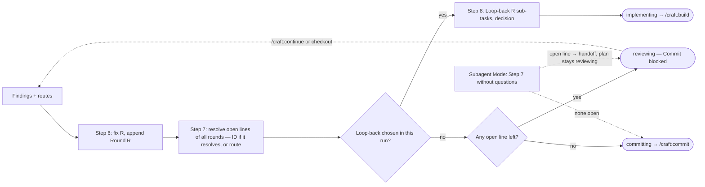

# Slice 034 — B3 review loop-back

> Completed: 2026-09-13
> Commits: 52eb9e8..29e2dc9 (branch only — direct-to-main)
> Review rounds: **3** (two two-pass rounds per D33, each ending in a loop-back to Phase 4; round 3 by targeted verification, user decision)
> Roadmap: B3 — "Review loop-back unmodelled"

## What

When the human routes a review finding back to Phase 4, the slice now actually goes there — new
sub-tasks, a decision entry, `Status: implementing` — and `/craft:continue` / `/craft:build` pick it up
without a hand edit. Open review findings are no longer lost or stuck on any path: every review round
offers everything still open from earlier rounds again (legacy plans without round headings included) —
spin-offs get their slice-ID, but only if that slice really exists; unrouted findings and fix-cap leftovers
get a route afterwards, a loop-back included. The autonomous run checks the same record: while anything
is open it writes a handoff, leaves the plan at `reviewing`, and never writes `committing`.

## Why

- **The loop-back was a graph hole of the B1 kind** — prose promised a transition no command wrote and no
  table row declared, so the status-graph harness could not see it; slice-033 had to set
  `reviewing → implementing` by hand.
- **A fresh reviewer never sees earlier rounds**, so the findings record has to carry them. Without that,
  a re-review could silently open the Commit gate on a spun-off finding (round 1, H2), and a `route pending`
  line written by the autonomous path could never be closed and would block Commit forever (round 2, N1).
- **One description per rule** — the autonomous gate had its own "open" judgment in `slice-builder`, and the
  loop-back was described in three places that had already drifted; `review.md` Step 7/8 and Subagent Mode
  are now the single definitions, everything else points to them.
- **A check that checks nothing stays green** — the delegation check bound only a token's presence: a
  renamed Step 8, a moved marker, a missing file and an emptied table all passed.

## Decisions

- **`/craft:review` writes `implementing`, at exactly one place (Step 8)** (user) — new row
  `/craft:review → implementing → /craft:build`. *Why not* `/craft:build` reading `reviewing`:
  `/craft:continue` routes `reviewing` to review, so the hand edit would remain and `reviewing` would get two
  consumers. *Why not* a new `reworking` status: five token lists for no behavior `implementing` lacks.
- **Both triggers run into one step** (user) — a Heavy · Rethink loop-back route and an accepted fix-cap
  escalation (slice-033 looped back through the cap). The cap fires only while local findings remain open.
- **The record, not the reviewer, carries earlier rounds** — Step 6 appends `### Round <R>` (legacy flat
  records count as one round; `R` fixed before writing); the open set is `new slice (pending)`,
  `route pending`, `open — fix cap, awaiting decision`. Step 7 first resolves open lines of every Phase-8
  round — a spin-off only with a slice-ID that resolves to a plan or archive file, an earlier unrouted or
  fix-cap line with a route recorded in place — then: loop-back chosen → Step 8; open line left → blocked;
  else clear. Earlier rounds change only by an ID or a route; remarks go under the current round as `note ·`.
- **Subagent Mode is the one definition of the autonomous review outcome** — `route pending` for Heavy ·
  Rethink, `open — fix cap` for an unaccepted cap batch, Step 7 without questions; an open line writes the
  `awaiting-rethink-decision` handoff and does **not** pause the plan (a paused plan never reached Step 8).
  `slice-builder`, the workflow skill and `/craft:execute` point there; the harness's delegation token binds it.
- **Harness delegation check resolves targets and binds its table** — the token's target heading must carry
  the rule's write marker (location, not meaning), a default branch reports crashes, and the table is bound
  to the `craft:delegates` tokens in `commands/` in both directions.
- **No new D-entry** — completes D28's escalation route inside the slice-031 marker contract (stated at
  planning, not objected to).
- **Scope extensions accepted** by starting `/craft:build` after the note: `agents/slice-builder.md`,
  `commands/execute.md`, `commands/recap.md` (revise an existing draft in place; a human revision drops the
  subagent flag).
- **Dogfooded** — both loop-backs were run by hand from the working tree's new Step 6 → 7 → 8 (the installed
  1.4.0 has none of it); following it exposed the round off-by-one and forced this plan's own legacy round-1
  record into `### Round 1` before round 2.
- **Probe hygiene → `rules.md` `[R]`** — scratch copy, one probe at a time, one fixture per parent directory;
  `bypassPermissions` confined to the fixture when a probe must write `.claude/plans/` (`acceptEdits` refuses);
  hooks omitted and `.primed` pre-created when the prime gate is not under test.
- **Evidence** — harness red with the row alone (83/1), then 86 → 87 checks; mutations M1–M11 each red with
  its own message (incl. M6/M7/M8/M10, which were green before the round-1/round-2 fixes); headless probes:
  probe 3 showed the Step-8 write path end to end; probe A (interactive, answers stated) showed legacy `R`,
  an invalid ID kept pending, an earlier `route pending` routed in place into Step 8, the waived-cap note;
  probe B (Subagent Mode) showed the all-rounds gate → handoff, plan left at `reviewing`, no `committing`.
  Probes 1–2 failed on probe design (hook deleted `.primed`; `acceptEdits` refused plan writes). Total probe
  cost ≈ $4.20.
- **Phase 5 verdicts `[W]` ×3 on evidence reports** — each time a hands-on run of the interactive part was
  offered (D33 carve-out) against a prepared fixture; none left a trace, so the live route dialog and the
  live Step-7 questions remain unshown.

## Commits

- `52eb9e8` — chore(plans): bump slice counter to 35
- `ede69d9` — feat(review): loop back to Phase 4 and keep open findings across rounds
- `41b03b1` — fix(recap): revise an existing recap draft in place
- `63c98db` — test(scripts): resolve delegation targets and bind the table to its tokens
- `29e2dc9` — docs(rules): add headless probe hygiene to the Phase-5 workflow rules

## Follow-ups

- **Stale handoff marker (round 1, R1 · Light · Rethink)** — after Step 8 in a worktree `.craft/handoff.md`
  still says `awaiting-rethink-decision`; no command clears markers, so the SessionStart hook,
  `/craft:execute` and `slice-builder` keep treating the slice as stopped.
- **Sequential epic (round 2, F8 · Light · Local, deferred by the user)** — unclear whether a review
  loop-back is a mid-slice hard stop in `/craft:execute`'s sequential path; under protected-main the re-run
  aborts on "branch already exists".
- **Reviewer blind to earlier rounds (round 2, F9 · Light · Rethink)** — the brief omits `## Review Findings`,
  so open spin-offs are likely re-raised each round as duplicates; showing prior rounds is an independence
  question.
- **No "resolved" route for an already-fixed finding (round 3 · Light · Rethink)** — Step 7 offers loop-back /
  spin-off / leave pending only; both probes met a finding a later round had fixed.
- **"Resolution" field not named (round 3 · Light · Rethink)** — Step 6 implies the resolution is the text
  after the last ` · `; descriptions that quote a resolution value can mislead a literal reader (a line-wide
  scan false-positived here).

## Known limits (disclosed, not closed)

- **Invisible until a release** — the installed 1.4.0 has none of this; a normal session gets it only after a
  version-bumped release, or in a `--plugin-dir` session.
- **Prose the harness cannot see** — Step 7's order and questions, the all-rounds read, the K > 0 cap
  condition, recap's revise-in-place. Deleting Step 7 case 1, emptying Step 8's prose around its marker, or a
  bold non-`Status:` status write in Subagent Mode all stay green (confirmed by sabotage).
- **Live interactive dialogs unshown** — covered by probes with answers stated in the prompt and by the
  parent following the prose by hand.

## Phase-8 Review Record

- **Round 1** — pass 1 rubric review (sabotaged harness copies) + pass 2 walk-through of 13 scenarios, both
  Phase-7 configurations: 1 Heavy · Rethink (H2 spin-offs had no mechanism to stay open), 1 Heavy · Local (H1
  subagent handoff paused the plan), 13 Light · Local (harness silent skip, unresolved token target, wrong
  NOTOKEN message, uncomputable round `R`, blocked output, missing-sub-tasks row, triple description of Step 8,
  Phase-7-kept walk-forward, recap duplicate section, either/or decision template, cap at K=0, header typo,
  case-sensitive pseudo-assertion), 1 Light · Rethink (R1). User: H2 loop-back, cap escalation accepted →
  loop-back R1 (7 sub-tasks), no in-phase fixes.
- **Round 2** — round-1 verification 13/16 full, H1 with stale references, H2 partial; new: 1 Heavy · Rethink
  (N1 `route pending` never resolvable — raised by both passes), 1 Heavy · Local (N2 autonomous gate skipped
  earlier rounds), 9 Light · Local (stale "pause" references and P2, legacy records, cap-breach resolution,
  waived-cap note, unvalidated slice-ID, recap Subagent Mode, sequential epic, SKILL delegation prose,
  unbound delegation table), 1 Light · Rethink (F9). User: N1 loop-back minimal, cap escalation accepted
  except F8 → loop-back R2 (8 sub-tasks); targeted verification instead of a third full round.
- **Round 3** — targeted verification (M10/M11 + regressions, probes A/B), no fresh reviewer pass, no Heavy;
  Step 7 on this plan: 0 open lines; 2 Light · Rethink follow-ups → clear.

## How (Diagram)

