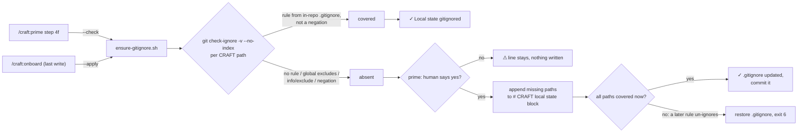

# Slice 035 — B4 consumer gitignore

> Completed: 2026-09-13
> Commits: 6ac68e7..ca4bfc2 (branch only — direct-to-main)
> Review rounds: **1** (two-pass per D33; 2 Heavy · Local fixed in-phase, cap reached)
> Roadmap: B4 — "Consumer projects do not gitignore `.claude/plans/.primed` / `.hook-env`"

## What

Every CRAFT project now keeps its local state out of git: the session marker, the hook's bash record, the execute
lock, the local settings, and the worktree handoff. New projects get this at onboarding. Existing projects get it
through `/craft:prime`, once the human agrees. Before this, a normal primed session left an untracked file behind,
and `/craft:execute` refused to start (A3, clean tree).

## Why

- **The project `.gitignore` is the only place every clone, teammate and CI run sees.** `.git/info/exclude` is per
  machine, and a self-ignoring `.claude/plans/.gitignore` is hard to see through.
- **An onboard-only fix reaches no existing project.** `/craft:onboard` A2 aborts on onboarded projects, so
  existing projects are repaired by `/craft:prime` step 4f, which writes only after a yes because `.gitignore` is
  durable state.
- **Only git knows which rule wins.** The 8 consumer repos ignore these paths in five hand-written shapes. The
  helper asks `git check-ignore -v --no-index` for the deciding rule instead of grepping, and counts only rules
  from the project's own `.gitignore` files; a personal global excludes file is not coverage.
- **One description per rule.** Which paths count, what counts as coverage and how the block is written live
  once, in `scripts/ensure-gitignore.sh`; onboard and prime only call it.

## Decisions

- **Target = project `.gitignore`** — the block is versioned and holds for every clone. *Why not*
  `.git/info/exclude`: per clone, invisible to teammates, repeated per machine. *Why not* a self-ignoring
  `.claude/plans/.gitignore`: unusual and hard to see through. Consequence: the edit dirties the tree once, so the
  apply output tells the human to commit it.
- **Existing projects are repaired through `/craft:prime`** (user) — report plus confirmation-gated `--apply`, the
  step-4e pattern. *Why not* onboard + CHANGELOG note: reaches no onboarded project. *Why not* making execute A3
  filter the markers: fixes execute, leaves the `git status` noise.
- **Path set** (user) — `.claude/plans/.primed`, `.claude/plans/.hook-env`, `.claude/plans/.execute.lock`,
  `.claude/settings.local.json`, `.craft/`. `.next-id` / `.next-epic-id` stay tracked; they are not local state.
- **Coverage is decided by `git check-ignore`, not by grepping `.gitignore`** — survey 2026-09-13 (read-only):
  `partsnProducts` / `revoco` ignore `.claude/plans/`, `picknGo` `.claude/plans/*`, `Proxmox` only `.primed`;
  `ShippingMTC`, `Support_automation`, `Cocktails`, `revoco-infra` none of the markers. *Why not* grep: it
  duplicates entries covered by broader rules and misses negations.
- **Only rules from in-repo `.gitignore` files count** — a path is covered when the deciding rule's source is a
  `.gitignore` inside the repo and the pattern is not a `!` negation. *Why not* also the global excludes file or
  `.git/info/exclude`: they live in one clone only. Found while building: the user's `~/.config/git/ignore`
  ignores `.claude/settings.local.json`, so the planning survey's "ignored in all 8 repos" for that file came from
  the personal file. Git also reads `$XDG_CONFIG_HOME/git/ignore` with `GIT_CONFIG_GLOBAL=/dev/null`, so the
  harness isolates `XDG_CONFIG_HOME` too.
- **The project is `CLAUDE_PROJECT_DIR`, not the git top level** (review R2, user: support subdirectory
  projects) — the hook writes the markers relative to the project dir, so probes run there and the block goes
  into `<project>/.gitignore`. *Why not* the repository root: root-anchored entries miss `app/.claude/...` and the
  helper reported a false ✓.
- **A conflicting later rule aborts the apply and restores `.gitignore`** — exit 6, byte-identical restore. *Why
  not* fight the rule: the project deliberately un-ignores CRAFT state; the human decides. (Position-dependence
  of negations stays a follow-up.)
- **Refuse a symlinked `.gitignore`, keep CRLF** (review R5) — renaming over a link replaces it with a regular
  file and leaves the target untouched; appended lines use the file's existing line ending.
- **Ignoring `.craft/` changes worktree removal** — an untracked `.craft/handoff.md` used to make
  `git worktree remove` refuse; ignored, removal succeeds and deletes the marker. Intended for `/craft:abort` and
  orphan cleanup, and it defuses (not fixes) the B7 stale-marker symptom at commit. The lost pre-removal warning
  in abort / orphan listing is a follow-up.
- **`${CLAUDE_PLUGIN_ROOT}` does not survive a `Read` of another command** (verified 2026-09-13,
  code.claude.com plugins-reference → Environment variables: substituted inline only in the loaded skill/command
  content; exported only to hook, MCP and LSP processes, not to the Bash tool) — the Phase-5 onboard probe passed
  only because the model guessed the helper path. Fixed by a Pre-flight note in onboard that hands borrowed
  `prime.md` text the resolved root; it also closes the pre-existing gap in Pre-flight Step 1. **Promoted to
  `rules.md` → Code Conventions.**
- **`claude plugin validate` needs a path** (verified 2026-09-13, Claude Code 2.1.270: without one the CLI fails
  with `missing required argument 'path'`) — `CLAUDE.md` and `rules.md` now say `claude plugin validate .`.
- **Docs: README now, CHANGELOG and docs site at the release** — the repo writes `CHANGELOG.md` only in
  `chore(release)` commits and defers docs-site updates to the release; the carry-over sits in the roadmap's
  "Next release" note.
- **Harness strength by mutation** — build: 6/6 mutations caught (the newline mutation survived at first and led
  to a tighter assertion); after review: 9/9, including the regressions R2, R4 and R5 named.
- **Dogfood gap** — this repo's own `.gitignore` covered `.primed` and `.hook-env` but not `.execute.lock` or
  `.craft/`; closed via the helper.
- **Plan file was missing the template's trailing sections** — the Phase-3 write stopped after `## Decisions
  Made During This Slice`; `## Recap Draft`, `## Review Findings`, `## Blocker`, `## Handoff`, `## Pause Note` were
  added in Phase 6. `/craft:plan` P2 did not catch it, because its section list ends at Decisions.
- **Phase 5 result: [W]** (user) — evidence: 6 harnesses and `claude plugin validate .` green; probe
  `/craft:prime` reported `⚠` without writing; `--continue "ja"` wrote the block and left `git status` at
  `M .gitignore`; probe `/craft:onboard` wrote the block after a file with no trailing newline, P2d ✓.

## Commits

- `6ac68e7` — chore(plans): bump slice counter to 36
- `f2f727f` — feat(scripts): add ensure-gitignore helper for CRAFT local state
- `92b1dee` — feat(prime): offer to gitignore CRAFT local state in step 4f
- `f24c515` — feat(onboard): gitignore CRAFT local state as the last onboarding write
- `393992d` — chore(gitignore): ignore the execute lock and the worktree handoff marker
- `1cc869e` — docs(rules): list the gitignore harness and pass a path to plugin validate
- `42de8c5` — docs(readme): document the CRAFT local-state gitignore block
- `ca4bfc2` — docs(rules): hand the resolved plugin root to prose borrowed by Read

## Follow-ups

- **Negation handling depends on position (R3 · Light · Rethink)** — a deliberate project `!path` above the append
  point is overridden without notice (CHANGED=yes), the same negation below the block aborts with exit 6 and a
  restore; onboard applies silently, prime's offer does not mention it.
- **Two more gitignore checks by grep (R6 · Light · Rethink)** — `ensure-readonly-context.sh` and
  `ensure-worktree-trust.sh` still check `.claude/settings.local.json` by exact line; their `GITIGNORED=` disagrees
  with `ensure-gitignore.sh` (broader or nested rule → `no`, negated exact line → `yes`), and worktree-trust can
  append a duplicate block mid-`/craft:execute` after A3. Both should delegate to `ensure-gitignore.sh`
  ("a rule is never described twice").
- **Handoff marker no longer shown before removal (R9 · Light · Local, outside plan scope)** — with `.craft/`
  ignored, `/craft:abort` Step 2b and `/craft:worktree-clean`'s orphan listing no longer show a live
  `.craft/handoff.md`; show its `Status:` before the [Y]/[N] prompt.
- **Step 4e lacks the dev-repo guard (R10 · Light · Local, outside plan scope)** — prime 4e falls back to any
  project's `scripts/ensure-readonly-context.sh`; 4f and 5c resolve project scripts only when `plugin.json`
  `name` is `craft`.
- **`/craft:plan` P2 checks only up to Decisions** — a plan missing `## Recap Draft` … `## Pause Note` passes.

## Known limits (disclosed, not closed)

- **Invisible until a release** — the installed 1.4.0 has none of this; normal sessions get it only after a
  version-bumped release, or in a `--plugin-dir` session.
- **Onboard's helper path is shown by self-report** — the re-probe model stated both paths came "from the command
  text, not a guess"; the harness cannot see prose.
- **Subdirectory projects and worktrees** — the helper covers a project below the git top level; CRAFT's worktree
  flow writes `.craft/` at the worktree root and does not model subdirectory projects.
- **ensure-primed gate trap** — a yes to the 4f offer inside the gate of `/craft:execute` makes A3 fail at once on
  the fresh, uncommitted `.gitignore` change.

## Phase-8 Review Record

- **Round 1** — pass 1 rubric review + pass 2 walk-through S1–S6 (prime no/yes then execute, onboard both modes,
  every `.craft/handoff.md` / worktree touchpoint, `.execute.lock`, this dev repo, the duplicate grep checks):
  2 Heavy · Local (R1 plugin root lost across `Read`, R2 false ✓ for subdirectory projects), 6 Light · Local
  (R4 harness blind spots, R5 leftovers / symlink / CRLF / exit codes, R7 carry-over only in plan, R8 onboard
  duplicating 4f, R9 abort / orphan warning, R10 4e guard), 2 Light · Rethink (R3, R6). User: in-phase batch
  R1 R2 R4 R5 R8 (cap 5), R2 as subdirectory support, R1 also for Pre-flight Step 1; R7 → roadmap at Phase 9;
  R3 R6 R9 R10 follow-ups. After fixes: 6 harnesses green (gitignore-sync 26/26), 9/9 mutations caught,
  onboard re-probe ✓ → clear.

## How (Diagram)

