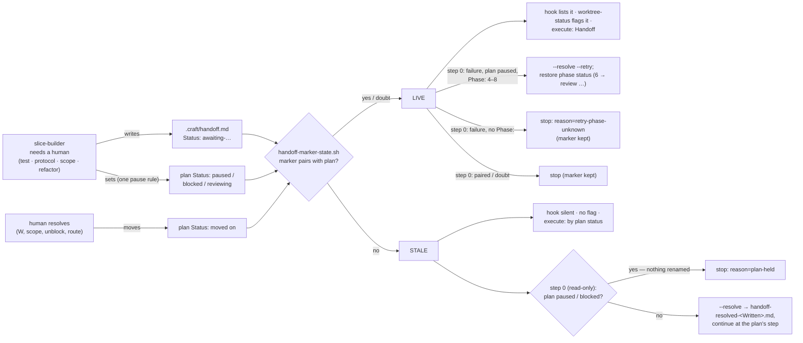

# Slice 036 — B7 stale handoff marker

> Completed: 2026-09-14
> Commits: eac1804..38b9985 (branch only — direct-to-main)
> Review rounds: **2** (round 1 two-pass per D33 → loop-back to Phase 4; round 2 two-pass → clear, fix cap waived)
> Roadmap: B7 — "Stale handoff marker"

## What

A worktree handoff marker now counts as "human needed" only while the slice plan is really waiting for it. Once the
human has resolved a handoff (Phase-5 answer, unblock, review route), the SessionStart hook no longer reports the
slice as pending, `/craft:worktree-status` no longer flags it, and `/craft:execute` no longer takes a finished slice
for a stopped one. The next `slice-builder` run in that worktree moves the old marker out of the way as
`handoff-resolved-<Written>.md` and carries on.

Every handoff that needs a human decision now pauses the plan, the scope question included — before, the plan stayed
at `implementing` on `awaiting-scope-decision`, so that marker was stale from birth. `slice-builder` decides before it
renames anything, never runs over a pause or block a human set, and a retry after `failure` resumes where the failure
happened instead of at Phase 4.

## Why

- **The plan status is the truth; the marker is its projection.** Having every resolving command delete the marker
  meant six places (test, debug, refactor, unblock, review, continue), and one forgotten resolver brings the bug back.
  One rule instead: each marker status pairs with one plan status, and the marker counts only while the plan is there.
  **Promoted to `intent.md` → "Derived state over cleanup".**
- **One description per rule.** The pairing lives in `scripts/handoff-marker-state.sh`; the table in
  `skills/workflow/SKILL.md` is its readable copy and the harness fails when they drift. The "helper cannot run"
  fallback is defined once in SKILL; step 0 is the one definition of stop-vs-rename.
- **Doubt means live.** A wrongly hidden handoff makes a waiting slice invisible; a wrongly shown one only costs noise.
  So `failure` stays live until a retry, a missing plan counts as live, and stale markers are renamed, not deleted.
- **A derivation is only as good as its writers.** Review round 1 found a writer (`awaiting-scope-decision`) that
  never paused the plan, and a matrix test that covered a state no writer produced. Every writer now declares its plan
  status in a marker the harness binds and pins. **Promoted to `rules.md` → Code Conventions.**

## Decisions

- **Plan status is the truth; the marker is a projection** (user) — derived liveness. *Why not* "every resolver
  deletes the marker": six resolvers, one forgotten one reopens B7.
- **Pairing** — `awaiting-test`, `awaiting-protocol`, `awaiting-scope-decision`, `awaiting-refactor-decision` →
  `paused`; `awaiting-block-decision` → `blocked`; `awaiting-rethink-decision` → `reviewing` (open findings lines are
  not parsed — `reviewing` is the conservative proxy); `failure` → none (live until a retry).
- **A stale marker is renamed, not deleted** (user) — `.craft/handoff-resolved-<Written>.md` inside the (since
  slice-035 gitignored) `.craft/`; collisions get `-2`, `-3`; the stamp cannot escape `.craft/`.
- **`failure` stays live until a retry** (user). *Why not* a `Plan-Status:` snapshot field: extends the marker
  format for one status.
- **Doubt means LIVE** — no plan (projects that gitignore `.claude/plans/`), several plans, missing or template status,
  unknown marker status, malformed Slice-ID, or an unrunnable helper → live.
- **Map of the marker before this slice** (survey 2026-09-14) — writers: Subagent Modes of build, test, refactor,
  review, and slice-builder (blocker, failure); readers: the SessionStart hook, `/craft:worktree-status`,
  `/craft:execute` step 6, slice-builder; clearers: **none**. `/craft:continue` does not know the worktree marker.
- **The hook finds the helper next to itself** (`BASH_SOURCE/../scripts/`), so hook and helper always come from one
  plugin copy; commands and the agent use `${CLAUDE_PLUGIN_ROOT}/scripts/` in their own content (slice-035 rule).
- **Fail-open = anything but an explicit `STALE` lists the marker** — missing, failing or silent helper included.
- **Helper is bash-3.2-compatible and scanned** — a hook calls it, so `test-toolchain-check.sh` parses and scans it and
  `rules.md` → Bash baseline names it.
- **`awaiting-scope-decision` added to the marker-format enum** in SKILL (build writes it; the enum lacked it).
- **One pause rule in `/craft:build` Subagent Mode** (review round 1, R1) — both human-decision overrides share the
  single `craft:writes status=paused` marker (the graph allows exactly one per row). *Why not* pairing the scope
  decision with `implementing`: every other human wait pauses, and `implementing` cannot be told apart from a running
  build.
- **Writer markers** (R1) — `<!-- craft:handoff status=… plan=… -->` at all 8 writes (build ×2, test ×2, refactor,
  review, slice-builder ×2); the harness binds `plan=` to the pairing, requires a writer per status and pins the exact
  (file, status) set. It binds the declaration, not the prose beneath — the slice-031 residual, disclosed.
- **Step 0: decide first, rename last** (R4 minimum + round-2 N1/N2) — read-only helper call, first-match table on
  helper state × plan status; stops (`paired`, doubt reasons, `helper-unavailable`, `plan-held`,
  `retry-phase-unknown`) never rename; a failure retry restores the failed phase's entry status (4 → `implementing`,
  5 → `testing`, 6 → `review`, 7 → `refactoring`, 8 → `reviewing`) **only over `paused`**; a status set since the
  failure is continued without restore. The restore is listed in SKILL → "Not in this graph" (variable, like
  `/craft:unblock`'s); the status-graph harness does not scan `agents/`, so it is unbound — disclosed.
- **Execute step 6 gains "Held at start"** (N3) — a subagent stopped in step 0 without a live marker is surfaced with
  its `reason=`.
- **Harness strength** — red-first (4 failures before hook and SKILL table existed); mutations caught: round-1 build
  8/8, R6 additions 3/3, writer binding (R1 shape, deleted marker, deleted second `failure` writer).
- **Phase 5 [W] twice** (user) — round 1: hook before/after on a two-worktree fixture, headless probes A (hook via
  `hooks.json`) and B (`/craft:worktree-status`), `--resolve` on copies; loop-back: comprehension probe C. After round
  2: comprehension probe D walked seven step-0 cases as specified.
- **Plan-template lesson applied** — every template section written in Phase 3 (slice-035 missed the trailing ones).

## Commits

- `eac1804` — chore(plans): bump slice counter to 37
- `dc37cb6` — feat(scripts): add a helper that decides whether a handoff marker is live
- `583dc39` — fix(hooks): report only live worktree handoff markers
- `405ffdd` — fix(build): pause the plan for scope decisions in subagent mode
- `32490ee` — chore(commands): mark every handoff-marker writer
- `d654018` — feat(slice-builder): decide on a leftover handoff marker before any phase
- `998e116` — fix(execute): count only live handoff markers
- `8c8d14b` — docs(workflow): define the handoff marker lifecycle
- `c8d0c3c` — docs(rules): list the handoff-marker harness and its bash-3.2 baseline
- `d168f9c` — docs(intent): derive handoff marker liveness instead of cleaning it up
- `38b9985` — docs(rules): mark every handoff-marker writer next to its write

## Follow-ups

- **Resolving from `paused` writes no status (R2 · Light · Rethink)** — markers paired with `paused` go stale only when
  something writes another status, and `/craft:continue`, `/craft:build` resume, a refactor skip and `/craft:debug` do
  not. `awaiting-refactor-decision`, `awaiting-protocol` and `awaiting-scope-decision` therefore stay live after the
  human's answer until Phase 4 completes interactively or the status is set by hand; an `/craft:execute` re-run stops
  at step 0 meanwhile. Define which command moves a plan off `paused` on resolution.
- **A stale marker can revive (R3 · Light · Rethink)** — liveness compares status only; when the plan later re-enters
  the paired status for an unrelated reason (`/craft:pause`, a loop-back back to `reviewing`, a later `/craft:block`),
  an old marker a human left in place counts again. Candidate: bind liveness to `Phase:` / `Written:` too.
- **Parallel re-run on an existing worktree (R8)** — `/craft:execute` step 5 runs `git worktree add` unconditionally,
  which fails when the slice worktree already exists, so a re-run never reaches `slice-builder` step 0 in parallel mode
  (B8 covers only the sequential path).

## Known limits (disclosed, not closed)

- **Invisible until a release** — the installed 1.4.0 has none of this.
- **No real autonomous run** — `slice-builder` step 0 and build's pause rule are shown by comprehension probes C and D
  and the scenario walks, not by an `/craft:execute` run.
- **Markers bind declarations, not prose** — a writer marker can stay while the sentence beneath stops pausing.
- **The retry restore is outside the status graph** — `agents/` is not scanned.
- **Failure handling pauses unconditionally** — even over a `blocked` it just wrote (pre-existing); step 0 then stops
  with `plan-held` rather than restoring.

## Phase-8 Review Record

- **Round 1** — pass 1 rubric + pass 2 scenario walk S1–S9: 1 Heavy · Rethink (R1 scope decision stale from birth),
  3 Light · Rethink (R2, R3, R4), 4 Light · Local (R5 doubt-reason stop message, R6 harness gaps, R7 fallback described
  thrice, R8 Recap claim). User: R1 loop-back (build pauses), R4 minimum folded in, R5–R8 fixed in-phase (4 of cap 5),
  R2/R3 follow-ups → loop-back, Phase 5 [W], re-recap.
- **Round 2** — fresh reviewer given round 1: R1/R5–R8 hold, R4 partial; 2 Heavy · Local (N1 rename before stop, N2
  restore over any status), 4 Light · Local (N3 paused-line fields + execute state, N4 duplicate step-0 description, N5
  scope-decision exit overstated, N6 writer check blind to a second writer). User: cap (5) waived, all 6 fixed
  in-phase; probe D confirmed step 0 → clear.

## How (Diagram)

The Walk-through as recapped in Phase 6 is superseded by round 2 on one point: step 0 now decides from the plan status
**before** it renames, so a `plan-held` or `retry-phase-unknown` stop leaves the marker in place.
