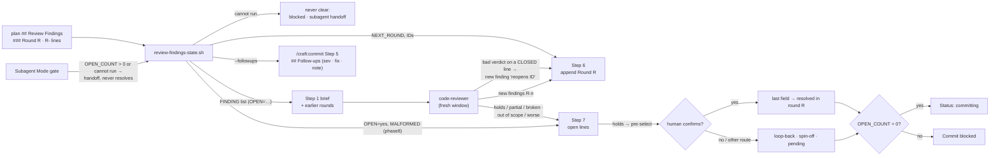

# Slice 037 — B6 review round lifecycle

> Completed: 2026-09-14
> Commits: d233bcd..6c28821 (branch only — direct-to-main)
> Review rounds: **2** (round 1 two-pass per D33 → loop-back to Phase 4; round 2 → clear, 5 of cap 5 fixed in-phase)
> Roadmap: B6 — "Review-round lifecycle"

## What

A re-review now knows what earlier rounds found. The reviewer first checks every earlier finding against the current
code and says, per ID, `holds`, `partial` or `broken`; only then does it report new issues, without repeating old
ones. When a later round has settled an open finding, the human can close it as `resolved in round <R>` —
pre-selected on `holds`, confirmed by the human. Which lines are open, which round comes next and which follow-ups go
to the archive is read by one parser (`scripts/review-findings-state.sh`) from the findings record, not by
interpreting prose.

A loop-back that fixed nothing no longer gets through: when the reviewer finds `partial`, `broken` or `worse` on an
already closed line, it also raises a new finding `reopens <ID>`, which blocks like any other. Follow-ups and
spin-offs get their own verdicts (`out of scope` / `worse`), so a `holds` never wrongly pre-selects `resolved`. The
parser reports near-format lines instead of silently closing them, and a failing helper never counts as "all done".

## Why

- **Independence comes from the fresh context window, not from hiding the history.** A blind reviewer cannot check
  the previous round's fixes on purpose and re-raises open spin-offs every round. slice-036 round 2, given round 1,
  judged R4 `partial` and still found two new Heavy findings. **Promoted to `intent.md` → D28 bullet.**
- **"Open or not" decides Commit, so it must not depend on how a model reads prose** — slice-034's false positive was
  a line-wide scan matching a resolution value quoted inside a description. The rule lives once, in the parser;
  `commands/review.md` Step 6 shows it readably, and the harness fails when the two diverge.
- **Doubt blocks.** A malformed line counts as open — a wrongly open line only costs a question, a wrongly closed one
  lets a Commit through. The same principle as slice-036's "doubt means live": a helper that does not run means
  "unknown", not "empty".
- **Visibility must not lift an old guarantee.** Round 1 showed that a blind reviewer used to re-raise a failed
  loop-back as a new Heavy finding; with verification the same verdict sat in a note that blocked nothing.
  `reopens <ID>` restores the guarantee without rewriting earlier rounds.

## Decisions

- **The reviewer sees every earlier round and verifies it first** (user). *Why not* only the open lines: in-phase
  fixes of the previous round would go unverified. *Why not* keep it blind and deduplicate in the parent: no one checks
  earlier fixes on purpose.
- **`resolved in round <R>`: the reviewer proposes, the human confirms** (user). A `holds` verdict pre-selects the
  route; `partial` / `broken` keep the line open. *Why not* auto-close on `holds`: routing is always human-confirmed.
  *Why not* human-only: the reviewer's verification would be thrown away.
- **Helper script + harness for the findings record** (user). *Why not* just name the field in Step 6: still
  unchecked prose, read by four consumers (review Step 6, Step 7, the Subagent-Mode gate, commit Step 5).
- **Finding IDs `R<round>-<n>`** — the verification needs a stable handle per finding; earlier `R1` / `N1` labels were
  ad hoc. Legacy lines without an ID are numbered by position within their round.
- **Doubt blocks** — a malformed line or an unknown resolution counts as open.
- **The resolution is the last ` · ` field** (build) — severity and fix-nature are fixed positions, so an extra ` · `
  in the description is harmless. Malformed means: bad severity, bad fix-nature, fewer than four fields, or an unknown
  resolution. A note inside the resolution must not contain ` · ` (learned in round 2, when R2-5 itself tripped it).
- **A resolution may carry a note** after `: ` or ` (`; the longest canonical prefix wins, so `(fix cap)` stays its
  own value. Indented lines continue the finding above; prose paragraphs and `- note ·` lines are not findings.
- **Aligned columns are allowed** — the helper trims severity and fix-nature.
- **Step 7 and Step 8 carry the finding ID** — the blocked output lists `<ID> · <description> → <resolution>`,
  loop-back sub-tasks are named `Loop-back <ID> — …`, and the Subagent-Mode gate reads `OPEN_COUNT` and never records
  `resolved`. `/craft:commit` Step 5 takes follow-ups from `--followups`.
- **A bad verdict on a closed line becomes a new finding `reopens <ID>`** (user, round-1 loop-back) — defined once in
  `agents/code-reviewer.md` → 2; old rounds stay untouched. On an open line the verdict suffices.
- **Separate verdicts for follow-up / spin-off lines** (user, round-1 loop-back) — `out of scope` / `worse` next to
  `holds` / `partial` / `broken`; only `holds` pre-selects `resolved`.
- **The helper-failure rule is defined once**, in Step 6's preamble (interactive: blocked; Subagent Mode: the gate's
  handoff, which stays the only marked `.craft/handoff.md` writer). `agents/slice-builder.md` hands the resolved plugin
  root to the phase commands it `Read`s (the rules.md convention since slice-035).
- **Near-format input is MALFORMED, not ignored** — star, numbered or indented bullets carrying the severity ·
  fix-nature pattern, duplicate or foreign-round IDs, heading numbers that are not their position, and an unclosed
  CommonMark-style fence. `## Review Findings` accepts any non-word suffix, case-insensitive.
- **Harness strength** — 30 cases; mutations caught 8/8 after the loop-back and 4/4 on round 2's fence and heading
  logic (a glued-suffix case and a genuinely padded fixture were needed to catch surviving mutations).
- **Evidence** — Phase 5 ran twice on automated evidence (D33), both [W]: 8 harnesses + `claude plugin validate .`
  green; the helper on real records (slice-036: `ROUNDS=2 NEXT_ROUND=3 OPEN_COUNT=0`; slice-037's own rounds parse
  clean); comprehension probes E (6 of 7 as specified, Q4 decided by the helper it could not read) and F (six
  questions as specified, one stale verdict list fixed on the spot).
- **Dogfood as the interactive test** — the installed 1.4.0 lacks even slice-034's Step 6–8, so this slice's own
  Phase-8 rounds were run by the parent following the working-tree Steps, with the human answering Step 7.

## Commits

- `d233bcd` — chore(plans): bump slice counter to 38
- `39a3b27` — feat(scripts): add a parser for the review findings record
- `d128ac8` — feat(code-reviewer): verify earlier review rounds before new findings
- `550fef6` — feat(review): hand earlier rounds to the reviewer and gate commit on the parser
- `5662c46` — fix(slice-builder): hand the plugin root to the phase commands it reads
- `e62a46d` — feat(commit): take archive follow-ups from the findings parser
- `34c562e` — docs(workflow): point the findings-record format to review Step 6 and the parser
- `1e472a6` — docs(rules): list the review-findings harness
- `6c28821` — docs(intent): let a re-review verify earlier rounds instead of blinding it

## Known limits (disclosed, not closed)

- **Invisible until a release** — the installed 1.4.0 has none of this.
- **`resolved in round <R>` is unexercised** — in round 2 every round-1 line was already closed by the loop-back, so
  the route was never offered in a real run; it is shown by probe E only.
- **Ad-hoc labels as the first field stay MALFORMED** — the slice-035 shape (`- R1 · Heavy · Local · …`) parses as a
  bad severity, so a re-review of such a plan asks about every line. Only closed records use it.
- **A prose line carrying the severity · fix-nature pattern blocks** — doubt blocks, by decision.
- **No real autonomous run** — the Subagent-Mode gate and slice-builder's plugin-root hand-over are shown by probe F,
  not by an `/craft:execute` run.

## Phase-8 Review Record

- **Round 1** — pass 1 rubric + pass 2 scenario walk V1–V8: 1 Heavy · Rethink (R1-1 a bad verdict on a closed line
  never blocks), 2 Heavy · Local (R1-2 failing helper reads as clear in Subagent Mode, R1-3 parser closes near-format
  input), 6 Light · Local (R1-4 … R1-9). User: R1-1 → Phase 4 loop-back; fix cap (5) exceeded by 8 local findings, the
  whole batch escalated into the loop-back; Phase 5 [W] again.
- **Round 2** — the first real run of the new flow: the brief carried round 1 and the helper's ID list; the reviewer
  returned a prior-round verification (9 × `holds`, no `reopens` owed) and 5 new findings (R2-1 Heavy · Local fence-skip
  regression of R1-3; R2-2 … R2-5 Light · Local), all fixed in-phase (5 of cap 5). Step 7 read `OPEN_COUNT=0` →
  `committing`.

## How (Diagram)

