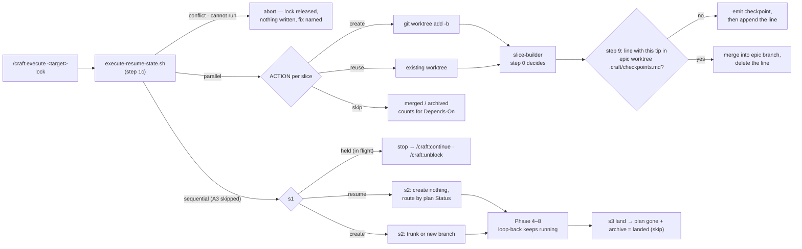

# Slice 038 — B8 execute re-run semantics

> Completed: 2026-09-14
> Commits: e875dda..b3fbe65 (branch only — direct-to-main)
> Review rounds: **3** (round 1 two-pass → loop-back, fix cap; round 2 → loop-back for R2-1, 6 in-phase fixes with the cap waived; round 3 → clear, 5 of cap 5 in-phase)
> Roadmap: B8 — "Execute re-run semantics"

## What

A second `/craft:execute` run now builds on what an earlier run left behind instead of re-creating it. In parallel
mode an existing epic or slice worktree is reused, slices already merged into the epic branch are skipped, and a
half-built slice is picked up by `slice-builder` in its old worktree. In a sequential epic a stopped slice resumes
where it stood, a paused or blocked slice stops the run with a route to `/craft:continue` / `/craft:unblock`, and a
review loop-back no longer stops the run. A state nothing accounts for — a branch without a worktree, a dirty tree
without a slice in flight, an epic worktree mid-merge — aborts before any write, with the fix named.

The re-run also survives the paths that close a slice: a slice has landed only when its plan is gone and its archive
exists, so a slice waiting on its PR resumes, and after s0 has merged one the next helper run still works. A review
checkpoint, once shown, is recorded in the epic worktree with the slice's tip and does not pause a second time — also
in a project that tracks its plans.

## Why

- **The promise was false.** `execute.md` said a re-run "picks up where it left off", but every re-run failed at
  `git worktree add -b` (exit 255, verified with git 2.55.0). Autopilot (F6) will drive exactly these paths unattended.
- **One helper decides what exists.** `scripts/execute-resume-state.sh` returns an `ACTION` and `REASON` per slice;
  `commands/execute.md` acts only on those, and the harness binds every action and every conflict reason to the prose.
  The line B6 and B7 drew: prose is not checkable. **Promoted to `intent.md` → "Derived state over cleanup".**
- **Doubt stops.** A false conflict costs one manual step; a false reuse would overwrite work.
- **"What exists" is not only a git question.** `/craft:commit` writes the archive before it opens a PR and deletes
  the plan when it closes a slice, so the plan's presence decides whether a slice has landed. "Merged" means a merge
  commit, because a fresh branch without commits is already an ancestor of its epic branch.
- **The checkpoint record belongs to the epic worktree.** In the epic plan (round 1) it dirtied the main checkout of a
  plans-tracking project, failed A3 and a stash re-armed it (round 2). Deriving it from the slice status would merge
  unseen after a crash. Written after the checkpoint is shown and keyed on the slice tip, an interrupt or a later change
  pauses again rather than merging unseen.

## Decisions

- **One slice for both modes** (user) — one re-run rule, defined once. *Why not* split parallel / sequential: two
  copies of "build on what exists".
- **A sequential review loop-back keeps running** (user) — the route is the human's decision, already made, and the
  human is present. *Why not* a hard stop: it forces a re-run for a decision already taken.
- **Helper + harness decide what exists** (user) — *Why not* prose-only git checks: unchecked prose. Promoted (I).
- **Real human re-runs in Phase 5** (user) — `rules.md` requires a human test for worktree / git paths; the fixtures
  are built by scripts, not recorded.
- **The helper takes resolved slices, not the decomposition** — entries are short names; A6 resolves them to a plan
  path, or to a slice-ID once landed, matched by the slice-ID written in the entry.
- **"Merged" = a merge commit whose non-first parent is the branch tip**, or — branch since deleted, epic only —
  execute's merge subject. The harness has the ancestor-trap case.
- **A sixth action, `held`** — a paused / blocked sequential slice is neither a conflict nor resumable; it is *in
  flight* and accounts for the dirty tree and its branch, so s1 reaches its stop.
- **No `craft:reads` markers in s2** — the status-graph harness requires a consumer row for each marker; s2 routes a
  resumed slice "as `/craft:continue` Step 3 routes that status" instead. One routing table.
- **Step 1c for both non-in-place paths; A3 skipped for a sequential epic** — a re-run legitimately finds the open
  slice's dirty trunk or checked-out branch, and only the helper can tell that from unaccounted dirt. The slice-021
  awaiting-approval A3 exception is replaced, on record.
- **Landed = plan gone + archive present** (round-1 loop-back) — a plan beside its archive has not landed (a PR is
  open, or a push failed). A6 now accepts a landed slice, where it used to reject any entry without a plan.
- **R1-10 decided, not changed** — `resume awaiting_approval` accepts a dirty tree; commit's first pass can leave its
  plan edit in the tree. Its remainder is the R2-2 follow-up.
- **The project dir holds `.claude/`, the repository the branches** (round 2, R2-3) — `CLAUDE_PROJECT_DIR` or the cwd,
  as slice-035 set; CRAFT's session files are excluded as dirt by top-relative pathspecs.
- **The checkpoint record lives in `<epic-worktree-root>/.craft/checkpoints.md`** (user, round-2 loop-back; supersedes
  the round-1 epic-plan mark) — one line `<slice-id> shown <date> <tip>`, written after the checkpoint is shown,
  matched only while the tip is unchanged, deleted once the slice is merged (round 3) so `git worktree remove` at
  epic-finalize does not fail on an untracked file. *Why not* a local file next to `.execute.lock`: gitignore block and
  A3 would need extending, and it would outlive the epic worktree.
- **Harness strength** — 99 cases on real git fixtures; mutations caught 11/11 (build), 9/9 (round-1 loop-back), 3/3
  (round 2), and the checkpoint exclude.
- **Evidence** — Phase 5 ran three times, all [W] on real `/craft:execute` re-runs with `--plugin-dir`: fixtures A–C
  (parallel epic mid-run, sequential direct hard stop, branch-without-worktree abort), D–E (held slice with work,
  checkpoint shown), F (checkpoint in a plans-tracking project, two runs). Comprehension probes G (8 scenarios) and H
  (7 scenarios) answered as specified; their gaps were fixed on the spot.

## Commits

- `e875dda` — chore(plans): bump slice counter to 39
- `5d6a631` — feat(scripts): add a helper that decides what an execute re-run finds
- `9e51eb3` — fix(execute): build a re-run on what an earlier run left behind
- `774f1d9` — docs(templates): note where a shown review checkpoint is recorded
- `6fce500` — docs(rules): list the execute re-run harness
- `b3fbe65` — docs(intent): derive what an execute re-run finds instead of re-creating it

## Follow-ups

- **R2-2** Light · Rethink · reopens R1-10: the leftovers R1-10 accepts at step 1c (an uncommitted archive, a tracked
  plan deletion after commit's Step 7) turn the post-s0 helper re-run into `dirty_without_open_slice` (reproduced), and
  the commit-or-stash hint loops; decide whether a landed slice's own leftovers count as dirt after s0, or require
  commit's first pass to leave a clean tree.
- **R3-6** Light · Rethink · `/craft:epic` writes decomposition entries without a slice-ID and nothing adds one, so under
  A6's slice-ID match key every ordinary sequential epic aborts at A6 on the re-run after its first slice lands until the
  entry is edited by hand (and in a plans-tracking project that edit trips step 1c); decide who links an entry to its
  slice-ID (`/craft:plan` from an epic, `/craft:commit` on archive) or match a landed slice by slug.

## Known limits (disclosed, not closed)

- **Invisible until a release** — the installed 1.4.0 has none of this.
- **The pull-request path (V7/W1) has no real run** — it needs a GitHub remote; shown by comprehension probe H and the
  harness only.
- **Untracked, unignored plans fail A3** — a project that leaves `.claude/plans/` untracked but not ignored (this repo
  does) fails `/craft:execute` A3 whenever a plan exists. Pre-existing, observed during the build.
- **Session-file and checkpoint excludes are pathspecs, not a shared list** — `.primed`, `.hook-env`, `.execute.lock`
  are named in the helper next to `scripts/ensure-gitignore.sh`'s local-state list.

## Phase-8 Review Record

- **Round 1** — pass 1 rubric + pass 2 scenario walk V1–V10: 3 Heavy · Local (R1-1 awaiting-approval archived first,
  R1-2 held slice owns no dirt, R1-3 s1 re-run on a deleted plan), 1 Heavy · Rethink (R1-4 checkpoint re-shown every
  run), 8 Light · Local (R1-5 … R1-12). User: R1-4 loop-back, fix cap exceeded → whole batch into the loop-back.
- **Round 2** — reviewer given round 1: 10 holds, R1-4 and R1-10 partial. New: R2-1 Heavy · Rethink (reopens R1-4: the
  epic-plan mark fails A3 where plans are tracked), R2-2 Light · Rethink follow-up, R2-3 Heavy · Local (git top level
  instead of the project dir), R2-4 … R2-8 Light · Local. User: R2-1 loop-back (record moves to the epic worktree), cap
  waived, R2-3 … R2-8 fixed in-phase.
- **Round 3** — 18 of 20 earlier findings hold (R1-10 via R2-2, R2-6 partial → R3-3). New: R3-1 … R3-5 Light · Local
  fixed in-phase (worktree removal with the record, record location, frontier rule stated twice, harness env isolation,
  tip-keyed record), R3-6 Light · Rethink kept as follow-up by the user → clear.

## How (Diagram)

