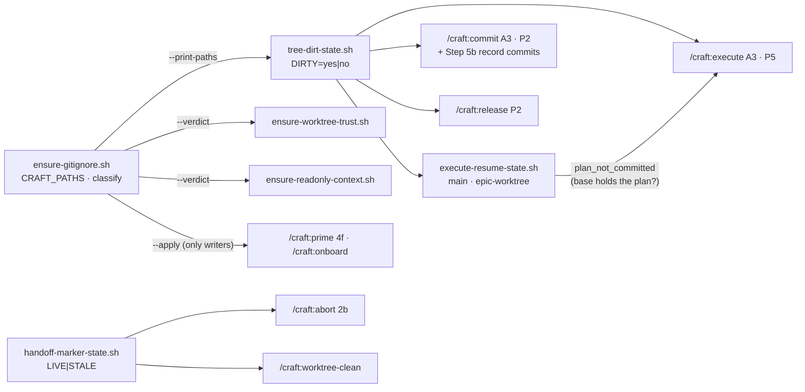

# Slice 039 — B9 B10 B13 B14 tree hygiene

> Completed: 2026-09-14
> Commits: a3bc520..392cec7 (direct-to-main; a212a11 in between is slice-040's counter bump)
> Review rounds: **2** (round 1 two-pass → loop-back for R1-1 with all 10 local edits, R1-2 spun off; round 2 → clear, 5 of cap 5 in-phase, R1-2 recorded as slice-040)
> Roadmap: B9 — "Gitignore check described three times", B10 — "Removal paths lost their handoff warning", B13 — "Commit leftovers after s0", B14 — "Plans vs. clean-tree checks"

## What

CRAFT no longer mistakes its own files for the human's work. An untracked plan (this repo), the ID counters and CRAFT's
local state no longer block `/craft:execute`; `/craft:commit` leaves a clean tree because it commits the archive and the
promotions itself, so a re-run after a landed slice goes on instead of looping on "commit or stash". Whether `.gitignore`
covers a CRAFT path is decided by `scripts/ensure-gitignore.sh` alone: a project's deliberate negation is respected
wherever it stands, and the two settings helpers no longer write `.gitignore` at all. `/craft:abort` and
`/craft:worktree-clean` show an open handoff before they remove a worktree.

After the review loop-back: `/craft:execute` creates a worktree only for a plan its base holds byte-identical and
otherwise stops before any write with the commit to make; `/craft:commit` works with tracked plans too (removes the plan
despite its status edits, commits and pushes the PR-number backfill on the PR branch) and keeps the human's own changes,
staged or not, out of every commit, listing them as theirs; both settings helpers take their gitignore answer from one
`ensure-gitignore.sh --verdict`, and a negated path gets no `git rm --cached` advice.

## Why

- **One rule, one place.** "Clean" was judged by `git status --porcelain` in three commands and by a private exclude list
  in the re-run helper; gitignore coverage was checked by three scripts, two by line-grep, and they disagreed. Now
  `scripts/tree-dirt-state.sh` and `scripts/ensure-gitignore.sh` decide and everyone else asks.
  **Promoted to `intent.md` → "CRAFT's own files are not the human's work".**
- **Plans excluded, not ignored or tracked** (user) — an ignore rule untracks nothing; tracking would add commits
  everywhere.
- **Commit cleans up after itself** (user) — otherwise P2 ("tree clean") contradicts its own Steps 5 and 7.
- **A negation is the project's decision** (user) — CRAFT does not override it.
- **Settings helpers report, never write** (user, found in build) — a `.gitignore` write in the middle of `/craft:execute`
  would later block `/craft:commit` A3.
- **The guard moved, it did not come back** (review loop-back) — A3 used to force committed plans, by accident the one
  thing keeping worktrees off stale plans. Restoring it everywhere would undo B14 for in-place and sequential runs, so the
  check sits at worktree creation, in the helper that already decides there.
- **Commit touches only what it wrote** (review loop-back) — pathspec commits, `-f` only for its own plan, P2 tells the
  human's changes from its own.
- **Where git decides:** plans stay dirt in the epic worktree (slice branches merge there); a negated directory
  (`!.craft/`) has no rule git names, so it stays a pinned known limit rather than a hand-written `.gitignore` parser.

## Decisions

- **One slice for B9, B10, B13, B14** (user) — all four are tree/gitignore hygiene around the same helpers and
  assertions. *Why not* four slices: they share `ensure-gitignore.sh`, `commit.md` and the clean-tree definition.
- **`scripts/tree-dirt-state.sh` with two scopes** — `--scope main` excludes every local-state path (read from
  `ensure-gitignore.sh --print-paths`) and `.claude/plans/`; `--scope epic-worktree` excludes only the local-state files
  and `.craft/checkpoints.md`. A helper that cannot run counts as dirt. `DIRT=` lines are per file
  (`--untracked-files=all`, round 2) so P2 can compare paths. Used by `/craft:execute` A3 + P5, `/craft:commit` A3 + P2,
  `/craft:release` P2 and the re-run helper; `/craft:abort` Step 2b and `/craft:upgrade` keep raw porcelain on purpose.
- **`plan_not_committed`** (review R1-1) — a would-be `create` becomes a conflict when the worktree's base (epic branch
  once it exists, else trunk; the epic line against the trunk) does not hold the plan byte-identical (`rev-parse
  <base>:<path>` vs `hash-object`, hashed from the project dir — round 2). *Why byte-identical, not "tracked and clean":*
  a plan committed on main after the epic branch was cut is tracked and clean, yet absent from the base. A `reuse` is not
  checked — the worktree's own plan is then the live one.
- **`/craft:commit` Step 5b + tracked plans** — Step 5b commits promotions (`docs(intent)` / `docs(rules)`) and the
  archive (`docs(slices)`); under protected main they ride on the PR branch before the push, and Steps 4–5 write into the
  finalize worktree there. The PR-number backfill is committed and pushed (user: over dropping it). A tracked plan goes
  with `git rm -f` in every mode and a `chore(plans): close` commit under `direct`. Steps 3, 5b, 6 and 7 commit by
  pathspec; Step 4 checks a promotion target the human is already editing (round 2). P2 reports a path already dirty at
  A3 and untouched by the run as the human's. P3/P4 read the checkout Steps 4–5 wrote in; a protected-main finalize
  second pass syncs the local trunk before removing worktrees. `roadmap.md` is not written by commit — a roadmap edit is
  the human's own change.
- **`ensure-gitignore.sh`** — `classify` by `git check-ignore -v`: covered | negated | absent; only absent is appended,
  so exit 6 is a safety net only; a global excludes file named `~/.gitignore` never counts. `--verdict <path>` is the one
  yes|negated|no mapping; no `TRACKED=` for a negated path. Prime 4f and onboard name negated paths.
- **Settings helpers report, never write `.gitignore`** (user, supersedes the plan's "delegate the append") —
  `ensure-readonly-context.sh` and `ensure-worktree-trust.sh` print `GITIGNORED=yes|negated|no|unknown` from `--verdict`;
  execute adds a `⚠` line on `no`. The writers stay `/craft:onboard` and `/craft:prime` 4f.
- **abort and worktree-clean are marker readers** — they show a LIVE marker's status and phase before the removal prompt
  (`state unknown (helper could not run)` on the fallback); an orphan's missing plan reads LIVE (doubt means live). The
  reader set is pinned against the lifecycle's Readers bullet both ways.
- **Guards** — prime 4e takes the `name == craft` guard of 4f / 5c; `/craft:plan` P2 requires every `## ` header of
  `templates/slice-plan.md.template` (the SECTIONS check accepts the derivation).
- **R1-2 spun off as slice-040** (user) — a tracked plan's deletion under protected main has no clean home (not the PR,
  not a plain `rm`, not a trunk commit); R2-6 shares the root and goes with it.

## Commits

- `a3bc520` — chore(plans): bump slice counter to 40
- `4d5fae8` — fix(scripts): decide gitignore coverage once and respect a project's negation
- `d5f2484` — feat(scripts): add a helper that decides what counts as uncommitted work
- `3a7fb5d` — fix(commit): leave a clean tree and never commit what the human keeps
- `95a7ca0` — fix(worktree): show a live handoff before removing a worktree
- `e93fe59` — fix(plan): derive the required plan sections from the template
- `102ea63` — docs(templates): leave .gitignore to onboard and prime in the rules template
- `22ade43` — docs(readme): local state is noise, not a blocker; negated paths stay
- `47bc016` — docs(rules): record the tree-dirt helper and the reader set
- `8dc8fe2` — docs: describe the new harness coverage in CLAUDE.md
- `392cec7` — docs(intent): CRAFT's own files are not the human's work

## Follow-ups

- **R1-13** Light · Rethink · in a subdirectory project both settings helpers write the repo-root `settings.local.json`
  but report `GITIGNORED` for the project-dir path.
- **R2-6** Light · Rethink · a tracked plan under protected main that Step 1 committed is edited again by Step 6
  (awaiting-approval, PR line), so the second pass's checkout to the trunk aborts on it; same root as R1-2 — carried by
  slice-040.
- **R2-7** Light · Rethink · pre-existing gap now reached through R1-1: slice-builder writes the plan status only into the
  worktree copy, while `/craft:commit` A1 and Mode Detection read the main checkout, so a Slice-finalize is never
  detected even for committed plans — parallel worktree mode needs the plan round-trip (hand the plan in, read its status
  back).
- **R1-2** → slice-040 (tracked plan lifecycle under protected main).

## Known limits (disclosed, not closed)

- **Invisible until a release** — the installed 1.4.0 has none of this.
- **Parallel worktree mode** — a project that never commits its plans (this repo) now gets `plan_not_committed`, and
  committing them is not enough either (R2-7).
- **A negated directory entry** — for `.craft/` then `!.craft/` git names no deciding rule, so the helper reads `absent`
  and the append overrides it; pinned by a harness case so a git change surfaces.
- **Tracked plan under protected main** — Step 7 leaves a staged deletion (R1-2); CRAFT's own commits no longer carry it
  (pathspec), a human's bare commit still would. Slice-040.
- **Not shown by a real run:** the protected-main PR path (no remote — backfill commit, finalize trunk sync) and a full
  worktree run; the hands-on removal / settings-write test offered in Phase 5 was not confirmed as run.

## Phase-8 Review Record

- **Round 1** — pass 1 rubric + pass 2 scenario walk V1–V11: 2 Heavy · Rethink (R1-1 worktrees built from HEAD without a
  plan guard, R1-2 staged tracked-plan deletion under protected main), 3 Heavy · Local (R1-3 PR backfill after Step 5b,
  R1-4 `git rm` on a modified plan, R1-5 protected-main finalize reads the wrong checkout), 7 Light · Local (R1-6 …
  R1-12), 1 Light · Rethink (R1-13). User: R1-1 loop-back, R1-2 new slice, all 10 local edits into the loop-back.
- **Round 2** — reviewer given round 1: 11 holds, R1-2 and R1-13 out of scope. New: R2-1 … R2-5 Light · Local fixed
  in-phase (relative-path hash from the repo root, Step 3 bare commit, promotion into a file the human is editing,
  collapsed untracked directories, misleading abort header), R2-6 and R2-7 Light · Rethink follow-ups. User: plan R1-2's
  slice now → slice-040 recorded → clear.

## Phase-5 Evidence

- Build: 9 harnesses green, headless probes (claude 2.1.270, scratch fixtures): `/craft:abort` shows the live marker
  before [Y]/[N]; `/craft:worktree-clean` shows the orphan's live marker, not the archived slice's stale one; `/craft:commit`
  direct commits `feat` + `docs(slices): archive`, `DIRTY=no`.
- After the loop-back: `/craft:commit` with a tracked plan and the human's staged + unstaged files → `feat` + archive +
  `chore(plans): close`, neither human file committed; `/craft:execute slice-001` with an untracked plan → A3 passes,
  step 1c aborts with `plan_not_committed`, no worktree or branch.

## How (Diagram)

