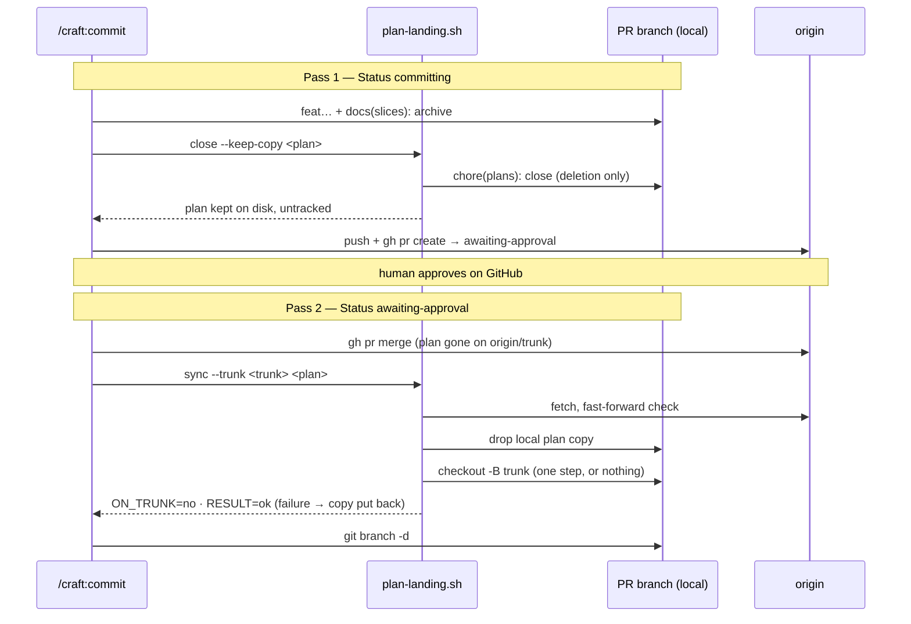

# Slice 040 — Tracked plan lifecycle under protected main

> Completed: 2026-09-14
> Commits: 7a7a764..f553f30 (direct-to-main)
> Review rounds: **1** (two-pass: rubric + scenario walk V1–V10 → 12 findings, all fixed in-phase with the fix cap waived; cleared without a round 2 by the user)
> Roadmap: B16 — "Tracked plan lifecycle under protected main" (slice-039 R1-2, R2-6)

## What

In a project that versions `.claude/plans/` and lands through `pull-request` + `Protected-main: yes`, a closed slice's
plan now leaves the trunk cleanly: it disappears from the remote with the approved merge, no staged deletion is left
behind locally, and the second pass's checkout to the trunk no longer aborts. Before, the plan stayed on the remote (a
fresh clone read the slice as not landed) and a human's next bare commit would have carried the deletion unnoticed.

## Why

- **The PR is the only vehicle** (user) — the trunk takes no direct commit, so the plan's removal rides in the PR as the
  branch's last commit, and the trunk moves in one merge from "plan present" to "plan gone + archive present"; the landed
  rule of `scripts/execute-resume-state.sh` stays as it is. **Promoted to `intent.md` → "Approve ≠ merge on protected
  `main`".**
- **A helper, not prose** — the obvious git command is provably wrong (`git rm --cached` + a pathspec commit re-tracks
  the file), and a model "simplifying" the prose would reintroduce exactly that; the prose names calls and outputs only.
- **Plan status edits never enter a commit** — they are CRAFT's bookkeeping.

## Decisions

- **The plan's deletion rides in the PR** (user, sub-task 1; no `D<N>` — it refines epic Decision D) — first pass:
  `scripts/plan-landing.sh close` commits the removal on the PR branch after Step 5b and before the push; in-place the
  copy stays on disk untracked as the live plan (`--keep-copy`), a finalize worktree keeps none. Second pass, after
  `gh pr merge`: `plan-landing.sh sync` drops the local copy before it touches the trunk and replaces Step 7's plan `rm`
  and trunk sync. *Why not* a follow-up PR or a second-pass auto-PR: a second approval per slice, and the remote trunk
  reads the slice as unlanded until then. *Why not* "landed = archive present": the plan would still sit on the trunk as
  an active slice. *Cost:* a PR closed unmerged leaves the deletion commit on its branch; and (review R1-11, user:
  accepted) until the merge the in-place plan is an untracked file, so `git checkout <trunk>` refuses in that checkout
  and `stash -u` / `clean` / `checkout -f` would destroy it — the awaiting-approval block says so.
- **A PR without the deletion completes cleanly** (review R1-7, user) — when the merged PR did not carry a plan's removal
  (`ON_TRUNK=yes`, a PR opened before this rule), `sync` removes the plan locally as an unstaged deletion: the checkout
  reads the slice as landed, and that deletion is what the removal PR needs. *Why not* leave the stale plan with a
  warning: `execute-resume-state.sh` would read it as `create` and rebuild a landed slice.
- **`scripts/plan-landing.sh`** — "tracked" means HEAD holds it, decided only here (`close` skips others, `CLOSED=no`,
  `COMMIT=-`). `sync` fetches, refuses a local trunk that cannot fast-forward, drops the copies, then moves the checkout
  in ONE git step (`checkout -B <trunk> <upstream>` from another branch, `merge --ff-only` on the trunk) — it completes or
  leaves HEAD where it was, so a failure puts every copy back on the branch sync started from (review R1-1). git's own
  message precedes `ERROR=`; INT/TERM/HUP put held copies back. `direct` is unchanged (`git rm -f` + `chore(plans): close`).
- **Constraints known from slice-039's review** — the deletion could not ride in the PR as a plain `git rm` (the in-place
  second pass still needs the plan), a plain `rm` left the plan tracked on the remote trunk, and the trunk takes no direct
  commit; the candidates weighed were the three rejected above.
- **git facts verified on a bare-origin fixture** (git 2.55.0) — (a) `git rm --cached` + `git commit -- <plan>` re-tracks
  the file from disk; (b) moving the copy aside, pathspec-committing, moving it back commits the deletion alone and keeps a
  human's staged change staged; (c) an untracked copy makes `git checkout <trunk>` abort while the trunk tracks the plan;
  (d) a tracked, modified plan makes `merge --ff-only` abort when the incoming merge deletes it. (a) and (c) are pinned in
  the harness.
- **Headless probe evidence** (claude 2.1.270, `--plugin-dir` scratch copy without `hooks/`, stubbed `gh`) — pass 1
  produced `feat`, `docs(slices): archive`, `chore(plans): close` holding only the plan's deletion, plan untracked on disk;
  it then stopped at `git push` on the user's global deny rule (not bypassed), so Step 6 items 1–3 were set up by hand and
  are not shown. Pass 2 called `sync` (`ON_TRUNK=no`, `RESULT=ok`), then `git branch -d`: on `main` = `origin/main`,
  nothing staged, no plan locally or remote, a fresh clone resolves `skip archived`. The probe predates the review fixes.
- **Phase 5: [W]** (user) — on the evidence report plus a hands-on run of `sync` in a scratch fixture (rollback on a
  conflicting local change, then the real second pass).
- **Related, not in scope** — slice-039 R2-7 (parallel worktree mode never detects a Slice-finalize because slice-builder
  writes the plan status only into the worktree copy) and the plan-to-worktree handoff follow-up (roadmap B15).

## Commits

- `7a7a764` — feat(scripts): take a tracked plan off the trunk under protected main
- `55ba440` — fix(commit): let a tracked plan's removal ride in the protected-main PR
- `fa2109b` — docs(rules): record the plan-landing harness
- `f78809b` — docs: describe the plan-landing harness in CLAUDE.md
- `f553f30` — docs(intent): a tracked plan leaves protected main through the PR

## Known limits (disclosed, not closed)

- **Invisible until a release** — the installed 1.4.0 runs none of this (nor slice-033 … slice-039).
- **Not shown by a real run:** push, `gh pr create` and the PR-number backfill (global `git push` deny), the finalize
  modes with a worktree, and the review fixes themselves in a headless probe (they rest on 70 harness cases and five
  mutation checks); no round-2 review of the 12 in-phase fixes (user).
- **The `direct` tracked-plan paragraph** still decides "tracked" with `git ls-files --error-unmatch` (slice-039 prose,
  direct path only).
- **A sequential epic's epic plan** is not closed by this slice's mechanics — it stays until the epic ends, as before.

## Phase-8 Review Record

- **Round 1** — pass 1 rubric (11 findings) + pass 2 scenario walk V1–V10 (8 findings), deduplicated to 12: 1 Heavy ·
  Local (R1-1 half-done trunk move after a failed fast-forward), 9 Light · Local (R1-2 swallowed git stderr, R1-3 held
  copy lost on interrupt, R1-4 "tracked" decided twice, R1-5 prose re-describing the helper, R1-6 stale pointers, R1-8
  execute s0 stop branch, R1-9 vacuous R2-6 case, R1-10 Step 1 barring sibling plans, R1-12 unconditional Standard `rm`),
  2 Light · Rethink decided by the user and fixed (R1-7 stale plan on `ON_TRUNK=yes`, R1-11 untracked plan during the
  wait). Fix cap waived; mutations confirm the new cases fail without their fix. Cleared without round 2 (user).

## How (Diagram)

