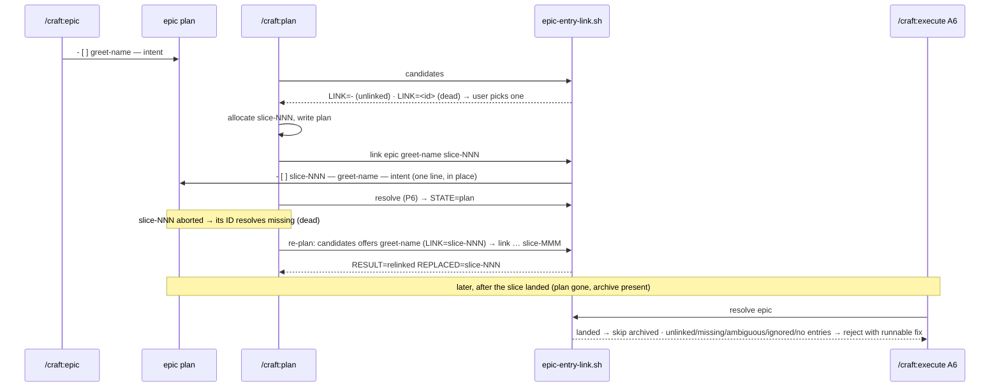

# Slice 041 — B12 epic slice-ID link

> Completed: 2026-09-15
> Commits: cab4850..44f0186 (direct-to-main; ac18be6 before it is this slice's counter bump)
> Review rounds: **3** (round 1 two-pass → loop-back for R1-1 with 7 local edits; round 2 two-pass → 10 local fixes in-phase, cap waived; round 3 verification → 7 local fixes in-phase, cleared without round 4)
> Roadmap: B12 — "Epic decomposition ↔ slice-ID" (slice-038 R3-6); first F6 prerequisite (design record `autopilot-mode.md` §11)

## What

When `/craft:plan` plans a slice that refines an epic's decomposition entry, it writes the slice-ID straight into that
entry. `/craft:execute` therefore still resolves every entry after its slice has landed and the plan is gone — as
`landed`, through its archive. Before, every epic re-run aborted at A6 after the first landed slice until someone added
the ID by hand, which an unattended autopilot run cannot do. A link stays correctable: when a linked slice is aborted,
its ID stays in the entry but counts as dead — `/craft:plan` offers the entry again ("was slice-NNN, aborted") and
replaces the dead ID, so the epic is never stuck. Epic plans are read robustly (CRLF, fenced blocks at any indent, a
trailing space on the heading), and an epic in which entries are missing or misread no longer passes as fine.

## Why

- **The ID is allocated in `/craft:plan`, so the link is made there** (user) — the epic changes before any
  `/craft:execute` or commit, so step 1c's `plan_not_committed` is not tripped by a later hand edit.
- **Format and matching belong to one helper** (user) — A6 used to match an entry to a plan by the agent's judgment,
  which nothing could check, and the autopilot planner needs the same rule.
- **A dead link is derived, not cleaned up** (user, review R1-1) — whether an ID lives is read from the files, so no
  removal path has to remember to unlink. **Promoted to `intent.md` → "Derived state over cleanup".**
- **A write never reports success it did not achieve** (review R2-2) — `link` changes exactly one line of a durable file;
  a truncated copy that says `RESULT=linked` would lose the epic plan in a project that does not track it.

## Decisions

- **`/craft:plan` links the entry** (user, planning) — *Why not* an A6 backfill in `/craft:execute`: execute would write
  the epic mid-run (1c risk in tracked projects) and "a plan matches" would still need a rule. *Why not* matching a
  landed slice by slug: slug and short-name often differ. *Why not* `/craft:commit` on archive: too late — until then the
  match stays agent judgment, and under protected main the epic edit lands only by PR.
- **A6 resolves entries through the helper** (user, planning) — `resolve` makes the match one checkable rule, which the
  autopilot planner (F6) reuses.
- **Existing epics are not migrated** — `/craft:plan` links new plans only. Consequence: since A6 no longer matches by
  judgment, an unlinked entry is rejected even while a plan for it exists; the rejection names the fix (`/craft:plan`,
  or the `link` command with the resolved plugin path). No epic plan existed in this repo.
- **A dead link is free** (user, review R1-1) — an entry whose ID resolves `missing` (neither plan nor archive) counts as
  no link: `candidates` offers it (`LINK=<dead-id>`), `link` replaces it (`RESULT=relinked`, `REPLACED=`). A live ID
  (`plan` / `landed` / `ambiguous`) is never replaced. *Why not* `/craft:abort` unlinks: every removal path would have to
  remember it — the pattern slice-036 rejected. *Why not* only an `unlink` tool: the human would repair every abort by
  hand. It holds only while slice-IDs are never handed out twice — A4's `.next-id` reset advice now counts plans,
  archives and epic entries (R2-7).
- **`scripts/epic-entry-link.sh`** — defines the entry format once (`- [ ] <short-name> — <intent>` /
  `- [ ] slice-NNN — <short-name> — <intent>`, column 0, only in `## Slice Decomposition`, exact short-name match).
  `parse` ignores a trailing CR / whitespace, hides fenced blocks (``` / ~~~ at any indent; a ``` info string holds no
  backtick; closed only by the same character, at least as long), and reports checkbox list items that are not entries
  plus a fence left open as `IGNORED` (a plain link bullet is not). `candidates` lists unlinked / dead-linked entries
  with `DUP=` for shared short-names and names ignored lines. `link` refuses no / several matches, a live link to another
  ID, an ID already on another entry of this or any other epic, a target ID with no single plan and no archive (also for
  `unchanged`), and a read-only epic plan; it writes through the existing file (mode, symlink, CRLF, missing final
  newline kept), checks the write status and the byte count before copying, verifies the copy with `cmp`, and on a failed
  copy keeps the full new content (`copy_failed:<file>`). `resolve` reports `plan | landed | missing | ambiguous |
  unlinked`, `IGNORED` lines, the counts and `RESULT=ok|unresolved` (unresolved on no entry or any ignored line).
- **Commands** — `/craft:plan` 5c names ignored lines, offers unlinked and dead-linked entries, lists `DUP` entries as not
  selectable and says entries of open slices are not listed; 8b links after the ID is allocated with guidance per error
  reason, says the human commits the edited epic plan before `/craft:execute`, and prints commands with the resolved
  plugin root; P6 checks through `resolve`. `/craft:execute` A6 accepts only `plan` and `landed`, rejects every other
  state, `ENTRY_COUNT=0` and each `IGNORED` line with a runnable fix, and points at the helper header for the output.
  `/craft:epic` and the epic template point at the helper instead of repeating the format.
- **Harness `scripts/test-epic-entry-link.sh`** — 105 cases on real fixtures (byte-exact `cmp`, mode, symlink, CRLF,
  indented / tilde / four-backtick fences, ignored items, glob / space short-names, abort → relink, target checks,
  read-only and size-limited writes, a sequential re-run where `execute-resume-state` fed from `resolve` skips the landed
  slice, A6 bound to every state from the helper header). Mutations across the three rounds each turned it red, except
  the recorded limits below.
- **Evidence** — headless probes (claude 2.1.270, `--plugin-dir` scratch copies): `/craft:plan` linked `greet-name` →
  slice-005, and after the loop-back relinked a dead `slice-003` (`RESULT=relinked REPLACED=slice-003`, dialog showed
  "was slice-003, aborted"). Phase 5 **[W]** twice (user), each on the evidence report plus a hands-on `/craft:plan`
  session in a scratch fixture.
- **Review round 1 → loop-back, R1-9 as a follow-up** (user) — recorded in the review record below.

## Commits

- `ac18be6` — chore(plans): bump slice counter to 42
- `cab4850` — feat(scripts): link an epic's decomposition entry to its slice-ID
- `e642248` — feat(plan): link the refined epic entry when a slice is planned
- `2e64050` — fix(execute): resolve epic entries through the link helper in A6
- `0d0e7ed` — docs(epic): point the epic command and template at the entry format
- `64ac84a` — docs(rules): record the epic entry link harness
- `53f1a36` — docs: describe the epic entry link harness in CLAUDE.md
- `44f0186` — docs(intent): an epic's link to an aborted slice is dead, not cleaned up

## Follow-ups

- **R1-9** Light · Rethink · other readers of `## Slice Decomposition` still decide by judgment (`/craft:commit`
  Epic-finalize detection and plan removal, `/craft:execute` s0, `/craft:continue` sequential-epic lookup), so "resolves
  entries through the helper" holds for A6 only.

## Known limits (disclosed, not closed)

- **Invisible until a release** — the installed 1.4.0 runs none of this (nor slice-033 … slice-040).
- **Not shown by a real run:** `/craft:execute` A6 rejecting / resolving an epic, and a re-run after a real landing (helper
  and harness only); the round-2/3 prose in `/craft:plan` (per-error guidance, `IGNORED` / `DUP` in 5c) — both probes ran
  before it.
- **Guards not shown independently:** `link`'s byte-count check, the `cmp` after the copy, and keeping the temp file on
  `copy_failed` — a size limit already fails at the write status, and a copy failing after the file is opened could not
  be provoked portably.
- **A short-name shaped like a slice-ID** reads as linked (documented in the helper header).
- **No round 4** — the seven round-3 fixes rest on harness cases and mutations, not on a fresh reviewer (user).
- **Step 1c's epic-line check** runs on the parallel path's first run only; plan.md's "commit the epic plan before
  `/craft:execute`" is worded generally.

## Phase-8 Review Record

- **Round 1** — pass 1 rubric (7) + pass 2 scenario walk V1–V11 (5), deduplicated to 9: 1 Heavy · Rethink (R1-1 a link
  could never be removed after an abort), 1 Heavy · Local (R1-2 heading variants → empty epic passed), 6 Light · Local
  (R1-3 … R1-8: write side effects, parser gaps, vacuous harness cases, duplicated format and unrunnable fix commands,
  one guidance for every error, "committed together"), 1 Light · Rethink (R1-9 follow-up). User: loop-back with all
  local edits; dead link derived as free.
- **Round 2** — both passes verified round 1 (R1-4 reopened, R1-5 / R1-7 partial, the rest held) and found 10: 2 Heavy ·
  Local (R2-1 indented fence hid entries with `RESULT=ok`, R2-2 truncated write reported as success), 8 Light · Local
  (harness isolation, ignored list items, guidance gaps, ID reuse, re-plan path, target checks, duplicate short-names).
  User: cap waived, fixed in-phase, round 3 to verify.
- **Round 3** — verification of R2: 6 hold, 4 partial, none reopened; 7 new Light · Local (link bullets misread,
  read-only handling, `unchanged` on a dead ID, silent `candidates`, backtick info strings, five surviving mutations,
  prose describing output). User: fixed in-phase, cleared without round 4.

## How (Diagram)


