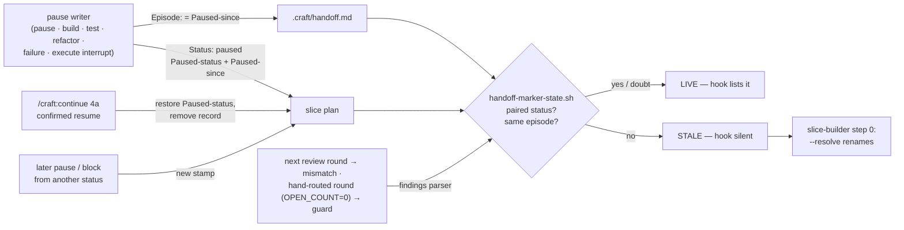

# Slice 042 — B11 handoff resolution from paused

> Completed: 2026-09-15
> Commits: bbd002e..de3b653 (direct-to-main; d62dceb before it is this slice's counter bump)
> Review rounds: **3** (round 1 two-pass → 15 findings, 13 local fixes in-phase, cap waived; round 2 two-pass verification → 13 local fixes in-phase, cap waived; round 3 verification → 5 local fixes in-phase, cleared without round 4)
> Roadmap: B11 — "Handoff resolution from `paused`" (slice-036 R2, R3); F6 prerequisite (design record `autopilot-mode.md` §11)

## What

A handoff marker stops counting once the human has answered it, and never counts again. Before, a marker stayed live
until some command happened to write another plan status — `/craft:continue`, a build resume, a refactor skip and
`/craft:debug` wrote none — and it revived whenever the plan later re-entered the same status for an unrelated reason: a
new pause, a new block, a new review round. For autopilot (F6) either meant phantom escalations or a stuck loop. Now
every pause records where it came from (`Paused-status`) and when (`Paused-since`); the confirmed resume in
`/craft:continue` (step 4a) restores it, and the marker carries its **episode** (`Episode:`) — the pause or block stamp,
or the review round — so the helper judges it live only while the plan is still in that episode. Anything the helper
cannot confirm still counts as live.

## Why

- **Derived state over cleanup stays the rule** — no resolver renames or deletes a marker; the plan is the truth and the
  helper derives liveness. **Promoted to `intent.md` → "Derived state over cleanup".**
- **One resume, like one unblock** (user) — the human's answer moves the plan off `paused` in exactly one place,
  mirroring `/craft:unblock`'s `Blocked-status` restore. Four resolvers (build, test, refactor, debug) would have been the
  forgettable pattern slice-036 rejected.
- **The status alone cannot tell episodes apart** (user) — every entry into `paused` / `blocked` from another status
  stamps anew, and a review round is counted by the findings parser, so an old marker needs no clean-up to go stale.
- **Doubt means live, also against LLM writers** — every stamp and `Episode:` is written by an agent following prose. A
  quoting or format slip, a round `0`, a marker stamp later than the plan's, an unclosed frontmatter: all read as
  unknown (live) or status-only, never as a mismatch that would hide a waiting slice (review R1-1, R2-1, R2-8).

## Decisions

- **R2 — `/craft:continue` 4a is the one resume** (user, planning) — restores `Paused-status`, removes the record, marks
  the Pause Note `> Resumed:`; runs only on `Status: paused` and a yes; `/craft:build` asks, then runs 4a steps 1–5;
  `/craft:test` and `/craft:refactor` refuse a paused slice and name `/craft:continue`. *Why not* each phase command
  resuming on its own: four resolvers. *Why not* a new `/craft:resume`: one more command for what continue already asks.
  4a's restore is unmarked in the status graph, like `/craft:unblock`'s (a variable written back, no single edge).
- **R3 — liveness binds to the episode** (user, planning) — one marker field `Episode:` for every paired status; the
  helper's `EPISODES` table (`paused=Paused-since`, `blocked=Blocked-since`, `reviewing=round`) is the one definition,
  bound to the SKILL table by the harness. *Why not* `Written: ≥` plan entry time: a stamp on every entry into
  `reviewing` and an ordering compare of free-form strings. *Why not* a `Round:` field for the rethink marker only: two
  fields for one concept.
- **Same episode on a repeat** — a pause of a paused slice and a re-block of a blocked one keep their stamp (review
  R1-4 reversed the Phase-4 "re-block refreshes"): neither answers the pending question, so a fresh stamp would be a
  false STALE.
- **Round count from `review-findings-state.sh`** — the one parser; it runs with the helper's own `${BASH}` and so joins
  the bash-3.2 set. **Promoted to `rules.md` → Stack & Tools (Bash baseline).** *Why not* counting `### Round` headings
  in the helper: a second definition of the round count.
- **A review episode also ends at `OPEN_COUNT=0` — as a guard** (review R1-13 corrected the rationale) — an interactive
  review appends its round before it routes, so the real path is `episode_mismatch`; `findings_closed` only covers a
  round routed by hand. Supersedes slice-036's "open findings lines are not parsed — `reviewing` is the proxy".
- **Only well-formed pairs are compared** (review R1-1) — both sides a UTC stamp `YYYY-MM-DDTHH:MM:SSZ` or a round
  number ≥ 1; `Episode:` read from the marker's closed `---` frontmatter only, in one awk pass (R2-1).
- **No pause over a block** (user, review R1-6) — `/craft:pause` refuses a blocked slice; `slice-builder`'s Failure
  handling leaves a blocked plan and its block marker untouched (R2-12); `/craft:block` over a paused slice takes
  `Blocked-status` from `Paused-status`, removes the record and marks the Pause Note `> Superseded by block:`.
- **Test Subagent Mode: prepare 5a, pause, write the marker** (review R2-10) — a 5a blocker takes the blocker path with
  no pause; the marker still copies a stamp that already exists.
- **Every pause writer is named and checked** — `/craft:pause`, the Subagent-Mode pauses of build / test / refactor,
  `slice-builder`'s Failure handling, and `/craft:execute`'s interrupt pause (found in review R2-11, declared as a
  transition row in R3-2). **Promoted to `rules.md` → Code Conventions:** non-failure writers write `Episode:`, paused
  writers the pause record; the harness checks both by proximity.
- **The no-answer warning is tied to this pause** (user: R1-15 follow-up + warning; R3-1) — 4a warns only when
  `.craft/handoff.md`'s `Episode:` equals the record's `Paused-since` (or a pre-B11 marker's status pairs with `paused`).
- **`rules.md` edits waited for Phase 9** — `/craft:build` does not edit `rules.md`; both edits were confirmed here.
- **Phase 5 on evidence, two paths knowingly unshown** (user, `[W]`) — a real-worktree demo of helper + hook, the
  harness matrix and mutations were shown; the interactive 4a dialog and a live hook run beyond the harness were not.

## Commits

- `d62dceb` — chore(plans): bump slice counter to 43
- `bbd002e` — feat(scripts): bind a handoff marker to the episode it was written in
- `fc8ed12` — feat(workflow): record every pause and resume it in one place
- `04b5527` — fix(commands): stamp the episode at every pause, block and rethink handoff
- `d378043` — docs: say where /craft:continue writes on the docs site
- `1417cd0` — docs: describe the episode matrix in CLAUDE.md
- `3047371` — docs(rules): bind the findings parser to bash 3.2 and handoff writers to episodes
- `de3b653` — docs(intent): a handoff marker is bound to its episode, not only its status

## Follow-ups

- **R1-15** Light · Rethink · the resume records no answer to the question a handoff asked (a scope decision, a
  protocol, a refactor pick): after a 4a resume a subagent re-run meets the same obstacle and pauses again — the
  ping-pong F6 must avoid. 4a now warns and sends the human to the interactive command; where an answer is stored so a
  re-run honours it (a Decisions entry, `## Active Rule Overrides`, a marker answer field) is an F6 orchestrator question.

## Known limits (disclosed, not closed)

- **Invisible until a release** — the installed 1.4.0 runs none of this (nor slice-033 … slice-041); R1 is next.
- **Writers are prose** — the harness binds that each writer *names* `Episode:` / the pause record near its write, not
  that an agent writes the exact stamp; a slip costs a live marker (noise), never a hidden one.
- **Not shown by a real run:** the interactive `/craft:continue` 4a dialog; `/craft:execute`'s interrupt pause; a hook
  run on a real consumer session beyond the harness fixtures.
- **Two `Episode:` lines in one frontmatter** — the first wins; an older first value reads `episode_mismatch`. No writer
  produces it.
- **A marker stamped before the plan** would get a false STALE if the plan's stamp is later — only the writing order
  (plan first, marker copies) prevents it.
- **No round 4** — the five round-3 fixes rest on harness cases, not on a fresh reviewer (user).

## Phase-8 Review Record

- **Round 1** — pass 1 rubric (8) + pass 2 scenario walk V1–V10 (13), deduplicated to 15: 1 Heavy · Local (R1-1 a
  malformed `Episode:` read as a mismatch → hidden handoff), 12 Light · Local (post-write round, pause record on the
  blocker path, re-block stamp, dead-end refusals, stale graph list, docs, 4a placement, writer list, P1, row wording,
  `findings_closed` rationale, a harness case that could not fail), 2 Light · Rethink (R1-6 pause over block → fixed by
  user choice; R1-15 follow-up). User: cap waived, round 2 verifies.
- **Round 2** — both passes verified round 1 (11 hold, R1-4 / R1-5 / R1-7 / R1-13 partial) and found 13 Light · Local
  (unclosed frontmatter size-dependence, round 0, 4a on non-paused slices, 5a order, execute interrupt pause, failure
  handling over a block marker, wording remnants). User: cap waived, round 3 verifies.
- **Round 3** — verification: 12 of 13 hold, R2-6 partial; 5 Light · Local (warning trigger, unmarked execute write,
  build's 4a delegation, interrupt scope and plan copy, slice-builder's manual resume text). Fixed in-phase, cleared
  without round 4.

## How (Diagram)

