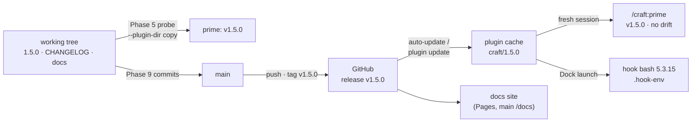

# Slice 043 — R1 release

> Completed: 2026-09-15
> Commits: 77663cd..b306c1f (direct-to-main; c777833 before it is this slice's counter bump, 686aab6 after it the rules promotion) — released as tag `v1.5.0` on 686aab6
> Review rounds: **2** (round 1 two-pass → 17 findings, all Local, fixed in-phase, cap waived; round 2 fact-check verification → 7 Light · Local, fixed in-phase, cap waived, cleared without round 3)
> Roadmap: R1 — "Release"; the last F6 prerequisite (design record `autopilot-mode.md` §11)

## What

CRAFT 1.5.0 is released: GitHub release `v1.5.0` "CRAFT v1.5.0 — Groundwork for Autopilot" (Latest), with notes generated
from the CHANGELOG `[1.5.0]` section, and the installed runtime now carries slice-032 … slice-042 — the toolchain
pre-flight, review rounds, handoffs derived from the plan and bound to their episode, `/craft:execute` re-runs, tree
hygiene, plan landing under protected main, epic links and the one resume. Before, all of it existed only in the working
tree; the installed 1.4.0 knew none of it. The docs site describes the 1.5.0 surface, README gained how a handoff is
answered, and `/craft:upgrade` no longer claims that a restart installs the synced version.

## Why

- **1.5.0, not 2.0.0** (user) — an interim release; 2.0.0 is reserved for autopilot, the headline feature. Because the
  number does not announce the new hard requirement (bash ≥ 5.0 and python3, or every gated command's `/craft:prime`
  aborts) nor the behavior changes, the CHANGELOG and the release notes open with an upgrade note.
  **Promoted to `rules.md` → Deployment (Versioning, Release mechanics).**
- **Release mechanics re-verified, not trusted from older notes** — against code.claude.com (plugins reference,
  discover-plugins) on 2026-09-15: the `version` is the update key, auto-update is on for this marketplace, a new version
  loads only in a new session, and `/craft:upgrade` only syncs the marketplace clone.
- **The docs site is the public reference** — brought fully up to date and checked in the browser, not only by the harness.
- **Dogfooding F6 needs the foundation installed** — autopilot is to be dogfooded on the runtime it will run on, not on 1.4.0.

## Decisions

- **Version 1.5.0, not 2.0.0 — an interim release preparing autopilot** (user) — accepted despite changes a strict SemVer
  reading calls breaking: `/craft:prime` aborts without bash ≥ 5.0 / python3 (slice-033); an unlinked epic entry is rejected
  (slice-041); `/craft:continue` writes on a confirmed resume and `/craft:pause` refuses a blocked slice (slice-042).
  *Consequence:* upgrade note above the CHANGELOG intro, leading the release notes. Promoted `[R]` (686aab6).
- **Docs site: full delta per the docs-site skill** (user) — every surface change since 1.4.0, not only the roadmap's named
  carry-overs; `test-docs-site.sh` is the mechanical gate, the skill the editorial contract.
- **Publication in Phase 9, verified after** (user) — Phase 4 prepares, Phase 5 shows pre-release evidence, Phase 9 commits,
  pushes, tags and creates the release, each outward step confirmed, then the install check. *Why not* publish in Phase 4:
  push, tag and release are outward-facing and must follow review.
- **The waived D33 Dock / IDE launch test joins this slice** (user) — result below under Post-release verification.
- **Stale surfaces: README gains the handoff answer path; `plugin-architecture.md` stays as written** — it is the May build
  blueprint (old `/prime`-style names, 8-phase loop), a historical design record like `brainstorm-decisions.md`; the living
  references are README, the docs site and `skills/workflow/SKILL.md`. *Why not* rewrite it: out of this slice's scope.
- **Docs-site delta done by a subagent, checked here** — a general-purpose agent edited only `docs/index.html` under the
  skill contract; verified by `test-docs-site.sh`, EN/DE parity 293/293, claim spot-checks and a visual check (EN + DE,
  dark + light). Fixed after the visual check: the pause label in the status SVG (two lines below the edge, x 284).
- **Phase 5 passed on pre-release evidence** (user, `[W]`) — a headless `/craft:prime` probe against a scratch copy (no hooks,
  fixture project) reported `✓ CRAFT plugin v1.5.0`, the bash / python3 tool line and the step-4f gitignore offer; 11/11
  harnesses, plugin validate, docs site checked visually.
- **Release mechanics are re-verified, not assumed** — CLAUDE.md's note was verified with Claude Code 2.1.270, the running
  version was 2.1.271, so sub-task 1 checked the primary source before the release relied on it.
- **Phase 9 finished across two sessions** (user, 2026-09-15) — the first session ran Steps 1–3 and the direct landing, then
  push, tag and release; this session resumed at Step 4 (A3's "nothing to commit" set aside by the user, A4 re-run green:
  11/11 harnesses, plugin validate), walked the decisions and ran the post-release verification in a fresh session.

## Post-release verification (2026-09-15)

- **Release:** `gh release list` → `CRAFT v1.5.0 — Groundwork for Autopilot` · Latest · `v1.5.0` · 2026-09-15T13:09:35Z;
  `main` = `origin/main` = tag `v1.5.0` (686aab6). Pages check done by the first session.
- **Install:** `~/.claude/plugins/installed_plugins.json` → `craft@craft` version `1.5.0`, install path
  `~/.claude/plugins/cache/craft/craft/1.5.0` (which path installed it — auto-update or `/plugin update` — was not recorded).
- **Fresh session `/craft:prime`:** `✓ CRAFT plugin v1.5.0`, `✓ Plugin runtime = working tree`, tool line bash 5.3.15 /
  python3 3.14.7, local state gitignored.
- **Drift helper:** `check-plugin-cache-drift.sh --plugin-root ~/.claude/plugins/cache/craft/craft/1.5.0` → `STATUS=in-sync`,
  `RUNTIME=cache`, `DIFF_COUNT=0`.
- **Dock launch (D33, waived in slice-033):** the session was started from the Dock (user). `.claude/plans/.hook-env` →
  `HOOK_BASH_VERSION=5.3.15(1)-release`, `HOOK_BASH_PATH=/opt/homebrew/bin/bash`; `check-toolchain.sh` → `HOOK_BASH=ok`,
  `STATUS=ok` — the hook received the Homebrew bash, no mismatch, so prime rightly shows no `⚠ Hook bash` line.

## Commits

- `c777833` — chore(plans): bump slice counter to 44
- `77663cd` — fix(upgrade): name how Claude Code installs the new version instead of a restart
- `df3e9e1` — docs(readme): say how a handoff is answered and how an upgrade installs
- `ef65785` — chore(docs-site): name the self-test harnesses in the regeneration skill
- `0a7faff` — docs(design): 1.5.0 prepares autopilot, which ships as 2.0.0
- `b306c1f` — chore(release): bump version to 1.5.0 (plugin.json, marketplace.json, CHANGELOG, docs site)
- `686aab6` — docs(rules): reserve the major bump for a headline feature and record the release mechanics

## Known limits (disclosed, not closed)

- **Only this machine was verified** — a consumer's auto-update, and the upgrade note's effect on a stock macOS (bash 3.2),
  are not shown.
- **Still unshown by a real run** (carried from the slices, now installed): push / PR / backfill and the worktree finalize
  modes under protected main (slice-040); `/craft:execute` A6 against a real epic (slice-041); the interactive
  `/craft:continue` 4a dialog (slice-042).
- **Left as found on the docs site:** the execution SVG says slice-builder runs "phases 4→8" while the agents card says 4–7;
  `test-docs-site.sh` does not check the required-tools list.

## Phase-8 Review Record

- **Round 1** — pass 1 rubric (9) + pass 2 fact-check of every user-facing release claim (13), deduplicated to 17: 1 Heavy ·
  Local (R1-1 upgrade note sent users to `/craft:plan` for an unlinked epic entry — a duplicate slice), 16 Light · Local
  (CHANGELOG line wrapping as hard breaks in the release body, notes order and footer, slice attributions, missing entries,
  harness card, README handoff sentence, SVG labels, checklist gaps, `.hook-env` purpose, overstated handoff pause, drift
  "older" vs. diverged, gated commands, checkpoints, unverified "restart installs"). The same unverified claim was corrected
  in `commands/upgrade.md` at the user's request. User: cap waived, round 2 verifies.
- **Round 2** — fresh fact-check: 15 of 17 hold, R1-10 / R1-14 partial (reopened as R2-1, R2-2); 7 Light · Local (Latest flag
  via `gh release list`, docs prime row, new-slice route, upgrade output timing, "differ" not "higher", CHANGELOG entry for
  the upgrade fix, plan texts). User: cap waived; cleared without round 3 on 11 harnesses, plugin validate, EN/DE parity
  293/293 and a regenerated `gh api markdown` notes preview (0 ` `).

## How (Diagram)

