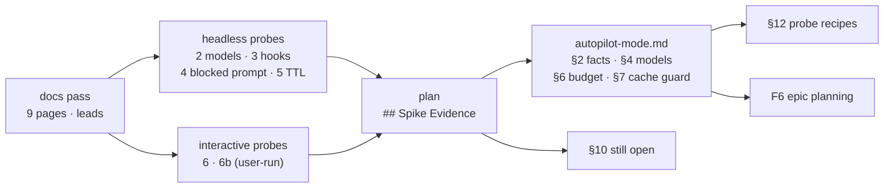

# Slice 044 — F6 autopilot spike

> Completed: 2026-09-15
> Commits: b1c255c (direct-to-main; d228c88 before it is this slice's counter bump)
> Review rounds: **2** (round 1 two-pass → 20 findings, 1 Heavy · Local + 19 Light · Local, fixed in-phase, cap waived; round 2 fresh verification → 19 hold, R1-8 partial, 8 Light · Local fixed in-phase, cap waived, cleared without round 3)
> Roadmap: F6 — autopilot mode; the spike slice named in design record `autopilot-mode.md` §10 / §11

## What

The autopilot design no longer rests on docs claims and memory: every runtime question its budget guard, cache guard and
builder loop depend on has a verdict with evidence in `.claude/project/design/autopilot-mode.md` — measured where a probe
could decide, marked inconclusive where a probe could not decide (`rate_limits` movement) and unverified where none was run
(credit spend, Fable, foreground builders) — so the F6 epic can be planned on checked facts. Before, several facts were
marked UNVERIFIED and one was wrong ("no in-session access to the 5h window"). The spike also found three things that
change the design — by default the builder runs asynchronously and its result arrives twice, the prompt hook fires for
subagent hand-backs, and subagents cannot simply `sleep` — and it produced a per-agent model proposal with a Sonnet
master. No plugin surface changed.

## Why

- **A wrong fact costs a whole unattended run** — autopilot runs for hours without the human and must never spill into paid
  usage, so docs served as leads and only a probe decided (the global rule: docs and training knowledge are never ground
  truth). It paid off twice: the 5h-window claim was wrong, and `claude plugin validate` would have seemed to confirm
  `model: fable` while it accepts even `not-a-model`.
- **Cost traps shaped the probes** — Fable bills usage credits without asking in `-p`, so no Fable probe ran; every probe
  ran on Sonnet. **Promoted to `rules.md` → Workflow Rules** (probes never select `fable`).
- **The model split follows verified prices** (Opus 5 = 2.5× Sonnet 5 on every token class): the master's biggest cost is
  its long cached context and its quality comes from deterministic rules, so it runs on Sonnet with real judgment moved to
  the human or an Opus agent.
- **One home for the facts** — the verdicts live in the design record, not in a second report ("a rule is never described
  twice").

## Decisions

- **Scope: four probe groups** (user) — statusline cadence during a subagent, blocked `UserPromptSubmit`, subagent cache TTL
  (Q5), cheap checks (`fable` alias, `SubagentStart` / `SubagentStop`, statusline fields). *Excluded:* the Workflow tool
  evaluation (Q4 made master + subagents the foundation), the concurrent-session MCP knockout (only fan-out across
  sessions, which Q4 rules out), Q6 thresholds (a design call). *Why not* a wider spike: those are not probe questions.
- **Verdicts live in the design record** (user). *Why not* a separate report: the same facts described twice.
- **Knowledge spike, nothing shipped** (user) — probes in scratch fixtures; a reusable sensor script is epic item §8.2.
  *Consequence:* no harness change, B2 does not apply.
- **Headless probes + one interactive run** (user) — the statusline item is interactive-only, so it is the real human test
  `rules.md` requires; a second interactive run (6b, full payloads) resolved what the first left open.
- **Docs are leads, probes are verdicts** — a docs statement alone never upgrades a design-record row to primary evidence.
- **No paid probe without consent** — headless probes never select `fable`. Promoted `[R]`.
- **Fable is never called automatically** (user) — on this account Fable has its own allotment (about half a weekly
  limit); development needs at most Opus; Fable only for planning, chosen by the human. *Consequence:* no automated
  `fable` tier; sub-task 2 needed no Fable spawn.
- **Probes run on `sonnet`** — they test Claude Code mechanics, not model quality.
- **Model tiers per agent — the user's starting point** (user) — reviewer Opus, builder Sonnet; the user asked for a
  recommendation on the master. Verified list prices 2026-09-15 (input / output / cache hit per MTok): Fable 5.1
  $10 / $50 / $0.25 · Opus 5 $5 / $25 / $0.50 · Sonnet 5 $2 / $10 / $0.20 · Haiku 4.5 $1 / $5 / $0.10.
- **Master on Sonnet, judgment moved out** (user, on the agent's recommendation) — *condition:* every decision needing
  real judgment goes to the human or a short-lived Opus agent; epic planning draws the line. *Why not* Opus: 2.5× on the
  whole long master context; Opus stays the fallback.
- **Per-agent model table — a proposal for §4** (user: decided in epic planning, couples to D2) — slice-planner Opus
  (Fable only by human choice) · plan-architect Opus · slice-builder Sonnet · builder after a ping-pong trip Opus ·
  E2E verification Sonnet · code-reviewer Opus · digests Sonnet; effort levels are proposals.
- **Phase 5 passed on the evidence report** (user, `[W]`).

## Verdicts (moved into the design record)

| Item | Verdict | Where |
|---|---|---|
| Statusline during a subagent | `refreshInterval` keeps it running every 5 s during a background subagent (confirmed); quiet without it (docs only); `cost.total_cost_usd` includes subagent spend live; `rate_limits` movement inconclusive | §2, §6 |
| Blocked `UserPromptSubmit` | no main-conversation request — headless and interactive (confirmed); `UserPromptSubmit` also fires for hand-backs, distinguishable only by leading prompt markup | §2, §7 |
| Subagent cache TTL (Q5) | default 5 m expires after a > 5 min gap; `subagentPromptCacheTtl` and a plugin agent's `experimental.cacheTtl` give 1 h (confirmed); break-even ≈ 0.65 × final context | §2, §6 |
| `fable` alias | valid subagent model (docs + Agent-tool enum); `plugin validate` checks no model value; CRAFT's enum stale in seven files | §2, §4, §8 2a |
| `SubagentStart` / `SubagentStop` | fire for plugin agents; payloads recorded; internal helper agents stop every ~30 s with `agent_type: ""` and leave no transcript | §2, §4, §6 |
| Async builder | the default in interactive sessions (fork mode); foreground switches documented, not probed — an epic-planning choice | §2, §4, §10 |

## Commits

- `d228c88` — chore(plans): bump slice counter to 45
- `b1c255c` — docs(design): verify the autopilot runtime facts in a spike

## Known limits (disclosed, not closed)

- **Foreground builders not probed** (user's route for R1-1) — `CLAUDE_CODE_FORK_SUBAGENT=0` /
  `CLAUDE_CODE_DISABLE_BACKGROUND_TASKS=1`; the latter removes the builder's wait path. §12 recipe 6 covers the rerun.
- **Unverified:** whether subagent requests move `rate_limits`; whether usage-credit spend shows there; whether helper
  agents keep the master's cache warm (their cost matches one read of the master prefix each); what a `model: fable`
  subagent spawned by the master does; what the runtime does with an invalid frontmatter `model`.
- **Undocumented formats relied on** — the hand-back / task-notification prompt markup (§7), and the
  `for n in $(seq …); do sleep 5; done` form that works around a sleep block whose message discourages it (§12 recipe 5).
- **Shipped CRAFT is likely affected** — interactive `/craft:review` / `/craft:execute` delegations are expected to receive
  each result twice (seen with a probe agent only), and `model-defaults.md` is stale on blocking subagents and full model
  IDs; the intent Non-Goal "no per-command model frontmatter" rests on a premise the docs now contradict. Recorded in
  design record §10 → epic item 2a.
- **Probe 2's validate output and the Agent-tool enum were not saved** — re-checkable only by re-running §12 recipe 2.

## Phase-8 Review Record

- **Round 1** — pass 1 rubric (11) + pass 2 fact-check against the raw probe evidence (12), deduplicated to 20: 1 Heavy ·
  Local (R1-1 the async builder stated as fixed though it is only the fork-mode default; route chosen by the user: text
  fix, foreground probe stays open), 19 Light · Local (shipped-CRAFT impact, guard arming rule, master cache, overage
  beyond Fable, model-table sourcing, a dropped Fable question, enum count, an over-labelled row, break-even 0.6 → 0.65,
  incomplete recipes, Workflow tool still open, TTL credits exception, helper transcripts, session-start `rate_limits`,
  matcher exactness, Fable allotment source, a3 numbers, plan evidence details, recap overclaims). User: cap waived,
  round 2 verifies.
- **Round 2** — fresh verification: 19 hold, R1-8 partial (reopened as R2-1); 8 Light · Local (enum wording, a broken §8
  list marker, the master-cache claim downgraded to unverified with the helper-read evidence, a stale Non-Goal premise,
  foreground options vs. the wait path, "every delegation twice" softened, a self-contradicting evidence bullet, recap
  precision). User: cap waived, cleared without round 3.

## How (Diagram)

