# Slice 045 — builder-return-probe

> Completed: 2026-09-15
> Commits: d804651 (direct-to-main; 23de5f9 bumps the epic counter for epic-003, 1cbd43b this slice's counter)
> Review rounds: **2** (round 1 two-pass → 16 findings: 2 Heavy · Rethink looped back to Phase 4, 14 Light · Local fixed in-phase, cap waived; round 2 fresh verification → 13 hold, 3 partial, 7 Light · Local fixed in-phase, cap waived, cleared without round 3)
> Epic: epic-003 (autopilot mode) — entry `builder-return-probe`; roadmap F6

## What

The autopilot epic now knows, by measurement rather than docs, how a builder's result reaches the master in the three
modes an interactive session can run in — default (fork mode on), `CLAUDE_CODE_FORK_SUBAGENT=0`,
`CLAUDE_CODE_DISABLE_BACKGROUND_TASKS=1` — and the user has decided on that evidence: builders run in the foreground (Q8,
design record §9). Two things surfaced on the way: a subagent must report through the undocumented `SubagentHandback`
before it can end a turn its caller started (enforcement seen in one of the three runs), so a builder cannot wait idle for
its own result; and a direct delegation to `craft:code-reviewer` — the agent `/craft:review` spawns — received its result
twice, confirming what slice-044 expected. Review added a consequence the user accepted: a master blocked on a foreground
builder cannot stop it mid-slice, so D32's in-slice budget stop and Q7's progress line need a home elsewhere
(`budget-and-cache-guard`, `autopilot-loop`). No plugin surface changed.

## Why

- **A wrong fact costs a whole unattended run** — the loop stands or falls with how a builder returns, so docs were leads
  and probes decided. It paid off: the docs were silent on `SubagentHandback`, and the worker misreported itself in run 1
  (`A=woken`, `HAS_MONITOR=no`) — verdicts rest on hook logs, marker files and transcripts, never on the worker's report.
  **Promoted to `rules.md` → Workflow Rules.**
- **Interactive, human-run** — `-p` has fork mode off, so only an interactive session shows the default; smoke runs came
  first so that no human run was spent on a broken probe — worker revision 1 would never have shown the idle wait.
- **Q8 follows the numbers** — foreground delivered once with the fewest main requests (1 delivery / 2 requests vs. 3 / 5
  in the default's worker part and 7 / 12 with fork mode off; one run per mode, dollar figures not like-for-like); the
  background mode's idle wait is no advantage for a builder, because it comes only after an early report.
- **One home for the facts** — the verdicts live in the design record, not in a second report.

## Decisions

- **Interactive, human-run probes** (user) — fork mode is off in `-p` / the SDK; `tmux` is not installed. *Why not* install
  tmux: an extra tool for one spike, and `rules.md` requires a real human test for interactive-only behavior anyway.
- **Three configurations, one sequence** (user) — default, `CLAUDE_CODE_FORK_SUBAGENT=0`,
  `CLAUDE_CODE_DISABLE_BACKGROUND_TASKS=1`. *Why not* only the two foreground runs: the CRAFT agent check needs a default
  run, and one fixture design for all three keeps the comparison clean.
- **CRAFT agent check on `sonnet`** (user) — `craft:code-reviewer` from the installed 1.5.0 with a model override and a
  trivial brief. *Why sonnet:* the delivery path is under test, not review quality.
- **Verdicts live in the design record**; **probes run on `sonnet`, never `fable`**.
- **Worker revised after smoke 2** — revision 1 ran both wait paths concurrently and never waited idle. *Why smoke first:*
  a human run spent on a probe that cannot show the idle wait would have been wasted.
- **Q8 → foreground builders via `CLAUDE_CODE_DISABLE_BACKGROUND_TASKS=1`** (user, on the agent's recommendation) —
  reasoning, rejected options (default + de-duplication; fork mode off) and consequences in design record §9 Q8.
- **Q8 kept after review R1-1** (user) — the blocked master cannot host D32's in-slice budget stop or Q7's progress line;
  where they live is deferred to epic-003 `budget-and-cache-guard` / `autopilot-loop`. *Why not* re-open Q8: the stop can
  live inside the builder or move between spawns; the single-delivery loop is worth more.
- **Shipped-surface finding routed, not fixed** — the duplicate delivery in today's CRAFT is an epic-003 deferred decision
  ("Unowned"), decided when `model-tiers` is planned. A knowledge spike changes no plugin surface.
- **Phase 5 passed twice on the evidence report** (user, `[W]`) — before and after the review loop-back; the mechanical
  assertion check caught two errors before the first pass (a wrong sync criterion; run 2 miscounted).

## Verdicts (moved into the design record)

| Item | Verdict | Where |
|---|---|---|
| Default (fork mode on) | `async_launched`, master turn ends; 3 deliveries in run 1, no ceiling (each wake / resume adds one) | §2, §4 |
| `CLAUDE_CODE_FORK_SUBAGENT=0` | foreground when Claude needs the result, but resumes run in the background with duplicates; 7 deliveries / 12 requests | §2, §4 |
| `CLAUDE_CODE_DISABLE_BACKGROUND_TASKS=1` | foreground, one hand-back, no task notification, 2 requests, no helper agent during a 1 m 54 s spawn | §2, §4 |
| `SubagentHandback` | undocumented report tool in interactive sessions; `[handback-send-enforce]` before ending a caller-started turn (run 2); a background subagent can idle after its report and be woken by its own command (run 1) | §2, §4, §6 |
| Builder wait path | blocking foreground command in every mode; a foreground builder's leftover background command is killed at its report, a background builder's re-starts it | §2, §6 |
| Statusline / cost | `refreshInterval` ticks while the master is blocked; `cost` rises live | §2, §6 |
| Mode discriminator | `PostToolUse` Agent `tool_response.status` (`completed` / `async_launched`) | §2, §4 |
| Q8 | foreground builders; consequence for D32's in-slice stop and Q7's progress line | §9, §6, §10 |

## Commits

- `23de5f9` — chore(plans): bump epic counter to 4
- `1cbd43b` — chore(plans): bump slice counter to 46
- `d804651` — docs(design): probe how a builder returns to the autopilot master

## Known limits (disclosed, not closed)

- **One run per mode** — counts and costs are single observations; the workers took different paths.
- **Not probed:** waits beyond 10 min (`BASH_MAX_TIMEOUT_MS`, `CLAUDE_ASYNC_AGENT_STALL_TIMEOUT_MS`); foreground spawns
  longer than the master's 1 h TTL; helper agents during long foreground spawns; `/craft:review` and `/craft:execute`
  themselves under fork mode (only a direct `craft:code-reviewer` delegation ran); enforcement in the default and
  background-tasks-off modes (inferred); Bash `run_in_background` absence in run 3 (worker's report + docs only).
- **Undocumented behaviour relied on** — `SubagentHandback`, `[handback-send-enforce]`, the hand-back / task-notification
  markup; re-check with design record §12 recipe 7 on Claude Code updates.
- **Unexplained** — a 51 s delay on one builder `echo` in run 3 (auto-mode classifier latency suspected, unverified).
- **Evidence lives in the session scratchpad** (fixtures, logs, generator, extractors) and in `~/.claude/projects/` — not
  in the repo; recipe 7 rebuilds it.

## Phase-8 Review Record

- **Round 1** — pass 1 rubric (10) + pass 2 fact-check against the raw evidence (10), merged to 16: 2 Heavy · Rethink
  (R1-1 Q8's unrecorded consequence for D32's in-slice budget stop and Q7's progress line; R1-2 the "no subagent can end
  its turn to idle-wait, in any mode" verdict contradicted by run 1) — both looped back to Phase 4 by the user, Q8 kept;
  14 Light · Local (cost comparison, sleep-block wait path, recipe references, `/craft:review` not run, unowned
  shipped-surface finding, Q8 mechanics, labels, §11 order, self-report labels, "up to three", statusline count, Monitor
  timeout, 51 s cause, kill timing). User: cap waived.
- **Round 2** — fresh verification: 13 hold, R1-2 / R1-8 / R1-9 partial (reopened as R2-1 … R2-3); 7 Light · Local
  (+ run-3 self-report in §4, recipe-7 range, Q7 wording, stale epic entry). User: cap waived, cleared without round 3.

## How (Diagram)

```mermaid
flowchart LR
  DOCS["docs pass<br/>leads"] --> GEN["fixture generator<br/>worker · hook + statusline loggers"]
  GEN --> SMOKE["3 smoke runs (-p)<br/>worker rev. 2"]
  SMOKE --> RUNS
  subgraph RUNS["3 interactive runs (user)"]
    D["default<br/>async · 3 deliveries"]
    N["FORK_SUBAGENT=0<br/>fg → bg resumes · 7"]
    B["DISABLE_BACKGROUND_TASKS=1<br/>fg · 1 delivery"]
  end
  RUNS --> EV["hooks.jsonl · statusline.jsonl<br/>transcripts · marker files"]
  EV --> CHK["assertion check<br/>(2 errors caught)"]
  CHK --> DR["design record<br/>§2 §4 §6 §7 §10 §12"]
  DR --> Q8["§9 Q8: foreground<br/>(user)"]
  Q8 --> REV["review round 1<br/>rubric + fact-check"]
  REV -->|"R1-1 · R1-2 loop-back"| DR
  REV --> LOOP["epic-003<br/>autopilot-loop · budget-and-cache-guard"]
```

