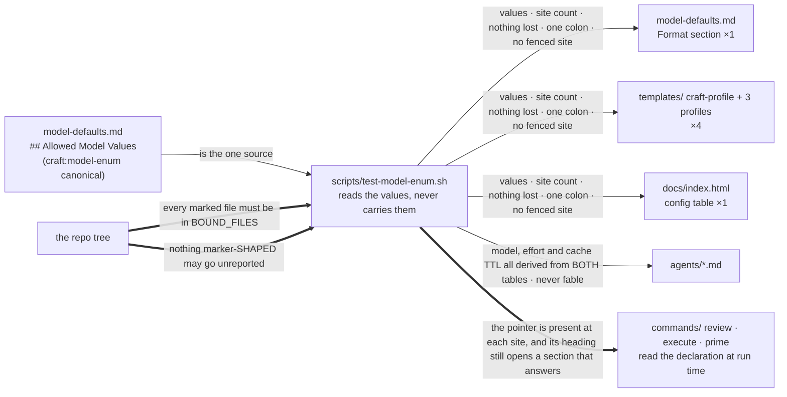
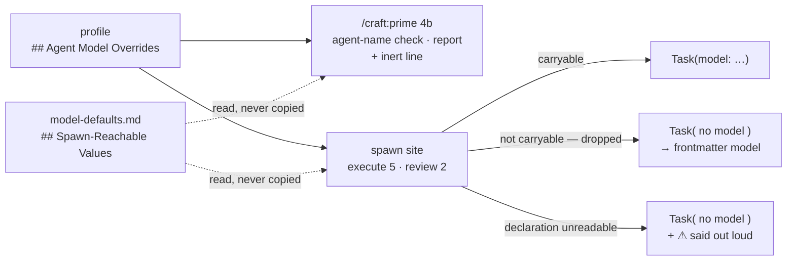

# Slice 046 — Model Tiers

> Completed: 2026-09-18
> Commits: 5fcb223..6504bba (branch only, trunk-based)

## What

The list of allowed model values was written out nine times across seven files, so adding a value
meant finding all nine. It is now declared **once**, in `model-defaults.md`, as **two** declarations
that are deliberately not the same set: `## Allowed Model Values` (what an agent's `model:`
frontmatter accepts) and `## Spawn-Reachable Values` (what the Agent-tool spawn parameter accepts, a
subset). Two of the original occurrences turned out not to need the values and were deleted; the
remaining six carry a marker and are compared against the declaration in both directions by
`scripts/test-model-enum.sh`. Two values that could not be expressed before are now sayable: `fable`
and full model IDs. Roles bind to **capability tiers** — `deep-reason` and `execute` — with models as
the tiers' current resolution, so a model generation can move without every role being re-argued.

`/craft:prime` no longer validates model values at all: it checks the agent name, reports everything
else as written, and says so. The project override now also reaches `slice-builder`, not only
`code-reviewer` — a gap slice-016 left and this slice surfaced by making the resolution order
normative. And the limit is **wired, not merely documented**: both spawn sites read the declaration
and pass an override only when the spawn can carry it, otherwise they spawn with no `model`
parameter; when the declaration itself cannot be resolved they spawn without a model **and say so**.

## Why

- **The tabu's other half.** `rules.md` says a rule is never described twice and the second copy has
  to go. Where a copy could go, it went — `commands/prime.md` once held two and now holds none. Where
  it could not — a profile template exists precisely so a human reads the values where they are
  needed — it is **bound** instead. That amendment was promoted to `rules.md` in this Phase 9, so the
  construction reads as the tabu's other half rather than as an unexplained breach of it.
- **Pass-through follows from an open set.** Once `<model-id>` is allowed, no rule can decide whether
  `gpt-4` belongs to it; a pattern would have to settle Bedrock and Vertex spellings and would age
  with every model generation, and `claude plugin validate` accepts any string anyway — the old
  warning guarded nothing it could see. The disclosed cost was **probed, not assumed**: an agent
  pinned to `model: gpt-4` passes validation and fails the spawn with `model_not_found` (HTTP 404).
- **Prime reports what CRAFT asks for, never what runs.** Claude Code resolves a subagent's model from
  further inputs CRAFT does not control; they are enumerated once, in `model-defaults.md` →
  *Sources outside CRAFT's reach*. That file said "No further sources" for four review rounds, because
  every round checked the slice against CRAFT's own design record — and a record cannot notice that a
  third-party tool moved underneath it. It was found by reading the current documentation.
- **The harness's shape was corrected by review, not designed.** Nine rounds repeated one pattern:
  every mechanism added here was correct in the case it was written for and open one level further
  out — a removed marker, a missing list entry, a near-miss spelling, a fenced example, a heading
  whose name resolved to nothing, a table column the harness had hardcoded instead of read. Binding
  `BOUND_FILES` itself inverts the burden of proof: the tree decides which files claim to be bound,
  and the list must account for every one of them.

## Decisions

- **The enum is declared once and the copies are harness-bound, not removed** — the templates and
  `docs/index.html` exist so a human reads the values where they are needed. *Why not a generator:*
  this repo deliberately carries no build tooling, and generated Markdown in a commit would be a new
  concept here. *Residual, disclosed:* the harness binds the enum's literal, never the prose around it.
- **`fable` is allowed and visibly flagged, not silently accepted** — a profile override is
  human-written by definition, so blocking it would be paternalistic; but on this account `fable` can
  bill to usage credits beyond its own allotment, and an override set once is invisible thereafter, so
  prime reports it at every session start. *Why not also a prose prohibition:* the harness's
  "no shipped agent declares `model: fable`" check binds the mechanical half; a prose rule would add an
  unchecked sentence for the rest.
- **When `model-defaults.md` cannot be read, prime names the model the spawn will ask for** — not the
  configured one. Prime and both spawn sites resolve the same two paths in the same session, so a
  declaration prime cannot read is one the spawn cannot read either; naming the override would name a
  value nothing will ask for, in the one branch where the spawn's behaviour is fully determined.
  *Why not the configured value:* the agent-models line is a statement about configuration, but the
  configuration it reports is *what CRAFT asks for*, which is the only claim a run could contradict.
- **Scope stops at today's two agents** — the tier table is written normatively now so `slice-planner`,
  `plan-architect` and the E2E verifier inherit it in later epic-003 slices instead of each re-deciding
  its own model, but only `slice-builder` and `code-reviewer` exist today, which keeps the observable
  effect measurable in this slice rather than deferred.
- **The fix for B-R7-1 is a genuine exception to the tabu** — *a pointer's own unreachability handler
  cannot live behind that pointer.* Promoted to `rules.md` → Code Conventions in this Phase 9, and
  bound by the harness so a later de-duplication pass goes red instead of reinstating the silence.

## Commits

- `5fcb223` — feat(model-defaults): declare the allowed model values once, add capability tiers
- `a0384fd` — feat(agents): give slice-builder its tier's effort and cache TTL
- `ac580a6` — docs(templates): bind the profile templates' value lists to the declaration
- `2b605a2` — docs(site): bind the docs page's model values and record the harness
- `416c758` — feat(prime): report the model CRAFT asks for instead of validating values
- `9fefaf7` — fix(spawn): carry a reachable override, drop the rest, say so when unreadable
- `06a2abf` — test(model-enum): bind every marked copy to the single declaration
- `6504bba` — docs: record the model-enum harness and prime's new contract

## Follow-ups

- **R1-21** (Light · Rethink) — the bound-copy rationale does not cover the two **intra-file** repeats
  inside `model-defaults.md` itself. *Half discharged here:* the second half, that the `rules.md` tabu
  read absolute, was promoted in this Phase 9. The intra-file repeats remain open.
- **R1-22** (Light · Rethink) — whether a CRAFT-internal marker belongs in generated user config was
  never decided, only done. Overlaps R1-20, which fixed the wording half.

## What this slice does NOT cover

The binding mechanism's known, reproduced holes are listed in exactly one place —
`model-defaults.md` → *How a copy is bound* → **Known limits of the binding mechanism** — which names
each by its finding ID and states how many there are. This archive keeps no second copy, deliberately:
that block once existed in four hand-maintained versions and was wrong in three of them, each
differently, which is the very failure the slice's mechanism exists to prevent, applied to the slice's
account of itself. Most are routed to **`slice-047 harness-fence-parser`**, which is planned and not
yet built; until it lands, read "fence-aware" there as "at the marker comparison level". Two residuals
are routed nowhere because nothing can close them — chiefly the **unmarked copy**: a file that names
the values and declines to carry a marker is invisible to every check here. That is not hypothetical,
it is finding R1-3, an unbound copy this slice itself added to `CLAUDE.md` and a human reviewer caught.

**The review pattern is itself a finding.** Nine rounds, and the stopping rule adopted in round 3 —
*another round earns its cost as long as it finds at least one case the mechanism silently passes* —
decided against stopping seven rounds running. Round 9 was put forward as its first honest test, on
the argument that round 8 had invented no mechanism and therefore left no fresh layer to find. The
premise was true and was verified; the conclusion did not follow. The surface round 8 added was
**prose**, and three of round 9's six Heavy findings live in it. *"No new mechanism" and "no new
surface" are different claims.* A later reader should assume there is another layer, and should look
first at whatever was added most recently.

## How (Diagram)

The **binding graph** — what the harness holds together at edit time. It names no values on purpose:

The **runtime path** is a separate graph with one branch. Both nodes that need the set read it from
the declaration, exactly as the code does:

The third edge is the one a human Phase-5 test found missing (B-R7-1) — the only defect in this slice
that no harness, no probe and no reviewer pass produced. Its instruction is the only part of the spawn
procedure written at the sites rather than in the declaration: read the dotted edges as "this branch
needs the declaration", and the third edge as the branch that has to work when the dotted edge does not.
