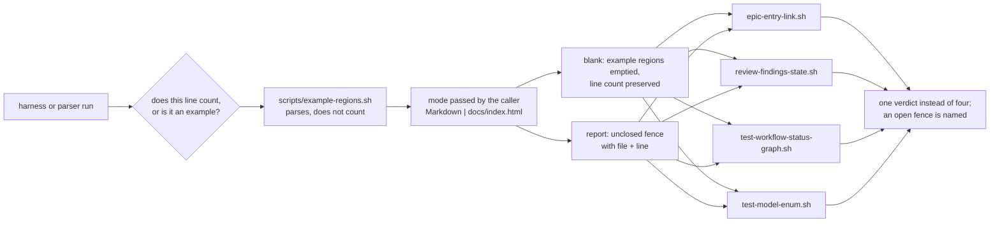

# Slice 047 — Harness Fence Parser

> Completed: 2026-09-29
> Commits: c5620e7..9aa1657 (branch only, trunk-based)

## What

Four scripts each decided for themselves whether a line was "just an example" or real content, and
they decided it by counting backticks — four answers to one question, which demonstrably diverged: a
nested fence, a `~~~` inside a backtick block or a fence left open at the end was enough for a marker,
an epic entry or a findings line to be invisible to one script and visible to the next. There is now
exactly one place that decides it, `scripts/example-regions.sh`, and it **parses** the constructs
instead of counting them: fences nested, indented, blockquoted and unclosed, multi-line HTML comment
blocks, and `<pre>` in `docs/index.html`, the one bound site that is not Markdown. The four consumers
— `epic-entry-link.sh`, `review-findings-state.sh`, `test-workflow-status-graph.sh` and
`test-model-enum.sh` — ask it; no parity toggle remains in `scripts/`. The ten harness holes slice-046
routed here are closed (R4-2, R4-6 … R4-10, R7-3a, R7-3b, plus the raw table reads).

The helper runs on bash 3.2 without `python3`, because `review-findings-state.sh` reaches it from the
SessionStart hook, and a consumer **without** it fails closed rather than answering. `report` names an
unclosed fence, and the harnesses ask it, so a fence left open fails with file and line instead of
letting a harness check less in silence.

For CRAFT's users the runtime effect on today's plans is nil — both runtime parsers already handled
fences correctly, and the migration was measured behaviour-preserving. The value is one definition
instead of four, and a status-graph harness that no longer misreads fenced examples in command prose.

Review found the slice's own regression twice, both on the number the commit gate reads
(`OPEN_COUNT`): a prose line that merely named a comment opener opened a block that never closed
(R2-1, the opener must now begin the line), and a block closed at the end of its last text line — the
shape an editor's comment toggle writes — was never closed either (R3-1, a block now ends at a line
that ends with the closer and opens no comment of its own). Gate at close, read off the run:
13/13 harnesses green, `test-example-regions.sh` 35 cases, `test-model-enum.sh` 117 checks with 57
red fixtures, `claude plugin validate .` passes.

## Why

- **The tabu applied to code.** *A rule is never described twice* — four scripts answering the same
  question is that violation, and the answer could not be one more check on top: the second, third and
  fourth copy had to go. slice-046's reviewer had recommended porting the good parser into a fifth
  place.
- **Parse, do not count.** The defect *was* the backtick-counting heuristic, so the repair could not be
  another heuristic.
- **Silence is the enemy.** A toggle that swallows an unclosed fence makes a harness greener, not
  louder; hence `report`, hence fail-closed consumers, hence no dependency on the hook path that can be
  missing.
- **The slice exists because a defect recurred four times**, one layer further out each round of
  slice-046 — round 4 named the cause: the harnesses parsed Markdown with grep.

## Decisions

- **Extract one helper; do not adopt a fifth copy** (user) — the four implementations disagreed, so
  the same file read differently depending on the harness. *Why not* port `epic-entry-link.sh`'s parser
  into `test-model-enum.sh`: a fifth answer to the same question.
- **The subject is "example, not content": one helper, three constructs, two modes** (user) —
  `markdown` for fences and comment blocks, `html` for `<pre>` and comment blocks; the caller passes the
  mode. *Why not* Markdown-only: `docs/index.html`, one of seven binding sites, would stay unprotected
  while `model-defaults.md` claimed the holes closed.
- **bash 3.2, extracted from `epic-entry-link.sh`, not rewritten** (user) — the hook path uses no
  `python3` today, and a python helper would add a hard dependency where fail-open is required. *Why
  not* re-implement in awk: the case table would pin a new implementation instead of the reference.
- **A consumer without the helper fails closed** — an answer from the raw file is the one outcome
  neither caller can detect; `/craft:review` Step 6 blocks Commit on a failed helper, and
  `handoff-marker-state.sh` reads `unknown`, which doubt-means-live keeps live.
- **A consumer calls the helper with its own interpreter** (`"${BASH:-bash}"`, never PATH's `bash`) —
  the plain call broke the hook-path guarantee `test-handoff-marker-state.sh` pins with a poisoned PATH;
  it was caught by that third harness, not by the two of the scripts being changed. Run the whole gate
  after every consumer migration.
- **Harnesses ask `report`, not only `blank`** — a harness that only blanks gets quietly green when a
  fence stays open; this is the first thing the helper makes possible rather than merely unifies.
- **The measured delta against the old toggles is recorded, with which side is right** — against
  `defenced()` the only difference over six real files is the R7-3a comment block (a fix); against the
  status-graph toggle, a nested-fence decoy is now hidden (right) and `` ``` see `x` `` is not an
  opener (CommonMark, the reference).
- **A fixture declares which occurrence it mutates** (R4-2) — `subst` takes `<n>/<total>`; uniqueness
  alone was too strict, because a fixture that mutates `test-model-enum.sh` carries its pattern twice.
- **The comment opener must begin the stripped line; the choice follows the direction of the failure**
  (R2-1) — permissive hides content silently, strict at worst reads a decoy as content and goes red. All
  seven real constructs in the tree satisfy the rule. The closer was widened in round 3 for the same
  reason (R3-1), keeping a decoy marker line from ending a block.
- **The docs harness binds its own harness table** — the staleness detector counted commands, skills,
  agents and hooks but not harnesses, so the thirteenth row would have been missed in silence; bound in
  both directions now.
- **`skills/workflow/SKILL.md` is still read raw by the status-graph harness** — it never had a toggle;
  blanking it would be a behaviour change outside the slice. Carried as follow-up R1-13.

## Commits

- `c5620e7` — feat(scripts): add example-regions.sh, the one definition of an example region
- `7caf639` — refactor(scripts): let the findings parser and the epic link helper ask example-regions.sh
- `ec2c91f` — test(harness): move the status-graph and model-enum harnesses onto example-regions.sh
- `e3d000b` — test(toolchain): bind example-regions.sh to the bash-3.2 baseline
- `fd21888` — test(docs-site): bind the harness table to scripts/ in both directions
- `9aa1657` — docs: record the example-regions helper and the limits it leaves

Landed alongside, not slice work: `75861da` docs(rules): calibrate Phase 8 to real risk ·
`bbd28db` chore(plans): bump slice counter to 49.

## Follow-ups

- **R1-1** (Heavy · Rethink, re-routed to a follow-up by the user) — `report` names only an unclosed
  fence; a multi-line comment block or `<pre>` that is never closed blanks the rest of its file without
  a report. The planned spin-off, slice-048, was aborted. After R2-1 and R3-1 what remains is genuinely
  malformed input, which also breaks the rendered Markdown — Light under `rules.md` → *Phase 8 is
  calibrated to real risk*.
- **R1-13** (Light · Rethink) — `test-workflow-status-graph.sh` reads `$TEMPLATE` and `$RULES` raw with
  no marker boundary; the disclosed `skills/workflow/SKILL.md` read is bounded by its
  `craft:transitions` markers and is the narrower question.
- **R2-7** (Light · Rethink) — the harness-table binding in `test-docs-site.sh` reads
  `docs/index.html` raw, so a harness name parked in a `<pre>` could stand in for a deleted row; not
  live (three `<pre>` blocks, none naming a harness).

## Review

Three Phase-8 rounds; the third was the last under the calibration adopted mid-slice (2026-09-29):
Heavy needs a realistic failure, at most three rounds, no automatic new slice. Round 3 verified every
earlier fix against the tree and found one new Heavy (R3-1), a regression on the commit gate reachable
by ordinary authoring — fixed in-phase, bite proven in a scratch copy.

## How (Diagram)


