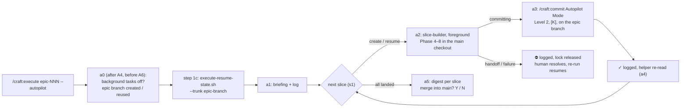

# Slice 049 — Autopilot Loop

> Completed: 2026-09-29
> Commits: b57a6c5..5a8f3ed (branch only, trunk-based)
> Epic: epic-003 (autopilot mode), entry `autopilot-loop`

## What

An already-planned epic now runs with one command, `/craft:execute epic-NNN --autopilot`: its slices are built,
reviewed and committed one after another on the epic's own branch `epic-NNN-<slug>`, with no halt between them, and
`main` does not move until the human says yes at the end. Before, every slice needed the human to start the next one.
Every human stop stays — a Phase-5 check, a review escalation, a blocker or a failure stops the run with `⛔`, and a
re-run resumes it from disk. Each event is logged with a real timestamp in the epic plan's `## Autopilot Log`.

## Why

- **A variant of the sequential epic path, not a new command.** Order, resume and landing already existed and are still
  described once; only four differences are new — the epic branch as the landing, a foreground `slice-builder` instead
  of the master building, Level-2 commits, no halt. A separate `/craft:autopilot` would have been a second prose for the
  same loop.
- **Loop first, stops later** (epic-003's vertical order): this slice removes no human stop; `autonomous-verification`,
  `ping-pong-breaker` and the guards remove them one by one.
- **An agent's report is no evidence.** Four defects the probes found — a foreign attribution trailer at Level 2, a
  resume that logged nothing, invented log timestamps, a one-directional post-assertion — were visible only in git and
  the files; every probed report read as complete.

## Decisions

- **`--autopilot` is a variant of `/craft:execute`'s sequential path** (user) — written as deltas a0–a5 that delegate
  to s0–s5. *Why not* an own `/craft:autopilot start | resume | stop`: a second description of order, resume and landing.
- **A per-run flag, not a profile value** — D32 requires an explicitly started run, and a flag keeps autopilot out of
  the profile's `Epic Mode` enum and its bound copies. *Why not* `Epic Mode: autopilot`: a standing default would start
  hands-off runs without a per-run decision.
- **Scope: the adjusted minimal loop** (user, after a side-by-side with the full entry) — the loop, R1-9 for execute
  s0/s1, a slim digest. *Why not* the full entry: about half again as large, the surplus in the handoff lifecycle where
  review rounds piled up before. R1-15 went to roadmap B18, the master judgment line to `ping-pong-breaker`.
- **Each slice commits directly on the epic branch** (user) — the `Slice:` footer groups it. *Why not* a short-lived
  slice branch merged `--no-ff`: branch management inside a checkout the human must not touch.
- **`slice-builder` in the foreground, in place** (user, per Q8) — one delivery, a lean master. *Why not* the master
  building: its context grows with every slice.
- **Progress between spawns, live phase in the plan** (user) — `▶ / ✓ / ⛔ / ■`, logged; during a spawn the plan's
  `Status:` is the live phase. *Why not* a builder-written progress file plus statusline: a new writer and user config.
- **The epic-end sign-off merges on the human's yes** (user) — `--no-ff` under `direct`; under protected main the yes
  opens the epic PR and the approval and merge happen on GitHub (a deliberate deviation: the existing PR gate is keyed
  on a finalize worktree an in-place epic does not have).
- **The resume helper needed no change** — the autopilot passes its epic branch as `--trunk`; the existing sequential
  rows answer everything. Consequence: a0 settles the epic branch before A6 and before step 1c, because on the trunk a
  slice landed on the epic branch reads `missing`.
- **`/craft:commit` needed an Autopilot Mode** — on an `epic-NNN-<slug>` branch its Step 6 and *In-place-finalize*
  would have pushed per slice or merged every landed slice into the trunk; the mode applies whoever runs the command,
  the autopilot at Level 2 or a human after answering a stop.
- **Esc leaves the slice at its execution status, not `paused`** — the explicit exception to execute's interrupt row:
  a paused slice would be `held` and need a `/craft:continue` before the re-run.

## Evidence

- **Gate:** 13/13 harnesses + `claude plugin validate .`, green before commit (`test-execute-resume-state.sh` 152/0 with
  the new autopilot cases — nine plus a control, read off the run; the commit message of `45fca60` says "ten cases plus
  a control", which is one too many).
- **Headless probes** (isolated from the user's settings, one fixture, two runs, twice; $3.55 in total): slices land on
  the epic branch without a halt, `main` untouched, a Phase-5 stop and its resume work, builders ran in the foreground.
  The first pair found four defects, fixed; the re-run confirmed the fixes (real timestamps inside the run's window).
- **Human test** (the user's own settings): T1 Esc mid-spawn and re-run, T2 a real `[W]`, T3 merge on yes
  (`e039b0c Merge epic-001: Greet`, two parents) — `[W]`. T4 showed the user's `rm` deny rule stopping every slice
  close; the master never went around it → roadmap B19.
- **Review:** two rounds under the new calibration. Round 1: 4 Heavy + 9 Light, all four Heavy from the scenario
  walk-through of the changed prose, none visible in the probes (the master had filled each gap by judgment); the fix
  cap was waived and 11 fixes applied. Round 2: 4 Light, fixed; no third round needed.

## Commits

- `b57a6c5` — fix(commit): take the attribution line from the profile only
- `f940e1f` — feat(execute): run an epic hands-off on its epic branch with --autopilot
- `5a79280` — feat(commit): land a slice on an autopilot epic branch without touching the trunk
- `30b1dcb` — feat(agents): let slice-builder run in place on an autopilot epic branch
- `a746275` — feat(templates): give the epic plan an Autopilot Log
- `45fca60` — test(execute-resume): pin the epic branch as the autopilot trunk
- `152cf70` — fix(test-model-enum): find the docs value line by its marker, not a line number
- `af3550b` — docs: document /craft:execute --autopilot
- `0fc6c2d` — docs(design): record the autopilot loop's decisions
- `5a8f3ed` — docs(roadmap): add B18 (handoff answers) and B19 (delete-safe cleanup)

Landed alongside, not slice work: `28d96f1` docs(changelog): record example-regions.sh (slice-047) · `24efaeb`
chore(plans): bump slice counter to 50.

## Follow-ups

- **R1-11** (Light · Rethink) — under protected main a re-run after a5's `[Y]` asks again and `gh pr create` fails on
  the existing PR; nothing detects an open or merged epic PR or says how to sync the trunk afterwards.
- **R1-13** (Light · Rethink) — the SessionStart handoff notice skips the main checkout, so an autopilot stop is not
  announced at session start; the plan status and the `## Autopilot Log` remain the record.
- Routed to the roadmap by this slice: **B18** (handoff-answer record, slice-042 R1-15) and **B19** (delete-safe plan
  cleanup and a lock that needs no removal — needed before an autopilot run on a machine with a deny rule on `rm`).

## How (Diagram)

