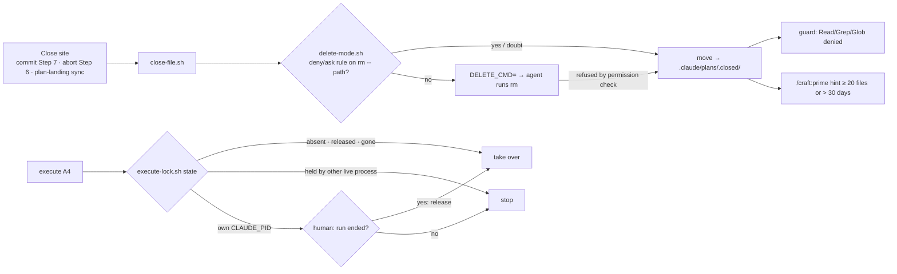

# Slice 050 — B19 Delete-Safe Cleanup

> Completed: 2026-09-30
> Commits: d89923b..0e0dd8c (branch only, trunk-based)

## What

CRAFT no longer removes its own files against the user's rule. When any settings level denies or asks on removing a
single file, closing or aborting a slice moves the plan into `.claude/plans/.closed/`, which the guard hook read-blocks
and no CRAFT scanner enters. The `/craft:execute` lock is never deleted in any project — it carries its state in its
content. Once `.closed/` piles up, `/craft:prime` hands the human a copy-ready delete command. An autopilot run on a
machine with such a rule no longer stops (deny) or prompts (ask) at every plan closure — slice-049's human test T4.

## Why

- **CRAFT never goes around a permission rule (D34).** Claude Code lets no level override a deny, and an ask prompts
  even in auto mode; the user set `Bash(rm:*)` on purpose. So CRAFT adapts, not the rule.
- **A helper never deletes.** In delete mode `close-file.sh` returns `DELETE_CMD=` and the agent runs it, so Claude
  Code's permission check stays the final judge: a detection gap (an unread settings level, a pattern the matcher gets
  wrong) costs a prompt or a stop, never a removal the user forbade.
- **Move mode switches on automatically, for ask rules too** — a prompt at every closure stalls an autopilot run as
  surely as a deny; `/craft:prime` makes the mode visible.
- **The lock carries its state in every project**, and A4 decides by a fixed rule instead of the agent's judgment,
  which settles slice-049 T1-a. A lock this very session holds goes to the human: its run may still be working in the
  background.

## Decisions

- **Move mode is automatic and rule-driven** (user) — a deny **or** ask rule that blocks removing a single file switches
  it on without asking. *Why not* the roadmap's one-time confirmation: an ask rule stalls autopilot like a deny, and a
  confirmation adds a question the rule already answered.
- **The helper never deletes** (planning) — delete mode returns `DELETE_CMD=`; a `DELETE_CMD` the permission check still
  refuses falls back to `--move`. *Why not* delete inside the helper: `bash script.sh` passes around the rule whenever
  detection misses one.
- **The lock carries its state in its content, in every mode** (user) — `STATE=held|released`, never removed; one lock
  path for all projects, not a move-mode variant.
- **Lock owner = the Claude Code process: `CLAUDE_PID` + its start time** (spike; *verified*
  code.claude.com/docs/en/env-vars, 2026-09-30 — requires Claude Code v2.1.214 or later). The old "current PID" was the
  Bash-tool shell, gone before the next call, so every lock would have read orphaned. The start time guards against PID
  reuse; the session ID is recorded for the human only.
- **An own-process lock asks the human, it is never taken over** (review R1-1, loop-back) — `DECISION=confirm`,
  `acquire` refuses; `/craft:execute` A4 and `/craft:worktree-clean` A3 ask and run the plain `release` only on `[N]`;
  an A4 or step-1 abort releases nothing (R2-1). *Why not* the spike's "own `CLAUDE_PID` → take over": interactive Agent
  spawns run in the background, the master's turn ends while the run lives, and subagents share `CLAUDE_PID` — a second
  `/craft:execute` in the same session would have taken over a live run's lock.
- **Helpers that remove plan files move them too; `plan-landing.sh sync` always moves its untracked copy** — it removes
  the copy inside a transaction and cannot hand a command back midway. Tracked removals stay (`git rm`, git can undo).
- **Periodic cleanup is a hint, never a deletion** (user) — at 20 files or one older than 30 days (counted from the
  close: the move stamps the file's time), `/craft:prime` prints a bounded `find … -delete` for the human. A
  session-scoped cron could not delete either: it runs under the same rules.
- **`.closed/` is read-blocked in two layers** (user) — CRAFT's scanners never look there (pinned), and the shipped
  guard denies Read / Grep / Glob into any `.claude/plans/.closed/`, in whichever checkout; root searches are scoped by
  the tools (Grep skips the gitignored directory; Glob may list names, Read of them is denied).
- **The deny reason sets the boundary itself** (Phase 5 [U], user) — blocked on purpose, do not read it another way, do
  not suggest changing the block, the human opens it. An open "ask the human" let an agent offer to loosen the block.
- **`delete-mode.sh` matcher scope** — user (`$HOME`, `$CLAUDE_CONFIG_DIR`), project and local (+ git top level), managed
  (`managed-settings.json` + `.d/*.json`, macOS / Linux paths *verified*); deny and ask count, allow is ignored; the
  command matched is exactly the absolute, single-quoted `DELETE_CMD` the agent issues. No wrapper stripping: CRAFT's
  own command has no wrapper.
- **One definition per command for closing a plan** — `/craft:commit` Step 7 *Closing an untracked plan*, which every
  mode points to; `/craft:abort` Step 6 carries its own call; both carry `<!-- craft:close-file -->`.
- **Scanners needed no change** — every CRAFT scanner globs `.claude/plans/<prefix>-*.md` non-recursively; the harness
  plants closed copies that would revive an aborted slice's link and asserts every output unchanged.
- **The SessionStart hook's `rm -f .claude/plans/.primed` stays** — hook commands run outside the permission check, and
  the marker is CRAFT's per-session state (D34's exemptions: temp files, tracked files, this marker).
- **Promoted:** the D34 headline to `intent.md` → Architectural Decisions; "no removal command in a line an agent
  issues" (context-mode's hook matched `rm` inside a heredoc that deleted nothing) to `rules.md` → Code Conventions.

## Evidence

- **Harnesses:** all fourteen green; `test-delete-safe.sh` 146 passed, 0 failed (final run); `claude plugin validate .`
  passed. Eight mutations of the review fixes (quoting, relative path, move time stamp, guard anchor, own process back to
  takeover, `acquire` accepting `confirm`, two `REASON=` lines, the abort-release prose) each turned it red.
- **Headless probe** (Phase 5, deny `Bash(rm:*)`): `/craft:abort` of a throwaway slice left the plan in `.closed/`
  (fixture state read at Phase 9, the live sibling plan untouched); the transcript was not kept, so "no denied tool
  call" is not re-shown here.
- **Human tests:** the guard's deny of a closed plan, iterated once on its reason ([U] → [W]); after the loop-back the
  own-session `confirm` dialog in `/craft:worktree-clean` ([Y] aborts, lock held; [N] plain release) — [W].
- **Review:** two rounds, two passes each (rubric + scenario walk). Round 1: 1 Heavy · Rethink (R1-1, own-process
  takeover → loop-back) + 12 Light · Local, fix cap waived. Round 2: 11 of 13 held, R1-5 / R1-6 partial; 1 Heavy · Local
  (R2-1, an A4 abort freeing a live run's lock through the prose) + 7 Light · Local, fix cap waived; no third round.

## Known limits

- MDM plist, registry, server-managed policy, `--settings` flags and a `dontAsk` mode are not seen by `delete-mode.sh`;
  each costs a prompt or a stop at the close, never a removal.
- A Bash `grep -r` / `cat` into `.closed/` is not reliably judged by any hook; Grep scoping relies on the gitignore that
  `/craft:prime` step 4f applies.
- A start time `ps` cannot read (BusyBox) falls back to the PID alone.
- Parallel worktree mode still removes its checkpoint record (`commands/execute.md` step 9) — roadmap **B20**.

## Commits

- `d89923b` — feat(scripts): close files and hold the execute lock without removing anything
- `e728c2f` — feat(hooks): read-block .claude/plans/.closed/ in the PreToolUse guard
- `aee9b0b` — feat(scripts): count .claude/plans/.closed/ as CRAFT local state and move synced plan copies
- `01f95c5` — feat(commands): close plans through close-file.sh and keep the execute lock as state
- `924e5a0` — test(scripts): add the delete-safe harness
- `cd5e0c8` — docs(design): record D34 — CRAFT never goes around a permission rule
- `edbc7c2` — docs: document delete-safe closing
- `0914222` — docs(roadmap): mark B19 shipped with slice-050, add the parallel-mode checkpoint follow-up
- `0e0dd8c` — chore(plans): bump slice counter to 51

## How (Diagram)

