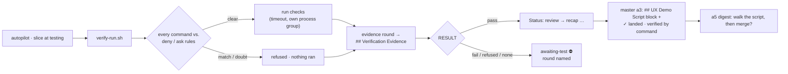

# Slice 051 — Autonomous Verification

> Completed: 2026-09-30
> Commits: 22cb92a..ebd88d7 (branch only, trunk-based)
> Epic: epic-003 (autopilot mode), entry `autonomous-verification`

## What

An autopilot run no longer waits for the human in Phase 5 when a slice's checks pass. A helper runs the
machine-readable checks of the slice's Test Strategy and writes the evidence into the plan itself; a clean pass moves the
slice on to Phase 6, and a failed, missing or refused check ends in the usual Phase-5 stop, now with the evidence named.
The product-feel check is not lost: every landed slice leaves a demo block in the epic plan's `## UX Demo Script`, which
the human walks at the epic end before the merge question.

## Why

- **D35 — a helper verifies, not the agent.** slice-045 and slice-049 showed agents misreporting their own runs (this
  slice's probe master placed a rule in the wrong settings file), so `verify-run.sh` runs the commands and writes the
  evidence; the builder never judges its own verification.
- **Only a clean pass replaces the stop.** A debug loop before it belongs to the ping-pong breaker.
- **The user's rules govern the checks too.** A command inside `bash verify-run.sh` never reaches Claude Code's
  permission check — the gap D34 closes for removals — so every check command is first judged against the deny / ask
  rules by the one matcher `delete-mode.sh` also uses. Unlike D34 there is no backstop behind it: a form the matcher does
  not see runs.
- **One script for the human.** The demo script lives in the epic plan and is shown at a5.

## Decisions

- **A helper runs the checks and writes the evidence** (user) — a machine-readable `<!-- craft:verify -->` block in
  `## Test Strategy`, executed by `scripts/verify-run.sh`. *Why not* the builder running the prose strategy: the verdict
  would be its own report.
- **A failed, refused or missing check is today's Phase-5 stop** (user) — `awaiting-test`, the round named in the Pause
  Note and the handoff. *Why not* one debug attempt first: the breaker's job.
- **The UX demo script lives in the epic plan** (user) — `## UX Demo Script`, written by `/craft:execute` a3 for every
  landing slice (a resume at `committing` included, a re-run never duplicates), Try this derived from the trigger the way
  `/craft:test` 5a does, the checks on a `Checked by` line, and how Phase 5 was passed.
- **The user's rules govern the checks, with one shared, subcommand-aware matcher** (user; review R1-9, R2-4) —
  `scripts/permission-rule-match.sh` (`MATCH=yes|no|doubt`) is the one definition; it tries every rule against the whole
  command and each subcommand like Claude Code (*verified* code.claude.com/docs/en/permissions, 2026-09-30: separators,
  substitutions, control-flow bodies, the wrapper list, leading assignments) and further where that only adds refusals
  (basename, `env` / `sudo` / `doas`, the string of `bash|sh|zsh -c` incl. flag clusters). Known limits: scripts or files a
  check calls, `eval`, aliases, functions, other interpreters; quoted separators refuse innocent checks (safe).
- **The verify block format** — a single-line marker (never a fence: `example-regions.sh` reads fences as examples), then
  `- check <name> :: exit=<n> | contains=<text> [timeout=<s>] :: <command>` lines with no other line between; a
  check-shaped line anywhere else in `## Test Strategy` is malformed (review R1-2, R2-1). The grammar lives once, in
  `verify-run.sh`'s header; the template carries one example and a pointer, and the harness parses that example.
- **The evidence cannot hide a finding** (review R1-1) — commands, expectations and output excerpts are neutralised
  (no fence, no HTML comment delimiter), so a check's output never opens an example region that would make
  `review-findings-state.sh` read an open finding as closed.
- **A pass is credited only if no later review loop-back followed it** (review R1-17, R2-3) — each evidence round records
  the review rounds the plan held when it ran; a3 credits it only when no loop-back decision names a later round. *Why
  not* compare dates: a date-only decision against a UTC datetime loses the order on the same day and across time zones.
- **The autopilot pass writes `review` through the `[W]` definition** — the status-graph harness allows one marker per
  row and knows only the Phase-7 configurations; the pass is the same transition.
- **Each check runs in its own process group, judged on its exit** (review R1-7) — output to an anonymous temp file, the
  group killed after the check; start and probe a server in one command.
- **Prefer `exit=` over `contains=` when the exit code carries the verdict** — `contains=0 failed` also matches
  "10 failed"; a note for the planning-pipeline slice.
- **Promoted:** a clause on the autopilot bullet in `intent.md` (D35) and the decision range D1–D35.

## Evidence

- **Harnesses:** all fifteen green on the final tree (`test-verify-run.sh` 67 passed, `test-delete-safe.sh` 147 passed);
  `claude plugin validate .` passed. Every review fix is backed by a mutation that turns the harness red (neutralising,
  stray-check scans above and below the block, the " :: " guard, round counting, the review-rounds field, process-group
  cleanup, basename / shell `-c` / flag clusters, a single quote in the matcher's embedded python).
- **Dogfood:** `verify-run.sh` on this slice's own plan — pass, 4/4 checks (run 1, 2026-09-30T11:38:19Z).
- **Headless probe** (2:56 min, $1.21, sonnet, `--setting-sources project,local`; fixture `probe-051` in the session
  scratchpad): slice-001 verified by command (2/2) and landed without a Phase-5 stop, its demo block written, `main`
  untouched; slice-002's `curl` check refused by a project deny rule, nothing ran, paused `awaiting-test` with the round
  named, lock released. Read from the files — the master's own summary placed the rule in the wrong file. The probe ran
  before review round 1 (the log then carried a separate verified line, since folded into the landed line).
- **Review:** two rounds, two passes each (rubric + scenario walk). Round 1: 4 Heavy + 13 Light, all Local, fixed
  in-phase (fix cap waived), 1 follow-up. Round 2: 15 of 17 held; R1-2 and R1-17 reopened; 1 Heavy + 7 Light, fixed
  in-phase (cap waived). No third round.

## Commits

- `22cb92a` — feat(scripts): share one subcommand-aware permission rule matcher
- `6895e94` — feat(scripts): verify a slice by command and write the evidence itself
- `0738e56` — feat(autopilot): pass Phase 5 by command and collect the UX demo script
- `430155b` — test(scripts): add the verify-run harness
- `24df327` — docs(design): record D35 — autopilot verifies by command, not by report
- `152de97` — docs: document the autopilot's verification by command
- `ebd88d7` — chore(plans): bump slice counter to 52

## Follow-ups

- **R1-18** (Light · Rethink) — once a3 closes the plan the evidence survives only in `.claude/plans/.closed/` (or
  nowhere in delete mode); the slice archive does not carry it. `/craft:commit` could copy the final evidence round into
  the archive.
- Observed in the probe, outside this slice: the autopilot handoff suggests `/craft:checkout` for a slice built in place
  (slice-049 wording).

## How (Diagram)

