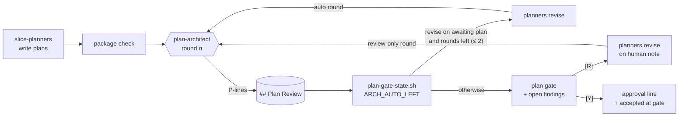

# Slice 055 — Plan Architect Review

> Completed: 2026-10-01
> Commits: 32fb007..70cb9f7 (branch only, trunk-based)
> Epic: epic-003 (autopilot mode), entry `plan-architect-review`

## What

An autopilot run now reviews an epic's slice plans as one package before the plan gate. Until now each
`slice-planner` saw only its own entry, so overlaps, cross-slice contracts that do not match, a wrong order or an
oversized slice surfaced while building, or never. A fresh-context `plan-architect` agent (Opus, `effort: high`,
read-only) now catches them; its findings are recorded durably in the epic plan's `## Plan Review`, the fixable ones
go back to the planners autonomously for at most two rounds, and the gate shows the human every finding still open.

## Why

- **Findings live in the epic plan**, not in the slice plans: a finding nearly always spans slices, so per-slice
  storage would duplicate it and leave the round count without a home.
- **Rounds are derived, never stored** — `plan-gate-state.sh` reads them from `## Plan Review`, the same principle as
  slice-052's ping-pong breaker: a counter nobody stores cannot be forgotten; an unreadable line counts open and ends
  the autonomous rounds (doubt means the gate).
- **The roles mirror `code-reviewer`**: the architect classifies (no Write / Edit tools), the planners revise — a
  planner that disagrees records why as a decision line — and the human decides. Open findings therefore do not
  withhold `[Y]`; `[Y]` records that the human saw them open.
- **Nothing is built before the yes, still**: only plans awaiting the gate are revised autonomously, after a human `[R]`
  the architect reviews once more without revising, and an architect's note never answers a `NEEDS-HUMAN:` question.

## Decisions

- **Findings live in the epic plan** (user) — a `## Plan Review` section with rounds and `P<round>-<n>` lines, parsed by
  `plan-gate-state.sh` (one parser for the record, like `review-findings-state.sh` for `## Review Findings`). *Why not*
  per slice plan: a finding spans slices — it would be duplicated, and the round count would have no one home.
- **Open findings do not withhold `[Y]`** (user) — the gate shows them; whether the package is right is the human's call
  (*Who decides what*). *Why not* block like `NEEDS-HUMAN:`: a finding the human judges wrong could only be cleared by a
  hand edit or `[N]`.
- **One review-only round after a human `[R]`** (user) — the architect re-checks the revised package without revising on
  its own, so a change made on the human's note cannot slip in an overlap unseen.
- **The architect reads every open plan, revises only pipeline plans** (user) — overlaps and contracts span hand-planned
  slices too; a finding on a hand-planned plan is a note at the gate. Narrowed in review to plans still awaiting the
  gate (below).
- **The architect classifies, the planners revise** (agent — mirrors `code-reviewer`) — the agent has no Write / Edit
  tools; a `revise` finding becomes a planner note, and a planner that disagrees records why as a decision line instead
  of silently skipping it.
- **Rounds are derived, never stored** (agent — intent "derived state over cleanup") — promoted to `intent.md`.
  `plan-gate-state.sh` counts the autonomous rounds of the current planning pass from `## Plan Review`; a malformed line
  counts open and sets `ARCH_AUTO_LEFT=0`.
- **Formats settled in Phase 4** — round heading `### Round <n> — <datetime> (<first | auto | review-only>)`; finding line
  `- P<n>-<k> · <slice-ids> · <kind> · <revise|note> · <text> · <resolution>` (the format is defined once, in
  `plan-gate-state.sh`'s header); `first` opens a planning pass, each `auto` after it spends one of two rounds,
  `review-only` spends nothing; open findings at `[Y]` get a separate `approved with open plan-review findings` log line,
  so the approval line keeps its one shape. A review that fails twice lets the gate say so and still offer `[Y]`.
- **Cap: 2 autonomous revision rounds** (entry, design record §4) — review → revise → review → revise → review → gate:
  at most 3 architect spawns and 2 planner rounds per pass, then the gate regardless.
- **A revise finding kept open by a VERDICT goes to the gate** (user, review R1-7) — the second autonomous round is for
  findings new in that round. *Why:* the planner already applied the note or recorded why not; pushing it again is the
  human's call.
- **`[Y]` marks open findings `accepted at gate`** (user, review R1-8) — a third resolution, written in place next to the
  separate log line, so a later planning pass neither shows nor re-checks them; the architect raises a covered problem
  again only when a plan changed since. *Why not* a helper `PASS=` field: old findings would stay formally open, and
  every reader would have to filter them.
- **Only `GATE=awaiting` plans are revised autonomously** (review R1-1) — an approved plan may already be building, and
  the approval line names only what the human saw; it is reviewed, its findings are notes, and `[R]` refuses it.

## Evidence

- **Verify block, Run 1** (`verify-run.sh`, in the plan): 7/7 pass — plan-gate-state (63/0), status-graph, model-enum
  (125 checks), docs-site, epic-entry-link, execute-resume, `claude plugin validate`.
- **Probe P2** (headless, Claude Code 2.1.286, overlap fixture: `greet-name` vs. `greet-default-user`, both defining
  `greet.sh <name>`): planners (2) and `plan-architect` (2 rounds) all on `claude-opus-5-5`, foreground; round 1 (`first`)
  raised P1-1 contract/revise, P1-2 overlap/note, P1-3 contract/note; one autonomous revision round; round 2 (`auto`)
  judged P1-1 `holds` → `resolved in round 2`; `ARCH_ROUNDS=2 ARCH_AUTO_LEFT=1 ARCH_OPEN_COUNT=2`. The gate listed the
  open findings and withheld `[Y]` on the planners' `NEEDS-HUMAN:` lines. $2.57, 5.6 min.
- **Human test T1** (the user, interactive, "R und Y funktionieren"): `first` → autonomous revision → `auto` (P1-1
  resolved) → gate → `[R] slice-001, slice-002 — nacheinander …; shout ist nicht Teil dieses Epics` → `review-only`
  (P3-1 contract/note) → gate → `[Y]` with the approval line and a separate `approved with open plan-review findings:
  P3-1` line → build started. Phase 5: `[W]`. *Cosmetic:* round 2 also wrote a `note · P1-1 holds` line; note lines are
  never findings, so nothing reads it.
- **Review**: round 1 — 2 Heavy + 7 Light, all Local, fixed in-phase (fix cap waived by the user); round 2 — 7 hold,
  R1-4 / R1-8 partial and reopened, 4 Light Local fixed in-phase; nothing open. Final tree: plan-gate-state 83/0,
  status-graph 95/0, docs-site green, epic-entry-link 105/0, execute-resume 154/0, review-findings 48/0,
  example-regions 35/0, `claude plugin validate` passed, model-enum green (125 checks, 57 fixtures red).
- **Not shown by a real run**: the review fixes (awaiting-only revision, one planner per plan, `accepted at gate`, the
  `[R]` refusal) are verified by harness pins and review walk-throughs only — no probe after round 1.

## Commits

- `32fb007` — feat(agents): add plan-architect for the package review before the plan gate
- `0a4839d` — feat(plan): let slice-planner apply plan-architect revision notes
- `5dd2f08` — feat(execute): review the planned package before the plan gate
- `158e76e` — feat(scripts): derive the plan review rounds in plan-gate-state.sh
- `0577cba` — docs: document the plan review before the plan gate
- `7b5eaf0` — docs(design): record the plan review as built
- `70cb9f7` — chore(plans): bump slice counter to 56

## How (Diagram)

`/craft:execute epic-NNN --autopilot` → planners → package check → step 4b: `plan-architect` judges earlier findings
(`holds` / `open`), reviews for `overlap` / `contract` / `order` / `sizing`, routes `revise` or `note` → the master
records the round in `## Plan Review` → `plan-gate-state.sh` derives `ARCH_AUTO_LEFT` → revise on an awaiting plan with
rounds left: one planner per plan, then an `auto` round; otherwise the gate with every open finding → `[R]` → planners
revise → `review-only` round → gate; `[Y]` → `accepted at gate` + approval line.

