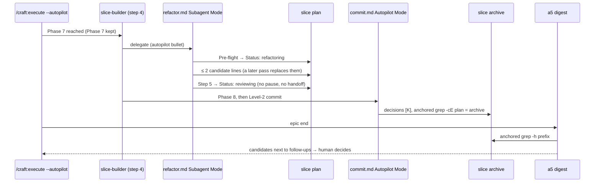

# Slice 056 — Autopilot Skips Phase 7 (B21)

> Completed: 2026-10-02
> Commits: f602284..33c3918 (branch only, trunk-based)
> Roadmap: B21 (stand-alone fix, no epic entry)

## What

An autopilot run in a project that keeps Phase 7 no longer stops at `awaiting-refactor-decision` — which broke
autopilot's "one plan gate, one epic-end sign-off" promise for every project except this one (it drops Phase 7 and never
showed the stop). The `slice-builder` now surveys up to two refactor candidates, applies none, writes them as
fixed-prefix decision lines and goes on to Phase 8; the commit carries them into the archive and the epic-end digest
puts them in front of the human.

## Why

- **The guardrail stays**: no structural change without human judgment — autopilot records candidates, never applies
  them. The design record (§3) promised the candidates to the human, so the survey still runs; its result moves to the
  one place autopilot meets the human anyway, the epic end.
- **Decision lines, not follow-ups**: follow-ups come from one parser (`review-findings-state.sh`); a second source would
  be a second definition of a follow-up.
- **One definition**: the autopilot path lives in `refactor.md` → Subagent Mode; `slice-builder` delegates to it, and the
  phase end delegates to Step 5's single status marker — the status graph is unchanged.
- **Checked by command, not by prose**: probe 1 lost a carried line despite "as written", probes 3 and 4 skipped a
  prescribed `grep` — so the carry is a counted, anchored check before the archive commit (promoted to `rules.md`), and
  the digest's remaining drift goes to B22 as a helper.

## Decisions

- **Root cause** (agent, from the code) — an autopilot `slice-builder` met Phase 7 with only two paths: the project drops
  it (`reviewing`) or `refactor.md` → Subagent Mode pauses at `awaiting-refactor-decision`. No autopilot path existed, so
  every Phase-7-kept project stopped there; this repo drops Phase 7 and never showed it.
- **Candidates as decision lines, read by a5** (user) — the survey still runs and applies nothing; each candidate becomes
  a fixed-prefix line in `## Decisions Made During This Slice`, autopilot's Level-2 commit keeps it `[K]`, and the a5
  digest lists it. *Why not* archive `## Follow-ups`: those come from one parser, and a second source in `/craft:commit`
  Step 5 would be a second definition of a follow-up. *Why not* skip without a survey: the design record (§3) promises
  the candidates to the human.
- **One definition in `refactor.md`** (agent — tabu "a rule is never described twice") — `slice-builder` step 4
  delegates to the autopilot bullet, like the Phase-7-dropped gate.
- **The missing ⛔ line is evidence only** (user) — once Phase 7 is skipped this stop is gone; probe run 2 checked
  whether another handoff stop writes its `⛔` line; missing would have been its own roadmap entry.
- **Stand-alone, no epic link** (user) — B21 is a roadmap fix; epic-003 has no entry for it.
- **The autopilot path delegates its status write to Step 5** (Phase 4) — the status-graph harness allows exactly one
  `craft:writes` marker per table row, and a delegating `## Subagent Mode` may carry no status write of its own. The
  bullet writes only the candidate lines and ends Phase 7 through `<!-- craft:delegates rule=phase7-end to=step-5 -->`.
  One route, one marker, one row; no new table row, no new `when=` value.
- **Scope extension: `commands/commit.md` → Autopilot Mode** (user) — Step 5 carries each decision line into the archive
  as written; otherwise the commit could reword a candidate and a5 would miss its prefix.
- **The autopilot bullet runs `refactor.md`'s Pre-flight first** (user, after probe run 1) — its status update writes
  `refactoring`, which run 1 skipped.
- **a5 reads the candidates by command** (user, after probe 3) — a line-start-anchored `grep`, each line shown without
  the prefix.
- **The digest goes to B22** (user) — slice-056 closes with the candidates reaching the human correct in content; the a5
  prose and its pin stay as the spec a digest helper will implement. *Why not* a digest helper here: it replaces how a5
  builds its whole output (follow-ups, UX demo), which is B22's scope, not B21's.
- **Probes 1 + 2** (Claude Code 2.1.286, Sonnet master) — run 1: the slice landed on the epic branch, no `paused`, no
  `awaiting-refactor-decision`, no `.craft/`, no `⛔`; it skipped `refactoring` and the commit master wrote the archive's
  decisions from memory, dropping the no-candidate line. Run 2: a `curl` check refused by a deny rule → `paused` /
  `awaiting-test` with a `⛔` log line — B21's missing `⛔` line did not reproduce (most likely the user's Esc).
- **Probe 3** — the archive held both seeded candidates verbatim after the `grep -cF` carry check (2 / 2); the a5 digest
  listed them paraphrased, the *why* dropped. Further a5 / a1 drift → roadmap B22.
- **Probe 4** — the master did not run the prescribed `grep`; the digest again came from context (the *why* kept, not
  byte-equal); the carry check held. New: `■ … complete, not merged` logged for an unanswered question (→ B22).
- **Verify Run 1: 5/6, model-enum timed out** — killed at 1200 s under load averages 298 / 365; a standalone run on the
  same tree was green (125 checks, 57 fixtures red) in 1440 s. A timeout under load, not a failed check.
- **Phase 5 passed `[W]`** (the user) on Verify Run 1 + the standalone model-enum run, the harness pins and probes 1–4.

## Evidence

- **Verify block, Run 1** (`verify-run.sh`, in the plan): 5/6 pass, model-enum timed out under load; standalone
  model-enum green (125 checks, 57 fixtures red).
- **Probes 1–4** (headless): see Decisions — the skip and the carry shown by real runs; the digest correct in content,
  not byte-equal (→ B22).
- **Review**: round 1, two passes (rubric + scenario walk S1–S9) — 2 Heavy + 6 Light, all Local, fixed in-phase (fix cap
  waived by the user): the carry check and the digest read anchored at the line start (slice-056's own plan counted 3
  unanchored hits with 0 candidates), the AUTOPILOT pin made to match the gate (it could never fail), VERBATIM /
  PREFLIGHT pins tightened, the repair inserts only missing lines, a later Phase-7 pass replaces earlier lines, the
  no-candidate line inside the check, `SKILL.md` delegation list and contract rule 1 updated. 7 scratch mutations each
  RED with exactly one failure. Final tree: status-graph 108/0 and 14 further harnesses green, `claude plugin validate`
  passed; model-enum not re-run (no marked file touched after Phase 5).
- **Not shown by a real run**: the review fixes (anchored commands, partial-drop repair, replace-on-re-entry) are
  verified by harness pins, fixture runs of the commands and the scenario walk only — no probe after round 1.

## Commits

- `f602284` — fix(refactor): record Phase-7 candidates instead of stopping an autopilot run
- `69058dd` — fix(commit): carry the autopilot's Phase-7 lines into the archive by command
- `e20d891` — fix(execute): list the Phase-7 candidates in the epic-end digest
- `9f0b71a` — test(scripts): pin the autopilot's Phase-7 path in the status graph
- `9912eeb` — docs: document the autopilot's Phase-7 candidates
- `c4ad856` — docs(design): record the Phase-7 autopilot row as built
- `6b3d293` — docs(roadmap): close B21, add B22
- `33c3918` — chore(plans): bump slice counter to 57

## How (Diagram)

