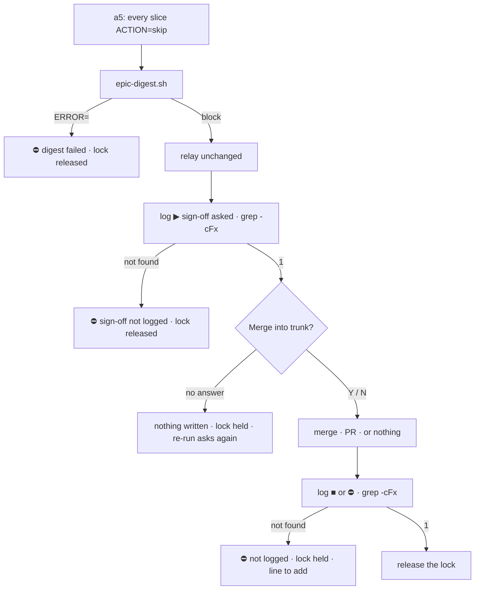

# Slice 057 — Autopilot Epic-End Digest Drift (B22)

> Completed: 2026-10-05
> Commits: e759834..b992ff5 (branch only, trunk-based)
> Roadmap: B22 (stand-alone fix, no epic entry); B22's a1 / `/tmp` items and two probe-1 findings → B23

## What

An autopilot run's epic end now shows a digest a helper generated, not one the master wrote from memory —
`scripts/epic-digest.sh` prints, per slice, the first sentence of the archive's `## What`, its follow-ups and its
Phase-7 candidates, then the epic's `## UX Demo Script` as written, its dates included. The run keeps its lock until the
human answers the merge question, and a5 checks each of its own log lines — the question asked, the answer given — by
command, so the log says what actually happened.

## Why

- **Prose did not bind the master**: slice-056's probes 3 and 4 wrote the digest from context — candidates
  paraphrased, the demo script retold, a verification dated `2021-…` — and skipped a prescribed `grep`. rules.md → *What
  an agent must carry or read out verbatim is checked by command*: a helper the master only relays fixes B22 #1–#3 at once.
- **The lock guards the merge**: it was released before the question, so a later `[Y]` would merge unlocked (#4). It is
  now released only after the answer's closing line is in the log.
- **An unanswered question is a state, not a guess** (#5): probe 4 logged `■ … complete, not merged` for a question
  nobody answered. Now nothing is written, the lock stays held, and a re-run asks again.
- **A log line that did not land is not passed over** (BUG-1, the first human test): a refused append went unnoticed and
  the log read "unanswered" after the merge — so a5 checks its lines with `grep -cFx`.

## Decisions

- **Scope: B22 #1–#5, everything around a5** (2026-10-02, user) — the digest from memory (#1), the paraphrased UX demo
  script (#2), the misdated verification (#3), the lock released before the merge question (#4), and the undefined log
  line for an unanswered question (#5). *Why not* all seven: #6 (the a1 briefing missing on a re-run) and #7 (the master
  writing helper files to `/tmp`) concern a1 and the master's general conduct, not a5 → roadmap **B23**.
- **The digest comes from a helper the master only relays** (2026-10-02, user; slice-056 decision "the digest goes to
  B22") — prose did not bind the master (probes 3 and 4 skipped the prescribed `grep` and wrote the digest from
  context); `rules.md` → *What an agent must carry or read out verbatim is checked by command* applies. The helper fixes
  #1–#3 at once: the demo script and its dates are copied from the plan, not recalled.
- **An unanswered sign-off is a defined state** (2026-10-02, agent proposal, user confirmed) — `▶ · <epic-id> · sign-off
  asked` before the question; no `■` until `[Y]` / `[N]`; the lock stays held, and a re-run reaches a5 again, taking the
  ended session's lock over by the existing takeover rule. *Why not* release the lock on an unanswered question: a later
  `[Y]` would merge unlocked — exactly #4.
- **BUG-1 → a5 checks its own log lines by command** (2026-10-05, Phase 5 `[B]`, user) — the sign-off line not landed →
  `⛔`, nothing asked, lock released; a closing `■` / `⛔` line not landed → `⛔`, the lock **held** (the user's choice:
  the answer has been acted on or attempted, and the log must say so first), the line to add and A4's `release --force`
  printed. Fixed in `/craft:debug` attempt 2 of 5; attempt 1's conflict with the pin `A5_NO_GREP` was resolved by
  narrowing that pin to its intent (no second reader of the archives), the user's decision.
- **Phase-5 evidence** (2026-10-05) — harnesses green and every a5 pin proved red by a scratch mutation (27 at the end of
  Phase 8). Probe 1 (Sonnet, seeded at `committing`): the digest in the transcript byte-equal to the helper's output, `▶ …
  sign-off asked` and no `■`, lock held. Probe 2 (`chmod 444`) did not reach the failure path — the Edit tool writes
  through a read-only file — but showed the check run before the question; probe 3 (`chflags uchg`) stopped `⛔` with
  nothing asked and `main` untouched. Human test 1 found BUG-1 (the auto-mode classifier refused the log append; the
  master merged and released with no `■`); human test 2 showed the fix (`▶` → `■` → release, the release chained to the
  `grep`). Phase 5 passed `[W]`.
- **Probe 1's two surprises outside a5 → B23** (2026-10-05, user) — a4's step-1c re-run passed the epic plan as a slice
  argument, got `RESULT=conflict` and went on to a5 instead of stopping `⛔`; and a log line carried a datetime not read
  off the clock (`19:13:55`, the file last written `19:13:50`).
- **Stand-alone, no epic link** (2026-10-02, user) — B22 is a roadmap fix like B21; epic-003's one open candidate
  (`budget-and-cache-guard`) is unrelated.
- **Phase 8: two rounds, 12 Light, no Heavy** (2026-10-05) — round 1 (7, fix cap waived by the user): a failed `[Y]`
  action logs a checked `⛔` line, the held lock named as step 1's one exception, the PR body generated by the helper,
  CRLF-safe checks, the digest's fields not restated in a5, two missing harness cases, the probe-1 findings into B23.
  Round 2 (5): the PR body fenced, `<reason>` one line without quotes, "acted on or attempted", the unloggable `⛔` lines
  marked printed only, the mid-merge trunk's ways out. The gate cleared without a round 3 (the user's decision; round 2's
  fixes are covered by pins and mutations only).

## Commits

- `e759834` — feat(scripts): generate the autopilot's epic-end digest
- `0c1f5dd` — fix(execute): relay the epic digest and hold the lock until the sign-off is answered
- `96c50ac` — docs: document the generated epic-end digest
- `904fc50` — docs(rules): add the epic-digest harness
- `2283d50` — docs(design): record the generated epic digest as built
- `846e6e4` — docs(roadmap): close B22, add B23
- `b992ff5` — chore(plans): bump slice counter to 58

## How (Diagram)

