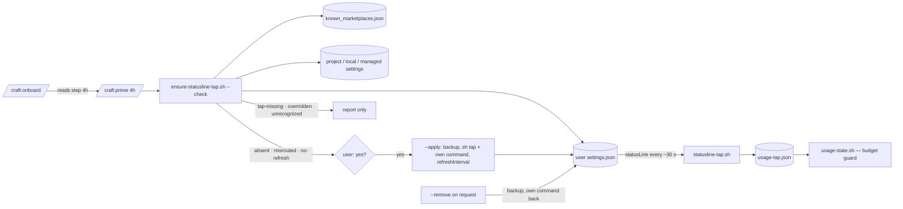

# Slice 059 — Statusline Tap Wiring

> Completed: 2026-10-06
> Commits: 8a15693..e723bf9 (branch only, trunk-based); the intent promotion in 29d935f
> Roadmap: F9 (stand-alone, a slice-058 follow-up); decision D36

## What

The statusline tap the autopilot's budget guard needs no longer has to be wired by hand. `/craft:prime` (step 4h) and
`/craft:onboard` notice when it is missing, wired to a working tree or a versioned plugin cache, or lacks
`refreshInterval`; they show the change to the user's `statusLine` and write it only after a yes, with a backup — the
user's own statusline command keeps running behind the tap, and `--remove` takes the tap out again. Before, the budget
guard ran blind (conservative mode) for every user who never followed the README recipe.

## Why

- **A plugin cannot wire it itself**: a plugin's settings carry no `statusLine`, and Claude Code runs no install or
  update hook — so D36 amends slice-058's "CRAFT never writes `statusLine`" to "only on a yes, with a backup, reversibly".
- **Never wire to a path that does not exist**: `sh` on a missing file would break the statusline, so the helper
  reports `tap-missing` while the marketplace clone predates the tap.
- **The user level only**: a project, local or managed `statusLine` wins and is only reported.
- **CRAFT's tap is recognised by path or content, never by name**: Phase 5 found (BUG-1) that the user's own
  ccstatusline wrapper carries the same name, and a yes would have erased it.

## Decisions

- **Build the wiring helper (user, 2026-10-06) — amends slice-058's "CRAFT never writes `statusLine`":** a plugin cannot
  wire the tap itself — a plugin's `settings.json` carries only `agent` / `subagentStatusLine`, and Claude Code has no
  plugin install or update hook (plugin reference, read 2026-10-06) — so without a helper every user wires by hand, and
  the guard runs blind (conservative mode) for everyone who does not. Writing stays the user's call: Level 1, a diff
  first, a backup always. To be banked as D36 before the build.
- **Offered by `/craft:prime` and `/craft:onboard` (user, 2026-10-06).** *Why not* a command of its own: more surface
  (docs counts, harnesses) for a one-time setup that prime already detects; an autopilot run only points at prime.
- **Compound commands are wrapped in `sh -c '…'` (user, 2026-10-06)** and shown in the diff. *Why not* refuse: the
  README's recipe already prescribes that wrap; refusing would push the user back to the manual path.
- **A misrouted wiring is repaired, not only reported (user, 2026-10-06):** a tap on a working tree or a versioned
  cache path is re-routed to the marketplace clone, the inner command kept; a missing `refreshInterval` is added.
- **`--remove` is part of this slice (user, 2026-10-06):** a wrapper CRAFT can put in it must also take out — the
  backup alone leaves the user to diff JSON by hand.
- **Never wire to a path that does not exist (agent, from the planning check, 2026-10-06):** this machine's marketplace
  clone is at v1.6.0, without `statusline-tap.sh`; wiring to it would break the statusline (`sh` on a missing file).
  `tap-missing` refuses and tells the user to `/craft:upgrade` first. Consequence: the human test runs after the
  release that ships the tap.
- **The marketplace path is read, not assumed (agent, 2026-10-06):** `~/.claude/plugins/known_marketplaces.json` →
  `craft.installLocation` (here `/Users/craschke/.claude/plugins/marketplaces/craft`); the README's literal path is the
  default install location, not a guarantee.
- **The user level is the one CRAFT writes; a higher level is reported (agent, 2026-10-06):** a project or local
  `statusLine` wins over the user's, so wiring the user level there would change nothing visible — `overridden` names
  the file and writes nothing.
- **Stand-alone slice, no epic link:** the only candidate entry, epic-003 `cache-guard`, is a different mechanism.
- **A seventh state, `unrecognized` (agent, in build, 2026-10-06):** a `statusLine` that names `statusline-tap.sh` but
  not at its start (`cd x && sh …/statusline-tap.sh …`), has an unbalanced quote, or is not an object — the helper
  cannot tell what is the user's command, so it refuses `--apply` and `--remove` and says to wire it by hand. *Why not*
  guess: a wrong split would rewrite the user's statusline into something that breaks.
- **The tap path is written as `~/…` when it lies under `$HOME` (agent, in build):** the form the README shows, and a
  settings file synced between machines with the same layout keeps working; outside `$HOME` the absolute path, quoted.
- **The write keeps the file's shape (agent, in build):** a symlinked `settings.json` (dotfile repos) is written through
  to its target, its mode is kept, and the indentation is read off the file; the backup goes next to the path the user
  knows (`settings.json.bak-craft-<stamp>`), not into a dotfile repo.
- **Onboard reads prime's step 4h instead of restating it — without a `craft:delegates` token (agent, in build):** the
  token is reserved for status delegations and has its own table in `test-workflow-status-graph.sh`, which went red on a
  new rule name; onboard's Local-State Gitignore sub-procedure borrows step 4f the same way, token-free.
  `test-statusline-wiring.sh` pins that onboard names step 4h and not the helper.
- **A no is not remembered (agent, in build):** prime asks again every session, like steps 4e / 4f. The tap is a
  user-level setting, so a user who declines meets the offer in every project — the cost of keeping no state; a
  remembered no would be a follow-up if it proves noisy.
- **Known limit of `--remove`:** a command the user wrote as `sh -c '<compound>'` in exactly the quoting `--apply`
  produces is unwrapped to the bare compound — equivalent when run, but not the user's original spelling.
- **`test-model-enum.sh` runs after all (agent, in build — corrects the plan):** the plan excluded it, but `rules.md`,
  `CLAUDE.md` and `docs/index.html` carry a `craft:model-enum` marker, and rules.md → Workflow Rules names it for any
  slice that touches such a file — so it is in the verify block, with `timeout=1200`.
- **CRAFT's tap is recognised by path or content, not by name (BUG-1, fixed in /craft:debug attempt 1):** a user's own
  statusline script may be called `statusline-tap.sh` (this repo's author's is). The 16 BUG-1 fixtures stay in
  `test-statusline-wiring.sh` as the regression check — the promotion the debug skill offers is already done.
- **Phase 5 passed on evidence, the real-file test after the release (user, 2026-10-06: [W]):** the human test the
  Workflow Rules require for a settings write cannot run before the release — the marketplace clone (v1.6.0) has no
  tap, and the helper rightly refuses; copying the tap into the clone by hand could block `/craft:upgrade`'s pull.
  **Open step after release + `/craft:upgrade`, before the `cache-guard` autopilot run:** the agent runs `--check`
  (expect `misrouted`) and, on the user's yes, `--apply` on the real `~/.claude/settings.json`, checks backup and
  diff, compares the statusline output before/after byte for byte and the tap's freshness over a minute; the user
  looks at the statusline.
- **Phase 9 promotion candidate:** `intent.md` names the decision range `D1–D35`; with D36 it is `D1–D36`. `CLAUDE.md`
  is updated; `intent.md` is not, because `/craft:build` never edits it.

## Commits

- `8a15693` — docs(decisions): record D36 — CRAFT may wire the statusline tap on a yes
- `aa0aaec` — feat(scripts): add the statusline tap wiring helper
- `a7d152f` — feat(prime): offer to wire the statusline tap at session start
- `4d4c7d2` — feat(onboard): offer the statusline tap during setup
- `c3762b1` — docs: document the statusline tap wiring
- `681bf5a` — docs(rules): add the statusline-wiring harness
- `28ff6d4` — docs(design): record the tap wiring in the budget-guard design
- `318796d` — docs(roadmap): close F9
- `e723bf9` — chore(plans): bump slice counter to 60
- `29d935f` — docs(intent): extend the decision range to D36

## Follow-ups

- R1-10 Light · Rethink · uninstalling CRAFT or its marketplace deletes the clone; the wired line then fails and the user's statusline goes empty, and `--remove` is gone with it — README and docs page now say to run `--remove` before uninstalling (user, in this round); a fail-open wired form (run the inner command when the tap is missing) stays open

## How (Diagram)

Prime 4h runs `ensure-statusline-tap.sh --check`. The helper reads the user settings, finds the marketplace clone
through `known_marketplaces.json`, looks at the higher settings levels and reports one of seven states. On `absent`,
`misrouted` or `no-refresh` prime shows the file, `CURRENT=` and `PROPOSED=` and asks. On a yes `--apply` backs the
file up, writes `sh <tap> <the user's command>` — wrapped as `sh -c '…'` when it is more than one plain command —
adds `refreshInterval: 30`, keeps every other key, the indentation, a symlink and the file mode, and checks the result
itself. From the next statusline refresh on the tap writes `usage-tap.json` and `usage-state.sh` has a reading again.
`--remove` takes the tap out and restores the user's command; onboard reads prime's step 4h and runs it as written.

