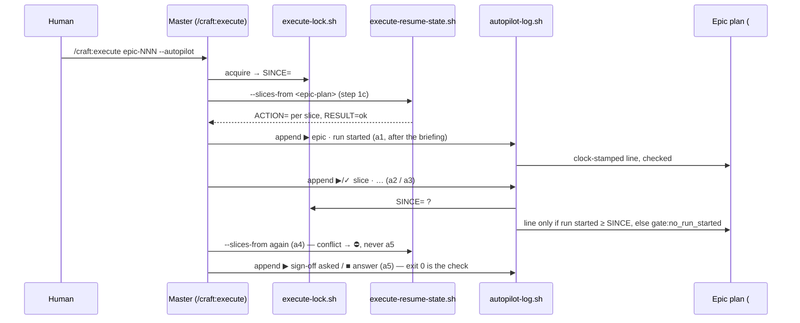

# Slice 063 — B23 Autopilot Master Drift

> Completed: 2026-10-07
> Commits: 99b8d3b..ab5fcbb (trunk-based on main, no PR)
> Roadmap: B23 (shipped); follow-up B27 (the a1 block's content, from the Phase-5 probe)

## What

An autopilot run's log can no longer be written freely by the master: a helper (`scripts/autopilot-log.sh`) owns each
line's clock, place and form; a slice step cannot be logged until the invocation has passed a1's run-start briefing;
a4's re-run of step 1c reads the slice list off the epic plan (`execute-resume-state.sh --slices-from`) instead of
taking one from the master, and stops `⛔` on a conflict before a5; and the master has one named place for its own
files, `.craft/tmp/`, inside the project.

## Why

Three probe rounds (slice-049, -056, -057) showed prose not binding the master: invented log times, a1 skipped on a
re-run, the epic plan passed as a slice, a conflict read and passed over, helper files in `/tmp`. slice-057's lesson —
what an agent must carry or read out verbatim is checked by command — is applied to the log: where a helper can bind,
it binds; where it cannot (the scratch place, the a1 block's content), the limit is named and pinned. The clock belongs
to the helper, not the master; the gate keys to the execute lock's `SINCE=`, because the lock already knows when this
invocation began — no stored counter that a writer could forget (the derived-state rule of slice-036 onward).

### Walk-through

The human re-runs `/craft:execute epic-NNN --autopilot`; the lock is taken and records `SINCE=`. Step 1c asks
`execute-resume-state.sh --slices-from <epic-plan>`, which resolves the epic's entries itself. a1 prints the briefing
and logs `run started` through `autopilot-log.sh`, which reads the clock, appends the line as the section's last,
checks it landed and prints it. When a2 or a3 then logs a slice's `▶` or `✓` line, the helper first checks the log for
this epic's `run started` at or after `SINCE=`; without one it refuses (`gate:no_run_started`) and the master goes back
to a1. After every landed slice the same `--slices-from` call runs again; a conflict stops the run `⛔` and never
reaches a5. At a5 the helper's exit 0 is the check that `sign-off asked` and the `■` line are in the log.

## Decisions

- **Scope: all four B23 items in one slice** (2026-10-06, user) — #1 a1 briefing missing on a re-run (slice-056
  probe 3), #2 helper files in `/tmp` (slice-056 probe 3), #3 a4's step-1c re-run with the epic plan as a slice
  argument, going on to a5 after `RESULT=conflict` (slice-057 probe 1), #4 a log datetime not read off the clock
  (slice-057 probe 1, the slice-049 rule broken again). *Why together:* the log helper is the core and carries #1's
  gate; #3 and #4 come from the same probe.
- **#4 → a helper writes every log line** (2026-10-06, user) — `scripts/autopilot-log.sh` reads the clock, places the
  line and checks it landed; the master only relays the printed line. *Why not* a pin that checks timestamps after the
  fact: it detects, it does not prevent — and rules.md → *What an agent must carry or read out verbatim is checked by
  command* is the lesson of slice-056 / slice-057. The line format moves into the helper (defined once).
- **#1 → a gate in the log helper, keyed to the lock's `SINCE=`** (2026-10-06, agent proposal, user confirmed with the
  effect) — `execute-lock.sh` records when the invocation's lock was taken; a slice-step line without a `run started`
  line at or after it is refused. That binds *visiting* a1 by command; whether the briefing block itself is printed
  stays prose — disclosed, not hidden.
- **#3 → `execute-resume-state.sh --epic-plan`** (2026-10-06, user) — the helper derives the slice list through
  `epic-entry-link.sh resolve`, so the master passes no list and cannot pass a wrong one. The `⛔` on conflict stays a
  prose instruction, bound by a pin. *Why not* only pin the spelled-out command line: the probe's master had the line
  and still built the argument list itself.
- **#2 → a named scratch place, `.craft/tmp/`** (2026-10-06, user) — the rule is pinned for presence only; no command
  can stop a write to `/tmp`. `.craft/` is already in the local-state gitignore set, so files there are no tree dirt —
  to verify against `scripts/tree-dirt-state.sh` in Phase 4 (it excludes `.craft/checkpoints.md` by name; an ignored
  path should not reach it at all). The probe transcripts that showed which files the master wrote are gone; the
  Phase-5 probe shows whether any are still written outside the project.
- **The new helper may use bash ≥ 5** — only the master's Bash tool calls it, never a hook (rules.md → Bash baseline).
- **`--slices-from`, not `--epic-plan`** (2026-10-07, Phase 4) — `execute-resume-state.sh` already has `--epic <epic-plan>`
  (the parallel epic target, which adds an epic line); a second flag `--epic-plan` beside it would read as the same
  thing. The flag says what it does: the slice list comes from that plan's entries. Exactly one source — a slice list
  beside it is a usage error (exit 2); an entry that does not resolve is exit 4, named (`slices_from:<why>`).
- **a5's own log checks move into the helper** (2026-10-07, Phase 4) — the helper re-reads the plan (CR dropped) and
  counts the exact line it wrote, so a5's `tr -d '\r' | grep -cFx` checks are its exit 0 now; a line that did not land
  is remedied by the refused helper call, never by a line the human stamps by hand. The `test-workflow-status-graph.sh`
  pins SIGNOFF_CHECK, ANSWER_CHECK, UNLOGGED_HELD, FAILED_ACTION and REASON_ONE_LINE were rewritten to the helper's
  form, their intent kept (BUG-1 of slice-057: a refused append never passes unnoticed).
- **The short a5 / a2 line forms are gone** (2026-10-07, Phase 4) — `■ <epic-id> merged into <trunk>`, `■ <epic-id> PR
  #<N> opened`, `■ <epic-id> complete, not merged` and `⛔ <slice-id> stopped: …` had no ` · ` separators in the prose,
  while `epic-close-state.sh` reads `· ■ · <id> · merged into <trunk>`. Through the helper every line has the one form.
- **Every helper argument `<text>` is single-quoted, `'` written `'\''`** (2026-10-07, Phase 4) — a2's line carries
  `"<title>"`, so double quotes would break it; a5's `<reason>` is one line because the helper refuses a line break.
- **`.craft/tmp/` is never tree dirt — verified** (2026-10-07, Phase 4) — `tree-dirt-state.sh --scope main` excludes
  every local-state path of `ensure-gitignore.sh --print-paths`, `.craft/` wholesale, tracked, ignored or neither; the
  autopilot runs in the main checkout. No change to `tree-dirt-state.sh`.
- **The pins bite — 21 scratch mutations, all red** (2026-10-07, Phase 4) — 15 on `execute.md` (helper call, datetime
  command, datetime line spec, a1 gate paragraph, gate routing, other-failure stop, scratch place, step 1c list, a4
  `--slices-from`, a4 stop before a5, a5 ■ form, a5 sign-off check, a5 answer check, a5 remedy, the usage ▶ pin) and 6 on
  the helpers (gate off, fixed clock, prepend, `SINCE` ignored, fences not blanked, an unresolved entry passed).
- **The headless probe is Phase 5's** (2026-10-07, Phase 4) — it was a sub-task, but it is the Test Strategy's runtime
  evidence, not implementation; it runs in `/craft:test`.
- **`test-model-enum.sh` joins the verify block** (2026-10-07, Phase 4) — `docs/index.html` carries a `craft:model-enum`
  marker and was touched (rules.md: then the slice names it, `timeout=1200`). Run: GREEN, 125 checks, 57 correctly RED.
- **Phase 5: `[W]` on automated evidence** (2026-10-07, user) — `verify-run.sh` round 1: 10/11, the one failure
  `epic-close-state` (below), round 2 `--only epic-close-state`: pass. Headless probe (Sonnet, a seeded re-run of an
  autopilot epic at `committing`, plugin copy without `hooks/`): the three new log lines (`run started`, `✓ slice-902 ·
  landed …`, `sign-off asked`) all written by `autopilot-log.sh` — monotonic, never later than the plan's mtime, all
  after the probe started; `run started` (22:42:27Z) after the lock's `SINCE=` (22:42:24Z); the one `Edit` on the epic
  plan was a3's UX demo block, not the log; a4's re-run used `--slices-from` and read `ok`; no `/tmp` in any tool input;
  a5 relayed the digest, logged `sign-off asked`, wrote no `■` without an answer and kept the lock. Not shown at run
  time: a2's spawn and a gate refusal (the re-run began at `committing`) — the harnesses hold them.
- **Known limit: the a1 block is printed, but not bound** (2026-10-07, user at `[W]`) — the probe's master printed the
  briefing and logged `run started`, but dropped the block's "Stops for you at: …" lines. The gate binds *visiting*
  a1, not the block's content, as planned. Binding the content would take a helper that prints it, as
  `epic-digest.sh` does for a5 — a candidate for a later slice, not this one.
- **`test-epic-close-state.sh` unsets an inherited `CLAUDE_PROJECT_DIR`** (2026-10-07, user, out of scope at Level 1) —
  the context-mode sandbox exports it pointing at this repo, the helper prefers it over the cwd, and 34 of 66 cases
  went red under `verify-run.sh` while green from the Bash tool. One `unset`, as `test-execute-resume-state.sh` already
  does; green from both since. A slice-061 / slice-062 harness defect, surfaced by this slice's verify block.
- **The probe's `cache guard not armed: restart_unavailable`** is the fixture's (2026-10-07) — the probe's plugin copy
  omits `hooks/` (rules.md → Workflow Rules), and `cache-guard-marker.sh` reads its restart line from the hook.
- **The plan was truncated once and restored** (2026-10-07, Phase 6, agent error) — writing the recap draft, a script
  located `## Recap Draft` by its first occurrence, which is a mention inside `## Vertical Slice Definition`, and
  replaced everything from there to `## Review Findings`. Restored from this session: every section as last written;
  `## Verification Evidence` round 1 verbatim from the run's printed output; round 2 (`--only epic-close-state`, lost
  with the rest) regenerated by a fresh `verify-run.sh --only epic-close-state` run below, not retyped.

## Commits

- `99b8d3b` — test(scripts): unset an inherited CLAUDE_PROJECT_DIR in the epic-close harness
- `b555a4a` — feat(execute): write the autopilot log through a helper and derive the slice list
- `ab5fcbb` — docs: list the autopilot log harness

## How (Diagram)

